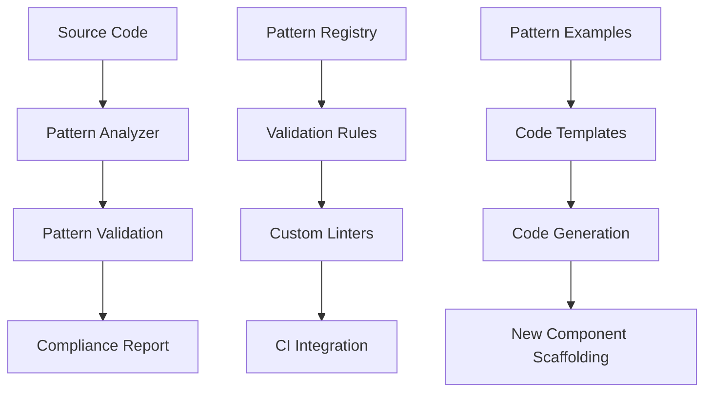

# Architectural Patterns - Design

## Overview

This design enhances and validates the comprehensive architectural patterns system for Freightliner, building upon the excellent existing documentation and implementation. The system will ensure consistent pattern usage, provide validation mechanisms, and support extensibility for future registry types and features.

## Current Pattern Analysis

### Existing Pattern Strengths
- **Composition over Inheritance**: Consistently implemented across ECR/GCR clients
- **Interface-Based Design**: Well-segregated interfaces with clear contracts
- **Shared Base Implementations**: BaseClient, BaseRepository, BaseAuthenticator, BaseTransport
- **Factory Patterns**: Flexible creation of clients and repositories
- **Options Pattern**: Extensive use for configuration flexibility
- **Concurrency Patterns**: Thread-safe implementations with proper mutex usage
- **Caching Strategies**: Multi-layer caching with appropriate invalidation

### Pattern Validation Needs
- **Consistency Enforcement**: Automated validation of pattern adherence
- **Performance Validation**: Benchmarks confirming pattern benefits
- **Extensibility Testing**: Validation with new registry implementations
- **Resource Management**: Comprehensive lifecycle management patterns

### Critical Pattern Issues Identified

Recent analysis has revealed significant architectural problems that violate established patterns:

#### Concurrency Anti-Patterns (Critical)
- **Race Conditions**: Non-atomic counter operations in `pkg/tree/replicator.go:850,857`
- **Goroutine Leaks**: Missing cleanup in worker pools (`pkg/replication/worker_pool.go:260`)
- **Channel Management**: Double-close vulnerabilities in worker pool lifecycle
- **Shared State Issues**: Concurrent map access without proper synchronization

#### Resource Management Anti-Patterns (Critical)
- **Memory Leaks**: Large image transfers not streamed, full buffering in memory
- **Connection Leaks**: No connection pooling limits for registry clients
- **File Handle Leaks**: TOCTOU race conditions in checkpoint file operations

#### Error Handling Anti-Patterns (Critical)
- **Missing Panic Recovery**: No panic recovery middleware for HTTP handlers
- **Circuit Breaker Absence**: No circuit breaker pattern for external registry calls
- **Context Misuse**: Context cancellation not properly handled in long-running operations

These anti-patterns directly contradict the architectural excellence found in other parts of the codebase and must be addressed as **P0 blockers** before production deployment.

## System Architecture

### 1. Pattern Enforcement Architecture



### 2. Pattern Hierarchy Design

#### Core Pattern Categories
```yaml
Architectural Patterns:
  Foundation Patterns:
    - Composition over Inheritance
    - Interface Segregation
    - Dependency Injection
    - Factory Pattern
    - Options Pattern
    
  Behavioral Patterns:
    - Strategy Pattern (Registry implementations)
    - Observer Pattern (Event handling)
    - Command Pattern (Operation encapsulation)
    
  Concurrency Patterns:
    - Worker Pool Pattern
    - Producer-Consumer Pattern
    - Mutex Pattern with Input Validation
    - Context-Aware Cancellation
    
  Resource Management Patterns:
    - Resource Pool Pattern
    - Lifecycle Management Pattern
    - Caching Pattern with Expiration
    - Cleanup Pattern with defer
```

## Component Design

### 1. Pattern Validation System

#### Custom Linter for Pattern Enforcement
```go
// pkg/internal/patterns/linter.go
package patterns

import (
    "go/ast"
    "go/parser"
    "go/token"
)

type PatternValidator struct {
    fileSet *token.FileSet
    rules   []ValidationRule
}

type ValidationRule interface {
    Name() string
    Validate(file *ast.File) []ValidationIssue
}

// Rule: Composition over Inheritance
type CompositionRule struct{}

func (r *CompositionRule) Validate(file *ast.File) []ValidationIssue {
    var issues []ValidationIssue
    
    ast.Inspect(file, func(n ast.Node) bool {
        switch node := n.(type) {
        case *ast.StructType:
            // Check for proper composition patterns
            if hasInheritanceAntiPattern(node) {
                issues = append(issues, ValidationIssue{
                    Type:    "composition",
                    Message: "Prefer composition over inheritance-like patterns",
                    Line:    r.getLine(node),
                })
            }
        }
        return true
    })
    
    return issues
}

// Rule: Interface Segregation
type InterfaceSegregationRule struct{}

func (r *InterfaceSegregationRule) Validate(file *ast.File) []ValidationIssue {
    var issues []ValidationIssue
    
    ast.Inspect(file, func(n ast.Node) bool {
        switch node := n.(type) {
        case *ast.InterfaceType:
            methodCount := len(node.Methods.List)
            if methodCount > 5 { // Configurable threshold
                issues = append(issues, ValidationIssue{
                    Type:    "interface_segregation",
                    Message: fmt.Sprintf("Interface has %d methods, consider splitting", methodCount),
                    Line:    r.getLine(node),
                    Suggestion: "Split large interfaces into smaller, focused interfaces",
                })
            }
        }
        return true
    })
    
    return issues
}

// Rule: Factory Pattern Usage
type FactoryPatternRule struct{}

func (r *FactoryPatternRule) Validate(file *ast.File) []ValidationIssue {
    var issues []ValidationIssue
    
    // Check for proper factory function patterns
    // Validate factory functions return interfaces, not concrete types
    // Ensure consistent naming (New*, Create*)
    
    return issues
}
```

#### Pattern Compliance Dashboard
```go
// pkg/internal/patterns/dashboard.go
package patterns

type PatternMetrics struct {
    Timestamp           time.Time
    CompositionUsage    float64 // Percentage of types using composition
    InterfaceCompliance float64 // Percentage of interfaces following segregation
    FactoryUsage        int     // Number of proper factory functions
    ConcurrencyIssues   int     // Thread safety violations
    CachingEfficiency   float64 // Cache hit rate
}

type PatternDashboard struct {
    metrics []PatternMetrics
}

func (d *PatternDashboard) GenerateReport() PatternReport {
    return PatternReport{
        OverallCompliance: d.calculateOverallCompliance(),
        TrendAnalysis:     d.analyzeTrends(),
        Recommendations:   d.generateRecommendations(),
        PatternUsage:      d.analyzePatternUsage(),
    }
}
```

### 2. Enhanced Base Implementation Patterns

#### Resource Lifecycle Management Pattern
```go
// pkg/client/common/resource_manager.go
package common

import (
    "context"
    "sync"
    "time"
)

// ResourceManager handles lifecycle of expensive resources
type ResourceManager struct {
    resources map[string]Resource
    mu        sync.RWMutex
    cleanup   map[string]func()
    ticker    *time.Ticker
    done      chan struct{}
}

type Resource interface {
    IsExpired() bool
    Close() error
    LastUsed() time.Time
}

func NewResourceManager(cleanupInterval time.Duration) *ResourceManager {
    rm := &ResourceManager{
        resources: make(map[string]Resource),
        cleanup:   make(map[string]func()),
        ticker:    time.NewTicker(cleanupInterval),
        done:      make(chan struct{}),
    }
    
    go rm.cleanupLoop()
    return rm
}

func (rm *ResourceManager) GetOrCreate(key string, factory func() (Resource, error)) (Resource, error) {
    // Check if resource exists and is valid
    rm.mu.RLock()
    if resource, exists := rm.resources[key]; exists && !resource.IsExpired() {
        rm.mu.RUnlock()
        return resource, nil
    }
    rm.mu.RUnlock()
    
    // Create new resource
    resource, err := factory()
    if err != nil {
        return nil, err
    }
    
    // Store resource with cleanup
    rm.mu.Lock()
    rm.resources[key] = resource
    rm.cleanup[key] = func() { resource.Close() }
    rm.mu.Unlock()
    
    return resource, nil
}

func (rm *ResourceManager) cleanupLoop() {
    for {
        select {
        case <-rm.ticker.C:
            rm.cleanupExpired()
        case <-rm.done:
            return
        }
    }
}

func (rm *ResourceManager) Close() error {
    close(rm.done)
    rm.ticker.Stop()
    
    rm.mu.Lock()
    defer rm.mu.Unlock()
    
    for key, cleanupFunc := range rm.cleanup {
        cleanupFunc()
        delete(rm.resources, key)
        delete(rm.cleanup, key)
    }
    
    return nil
}
```

#### Enhanced Factory Pattern with Validation
```go
// pkg/client/common/validated_factory.go
package common

import (
    "context"
    "fmt"
)

// ClientFactory creates registry clients with validation
type ClientFactory struct {
    validators []ClientValidator
    providers  map[string]ClientProvider
}

type ClientValidator interface {
    ValidateOptions(opts interface{}) error
}

type ClientProvider interface {
    CreateClient(ctx context.Context, opts interface{}) (RegistryClient, error)
    SupportedRegistryType() string
}

func NewClientFactory() *ClientFactory {
    return &ClientFactory{
        providers: make(map[string]ClientProvider),
    }
}

func (f *ClientFactory) RegisterProvider(provider ClientProvider) {
    f.providers[provider.SupportedRegistryType()] = provider
}

func (f *ClientFactory) CreateClient(ctx context.Context, registryType string, opts interface{}) (RegistryClient, error) {
    // Input validation
    if registryType == "" {
        return nil, fmt.Errorf("registry type cannot be empty")
    }
    
    // Find provider
    provider, exists := f.providers[registryType]
    if !exists {
        return nil, fmt.Errorf("unsupported registry type: %s", registryType)
    }
    
    // Validate options
    for _, validator := range f.validators {
        if err := validator.ValidateOptions(opts); err != nil {
            return nil, fmt.Errorf("options validation failed: %w", err)
        }
    }
    
    // Create client
    client, err := provider.CreateClient(ctx, opts)
    if err != nil {
        return nil, fmt.Errorf("failed to create %s client: %w", registryType, err)
    }
    
    return client, nil
}

// ECR Provider Implementation
type ECRClientProvider struct{}

func (p *ECRClientProvider) SupportedRegistryType() string {
    return "ecr"
}

func (p *ECRClientProvider) CreateClient(ctx context.Context, opts interface{}) (RegistryClient, error) {
    ecrOpts, ok := opts.(ECRClientOptions)
    if !ok {
        return nil, fmt.Errorf("invalid options type for ECR client")
    }
    
    return NewECRClient(ecrOpts)
}
```

### 3. Advanced Concurrency Patterns

#### Context-Aware Worker Pool Enhancement
```go
// pkg/replication/enhanced_worker_pool.go
package replication

import (
    "context"
    "runtime"
    "sync"
    "time"
)

// EnhancedWorkerPool provides context-aware parallel processing with priority queues
type EnhancedWorkerPool struct {
    ctx          context.Context
    cancel       context.CancelFunc
    
    highPriority chan Job
    lowPriority  chan Job
    results      chan Result
    
    workers      int
    wg           sync.WaitGroup
    
    metrics      *WorkerPoolMetrics
    mu           sync.RWMutex
}

type Job struct {
    ID       string
    Priority Priority
    Func     func(context.Context) error
    Timeout  time.Duration
}

type Priority int

const (
    PriorityHigh Priority = iota
    PriorityLow
)

type WorkerPoolMetrics struct {
    JobsProcessed   int64
    JobsFailed      int64
    AverageExecTime time.Duration
    WorkerUtilization float64
}

func NewEnhancedWorkerPool(ctx context.Context, workers int) *EnhancedWorkerPool {
    if workers <= 0 {
        workers = runtime.GOMAXPROCS(0)
    }
    
    poolCtx, cancel := context.WithCancel(ctx)
    
    return &EnhancedWorkerPool{
        ctx:          poolCtx,
        cancel:       cancel,
        highPriority: make(chan Job, workers*2),
        lowPriority:  make(chan Job, workers*10),
        results:      make(chan Result, workers*2),
        workers:      workers,
        metrics:      &WorkerPoolMetrics{},
    }
}

func (p *EnhancedWorkerPool) Start() {
    for i := 0; i < p.workers; i++ {
        p.wg.Add(1)
        go p.worker(fmt.Sprintf("worker-%d", i))
    }
}

func (p *EnhancedWorkerPool) worker(name string) {
    defer p.wg.Done()
    
    for {
        select {
        case <-p.ctx.Done():
            return
            
        case job := <-p.highPriority:
            p.processJob(job, name)
            
        case job := <-p.lowPriority:
            // Only process low priority if no high priority jobs
            select {
            case highJob := <-p.highPriority:
                p.processJob(highJob, name)
                // Put low priority job back
                select {
                case p.lowPriority <- job:
                case <-p.ctx.Done():
                    return
                }
            default:
                p.processJob(job, name)
            }
        }
    }
}

func (p *EnhancedWorkerPool) processJob(job Job, workerName string) {
    start := time.Now()
    
    // Create job context with timeout
    jobCtx := p.ctx
    if job.Timeout > 0 {
        var cancel context.CancelFunc
        jobCtx, cancel = context.WithTimeout(p.ctx, job.Timeout)
        defer cancel()
    }
    
    // Execute job
    err := job.Func(jobCtx)
    duration := time.Since(start)
    
    // Update metrics
    p.updateMetrics(duration, err == nil)
    
    // Send result
    select {
    case p.results <- Result{
        JobID:    job.ID,
        Error:    err,
        Duration: duration,
        Worker:   workerName,
    }:
    case <-p.ctx.Done():
        return
    }
}

func (p *EnhancedWorkerPool) SubmitWithPriority(job Job) error {
    select {
    case <-p.ctx.Done():
        return p.ctx.Err()
    default:
    }
    
    var queue chan Job
    switch job.Priority {
    case PriorityHigh:
        queue = p.highPriority
    case PriorityLow:
        queue = p.lowPriority
    default:
        queue = p.lowPriority
    }
    
    select {
    case queue <- job:
        return nil
    case <-p.ctx.Done():
        return p.ctx.Err()
    }
}
```

### 4. Pattern Documentation and Examples

#### Pattern Template Generator
```go
// pkg/internal/patterns/generator.go
package patterns

import (
    "text/template"
    "strings"
)

type PatternTemplate struct {
    Name        string
    Description string
    Template    string
    Example     string
}

var patterns = map[string]PatternTemplate{
    "registry_client": {
        Name:        "Registry Client Pattern",
        Description: "Implements a new registry client using composition and factory patterns",
        Template: `
// {{.PackageName}}/client.go
package {{.PackageName}}

import (
    "context"
    "freightliner/pkg/client/common"
)

// Client represents a {{.RegistryName}} registry client
type Client struct {
    *common.BaseClient
    // {{.RegistryName}}-specific fields
    {{.SpecificFields}}
}

// ClientOptions configures the {{.RegistryName}} client
type ClientOptions struct {
    common.BaseClientOptions
    // {{.RegistryName}}-specific options
    {{.SpecificOptions}}
}

// NewClient creates a new {{.RegistryName}} client
func NewClient(opts ClientOptions) (*Client, error) {
    // Input validation
    if err := validateOptions(opts); err != nil {
        return nil, err
    }
    
    baseClient := common.NewBaseClient(opts.BaseClientOptions)
    
    return &Client{
        BaseClient: baseClient,
        // Initialize {{.RegistryName}}-specific fields
    }, nil
}

// GetRepository implements common.RegistryClient
func (c *Client) GetRepository(ctx context.Context, name string) (common.Repository, error) {
    return c.GetCachedRepository(ctx, name, func(repo name.Repository) common.Repository {
        return New{{.RegistryName}}Repository(c, repo, name)
    })
}
`,
        Example: "See pkg/client/ecr/ for complete implementation example",
    },
}

func GeneratePatternCode(patternName string, data interface{}) (string, error) {
    pattern, exists := patterns[patternName]
    if !exists {
        return "", fmt.Errorf("unknown pattern: %s", patternName)
    }
    
    tmpl, err := template.New(patternName).Parse(pattern.Template)
    if err != nil {
        return "", err
    }
    
    var buf strings.Builder
    if err := tmpl.Execute(&buf, data); err != nil {
        return "", err
    }
    
    return buf.String(), nil
}
```

## Implementation Strategy

### Phase 1: Pattern Validation Infrastructure (Week 1-2)
1. **Custom Linters Development**
   - Create pattern-specific linting rules
   - Integrate with existing golangci-lint setup
   - Add pattern validation to CI pipeline

2. **Pattern Metrics Collection**
   - Implement pattern usage analytics
   - Create compliance scoring system
   - Add trend analysis capabilities

### Phase 2: Enhanced Base Patterns (Week 3-4)
1. **Resource Management Enhancement**
   - Implement comprehensive resource lifecycle management
   - Add automatic cleanup and monitoring
   - Create resource pool patterns for expensive objects

2. **Factory Pattern Enhancement**
   - Add validation and error handling to factories
   - Implement registry pattern for pluggable providers
   - Create template-based code generation

### Phase 3: Advanced Pattern Features (Week 5-6)
1. **Concurrency Pattern Enhancement**
   - Implement priority-based worker pools
   - Add context-aware cancellation throughout
   - Create deadlock detection and prevention

2. **Pattern Documentation and Training**
   - Create interactive pattern examples
   - Implement pattern scaffolding tools
   - Add pattern compliance dashboard

## Validation and Testing

### Pattern Compliance Testing
```go
// pkg/internal/patterns/compliance_test.go
package patterns_test

func TestCompositionPatternCompliance(t *testing.T) {
    clientPackages := []string{
        "pkg/client/ecr",
        "pkg/client/gcr",
    }
    
    for _, pkg := range clientPackages {
        t.Run(pkg, func(t *testing.T) {
            validator := patterns.NewCompositionValidator()
            issues := validator.ValidatePackage(pkg)
            
            assert.Empty(t, issues, "Package %s should follow composition patterns", pkg)
        })
    }
}

func TestInterfaceSegregationCompliance(t *testing.T) {
    interfaces := findAllInterfaces("./...")
    
    for _, iface := range interfaces {
        t.Run(iface.Name, func(t *testing.T) {
            methodCount := len(iface.Methods)
            assert.LessOrEqual(t, methodCount, 5, 
                "Interface %s has too many methods (%d), consider splitting", 
                iface.Name, methodCount)
        })
    }
}

func BenchmarkWorkerPoolPattern(b *testing.B) {
    ctx := context.Background()
    pool := replication.NewEnhancedWorkerPool(ctx, 4)
    pool.Start()
    defer pool.Stop()
    
    b.RunParallel(func(pb *testing.PB) {
        for pb.Next() {
            job := replication.Job{
                ID:   fmt.Sprintf("job-%d", rand.Int()),
                Func: func(ctx context.Context) error {
                    time.Sleep(time.Millisecond)
                    return nil
                },
            }
            
            pool.SubmitWithPriority(job)
        }
    })
}
```

### Performance Validation
- **Composition vs Inheritance**: Benchmark showing composition performance benefits
- **Interface Segregation**: Validate that smaller interfaces improve testability
- **Caching Effectiveness**: Measure cache hit rates and performance improvements
- **Concurrency Patterns**: Validate thread safety and performance under load

## Benefits and Value Proposition

### For Developers
- **Consistent Patterns**: Automated validation ensures consistent architecture
- **Faster Development**: Pattern templates and code generation speed up development
- **Better Testing**: Well-segregated interfaces improve testability
- **Clear Guidelines**: Documented patterns with examples provide clear direction

### For Architecture
- **Pattern Enforcement**: Automated validation prevents architectural drift
- **Performance Optimization**: Validated patterns ensure performance benefits
- **Extensibility**: Factory and interface patterns support easy extension
- **Quality Assurance**: Pattern compliance metrics track architectural quality

### For Maintenance
- **Consistent Codebase**: All components follow same architectural patterns
- **Reduced Complexity**: Well-defined patterns reduce cognitive load
- **Easier Debugging**: Consistent patterns make issues easier to identify and fix
- **Future-Proofing**: Extensible patterns support future requirements