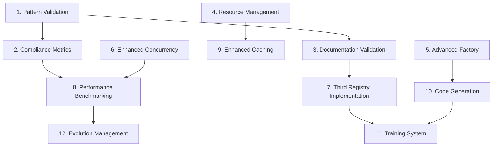

# Architectural Patterns - Implementation Tasks

## Overview

This document breaks down the implementation of enhanced architectural patterns for Freightliner into specific, actionable tasks that build upon the excellent existing pattern documentation and implementation to add validation, enhancement, and extensibility features.

## Task Breakdown

### Phase 1: Pattern Validation Infrastructure (High Priority)

- [ ] 1. **Create Pattern Validation Linting System**
  - Develop custom golangci-lint rules for architectural pattern enforcement
  - Implement composition pattern validation (prefer embedding over inheritance-like patterns)
  - Add interface segregation validation (detect overly large interfaces)
  - Create factory pattern validation (ensure proper factory function patterns)
  - _Leverage: Existing .golangci.yml configuration and Go AST analysis_
  - _Requirements: 1.1, 1.2, 1.3, Gap 1_

- [ ] 2. **Implement Pattern Compliance Metrics System**
  - Create pattern usage analytics and compliance scoring
  - Add trend analysis for architectural pattern adoption
  - Implement pattern violation tracking and reporting
  - Create pattern compliance dashboard for visibility
  - _Leverage: Existing codebase structure and pattern documentation_
  - _Requirements: Gap 1, Gap 4_

- [ ] 3. **Build Pattern Documentation Validation**
  - Create automated validation that code matches documented patterns
  - Add consistency checking between documentation and implementation
  - Implement pattern example validation and testing
  - Create pattern drift detection and alerting
  - _Leverage: Excellent existing pattern documentation in docs/_
  - _Requirements: 1.4, Gap 3_

### Phase 2: Enhanced Base Pattern Implementation (Medium Priority)

- [ ] 4. **Implement Enhanced Resource Management Patterns**
  - Create comprehensive ResourceManager for expensive resource lifecycle
  - Add automatic cleanup and resource pool patterns
  - Implement resource leak detection and prevention
  - Create resource usage monitoring and optimization
  - _Leverage: Existing base implementations and caching patterns_
  - _Requirements: Gap 6_

- [ ] 5. **Build Advanced Factory Pattern System**
  - Create validated factory pattern with comprehensive error handling
  - Implement pluggable provider registry for extensible factories
  - Add factory configuration validation and testing
  - Create template-based code generation for new factories
  - _Leverage: Existing factory patterns in client creation_
  - _Requirements: 3.1, 3.2, 3.3, Gap 8_

- [ ] 6. **Enhance Concurrency Pattern Implementation**
  - Create priority-based worker pool with advanced scheduling
  - Implement context-aware cancellation throughout all patterns
  - Add deadlock detection and prevention mechanisms
  - Create concurrency pattern performance monitoring
  - _Leverage: Existing WorkerPool and concurrency documentation_
  - _Requirements: 2.1, 2.2, 2.3, 2.4_

### Phase 3: Pattern Extension and Validation (Medium Priority)

- [ ] 7. **Create Third Registry Implementation for Pattern Validation**
  - Implement Docker Hub registry client using existing patterns
  - Validate that patterns scale to new registry types
  - Test interface segregation and factory extensibility
  - Document lessons learned and pattern improvements needed
  - _Leverage: Existing ECR/GCR client implementations and patterns_
  - _Requirements: Gap 5_

- [ ] 8. **Implement Pattern Performance Benchmarking**
  - Create comprehensive benchmarks for all architectural patterns
  - Add performance validation that patterns provide expected benefits
  - Implement pattern performance regression detection
  - Create pattern optimization recommendations based on benchmarks
  - _Leverage: Existing implementations and Go benchmarking tools_
  - _Requirements: Gap 2_

- [ ] 9. **Build Enhanced Caching Pattern System**
  - Implement LRU and time-based cache eviction strategies
  - Add cache performance monitoring and optimization
  - Create intelligent cache warming and preloading
  - Implement distributed caching patterns for future scaling
  - _Leverage: Existing caching implementations in base classes_
  - _Requirements: 6.1, 6.2, 6.3, 6.4_

### Phase 4: Developer Experience and Tooling (Lower Priority)

- [ ] 10. **Create Pattern Code Generation Tools**
  - Build template-based code generation for new registry clients
  - Create scaffolding tools for new repository implementations
  - Add interactive pattern selection and customization
  - Implement code generation validation and testing
  - _Leverage: Existing pattern documentation and implementations_
  - _Requirements: Gap 3_

- [ ] 11. **Implement Pattern Training and Examples System**
  - Create interactive pattern learning examples with validation
  - Build guided implementation tutorials for each major pattern
  - Add pattern best practices documentation with real examples
  - Create pattern anti-pattern detection and education
  - _Leverage: Comprehensive existing pattern documentation_
  - _Requirements: Gap 3_

- [ ] 12. **Build Pattern Evolution Management System**
  - Create formal process for proposing and reviewing pattern changes
  - Implement pattern versioning and migration strategies
  - Add backward compatibility validation for pattern changes
  - Create pattern impact analysis tools
  - _Leverage: Existing well-established patterns and documentation_
  - _Requirements: Gap 4_

## Task Dependencies



## Implementation Priority Guidelines

### Critical Foundation (Week 1-2)
- **Task 1**: Pattern Validation - Essential for maintaining architectural consistency
- **Task 2**: Compliance Metrics - Provides visibility into pattern adoption
- **Task 3**: Documentation Validation - Ensures documentation accuracy

### Core Enhancement (Week 3-5)
- **Task 4**: Resource Management - Critical for production stability
- **Task 5**: Advanced Factory - Supports future extensibility
- **Task 6**: Enhanced Concurrency - Important for performance and reliability

### Validation and Testing (Week 6-8)
- **Task 7**: Third Registry - Validates pattern extensibility
- **Task 8**: Performance Benchmarking - Confirms pattern benefits
- **Task 9**: Enhanced Caching - Optimizes system performance

### Developer Experience (Week 9+)
- **Task 10**: Code Generation - Improves developer productivity
- **Task 11**: Training System - Supports pattern adoption
- **Task 12**: Evolution Management - Enables future pattern evolution

## Detailed Task Specifications

### Task 1: Pattern Validation Linting System
```go
// pkg/internal/patterns/linter.go
package patterns

import (
    "go/ast"
    "go/parser"
    "go/token"
)

// CompositionRule validates composition over inheritance patterns
type CompositionRule struct{}

func (r *CompositionRule) Validate(file *ast.File) []ValidationIssue {
    var issues []ValidationIssue
    
    ast.Inspect(file, func(n ast.Node) bool {
        switch node := n.(type) {
        case *ast.StructType:
            // Check for embedded types (composition)
            hasEmbedding := false
            hasFields := false
            
            for _, field := range node.Fields.List {
                if len(field.Names) == 0 {
                    hasEmbedding = true
                } else {
                    hasFields = true
                }
            }
            
            // Flag structs that might benefit from composition
            if hasFields && !hasEmbedding {
                if r.mightBenefitFromComposition(node) {
                    issues = append(issues, ValidationIssue{
                        Type:    "composition",
                        Message: "Consider using composition (embedding) for shared functionality",
                        Line:    r.getLine(node),
                        Suggestion: "Embed base types instead of duplicating functionality",
                    })
                }
            }
        }
        return true
    })
    
    return issues
}

// InterfaceSegregationRule validates interface size
type InterfaceSegregationRule struct{}

func (r *InterfaceSegregationRule) Validate(file *ast.File) []ValidationIssue {
    var issues []ValidationIssue
    
    ast.Inspect(file, func(n ast.Node) bool {
        switch node := n.(type) {
        case *ast.InterfaceType:
            methodCount := len(node.Methods.List)
            if methodCount > 5 { // Configurable threshold
                issues = append(issues, ValidationIssue{
                    Type:    "interface_segregation",
                    Message: fmt.Sprintf("Interface has %d methods, consider splitting", methodCount),
                    Line:    r.getLine(node),
                    Suggestion: "Split large interfaces into smaller, focused interfaces",
                })
            }
        }
        return true
    })
    
    return issues
}
```

### Task 4: Enhanced Resource Management Implementation
```go
// pkg/client/common/resource_manager.go
package common

import (
    "context"
    "sync"
    "time"
)

// ResourceManager handles lifecycle of expensive resources
type ResourceManager struct {
    resources    map[string]*resourceEntry
    mu           sync.RWMutex
    cleanupInterval time.Duration
    maxIdleTime     time.Duration
    ticker          *time.Ticker
    done            chan struct{}
}

type resourceEntry struct {
    resource Resource
    lastUsed time.Time
    useCount int64
}

type Resource interface {
    Close() error
    IsHealthy() bool
    LastUsed() time.Time
}

func NewResourceManager(cleanupInterval, maxIdleTime time.Duration) *ResourceManager {
    rm := &ResourceManager{
        resources:       make(map[string]*resourceEntry),
        cleanupInterval: cleanupInterval,
        maxIdleTime:     maxIdleTime,
        ticker:          time.NewTicker(cleanupInterval),
        done:            make(chan struct{}),
    }
    
    go rm.cleanupLoop()
    return rm
}

func (rm *ResourceManager) GetOrCreate(key string, factory func() (Resource, error)) (Resource, error) {
    // Fast path: check if resource exists and is healthy
    rm.mu.RLock()
    if entry, exists := rm.resources[key]; exists {
        if entry.resource.IsHealthy() {
            entry.lastUsed = time.Now()
            entry.useCount++
            rm.mu.RUnlock()
            return entry.resource, nil
        }
    }
    rm.mu.RUnlock()
    
    // Slow path: create new resource
    rm.mu.Lock()
    defer rm.mu.Unlock()
    
    // Double-check after acquiring write lock
    if entry, exists := rm.resources[key]; exists && entry.resource.IsHealthy() {
        entry.lastUsed = time.Now()
        entry.useCount++
        return entry.resource, nil
    }
    
    // Create new resource
    resource, err := factory()
    if err != nil {
        return nil, err
    }
    
    // Clean up old resource if it exists
    if entry, exists := rm.resources[key]; exists {
        entry.resource.Close()
    }
    
    // Store new resource
    rm.resources[key] = &resourceEntry{
        resource: resource,
        lastUsed: time.Now(),
        useCount: 1,
    }
    
    return resource, nil
}

func (rm *ResourceManager) cleanupLoop() {
    for {
        select {
        case <-rm.ticker.C:
            rm.cleanupExpired()
        case <-rm.done:
            return
        }
    }
}

func (rm *ResourceManager) cleanupExpired() {
    rm.mu.Lock()
    defer rm.mu.Unlock()
    
    now := time.Now()
    for key, entry := range rm.resources {
        if now.Sub(entry.lastUsed) > rm.maxIdleTime {
            entry.resource.Close()
            delete(rm.resources, key)
        }
    }
}
```

### Task 6: Enhanced Concurrency Pattern Implementation
```go
// pkg/replication/priority_worker_pool.go
package replication

import (
    "context"
    "runtime"
    "sync"
    "time"
)

// PriorityWorkerPool provides context-aware parallel processing with priority queues
type PriorityWorkerPool struct {
    ctx          context.Context
    cancel       context.CancelFunc
    
    highPriority chan Job
    normalPriority chan Job
    lowPriority  chan Job
    results      chan Result
    
    workers      int
    wg           sync.WaitGroup
    
    metrics      *WorkerPoolMetrics
    mu           sync.RWMutex
}

type JobPriority int

const (
    PriorityHigh JobPriority = iota
    PriorityNormal
    PriorityLow
)

type Job struct {
    ID       string
    Priority JobPriority
    Func     func(context.Context) error
    Timeout  time.Duration
    Metadata map[string]interface{}
}

type WorkerPoolMetrics struct {
    JobsQueued      map[JobPriority]int64
    JobsProcessed   int64
    JobsFailed      int64
    AverageExecTime time.Duration
    WorkerUtilization float64
    QueueDepth      map[JobPriority]int
}

func NewPriorityWorkerPool(ctx context.Context, workers int) *PriorityWorkerPool {
    if workers <= 0 {
        workers = runtime.GOMAXPROCS(0)
    }
    
    poolCtx, cancel := context.WithCancel(ctx)
    
    return &PriorityWorkerPool{
        ctx:            poolCtx,
        cancel:         cancel,
        highPriority:   make(chan Job, workers*2),
        normalPriority: make(chan Job, workers*5),
        lowPriority:    make(chan Job, workers*10),
        results:        make(chan Result, workers*2),
        workers:        workers,
        metrics: &WorkerPoolMetrics{
            JobsQueued: make(map[JobPriority]int64),
            QueueDepth: make(map[JobPriority]int),
        },
    }
}

func (p *PriorityWorkerPool) Start() {
    for i := 0; i < p.workers; i++ {
        p.wg.Add(1)
        go p.worker(fmt.Sprintf("worker-%d", i))
    }
    
    // Start metrics collector
    go p.metricsCollector()
}

func (p *PriorityWorkerPool) worker(name string) {
    defer p.wg.Done()
    
    for {
        select {
        case <-p.ctx.Done():
            return
            
        case job := <-p.highPriority:
            p.processJob(job, name)
            
        case job := <-p.normalPriority:
            // Check for high priority jobs first
            select {
            case highJob := <-p.highPriority:
                p.processJob(highJob, name)
                // Put normal job back
                select {
                case p.normalPriority <- job:
                case <-p.ctx.Done():
                    return
                }
            default:
                p.processJob(job, name)
            }
            
        case job := <-p.lowPriority:
            // Check for higher priority jobs first
            select {
            case highJob := <-p.highPriority:
                p.processJob(highJob, name)
                // Put low job back
                select {
                case p.lowPriority <- job:
                case <-p.ctx.Done():
                    return
                }
            case normalJob := <-p.normalPriority:
                p.processJob(normalJob, name)
                // Put low job back
                select {
                case p.lowPriority <- job:
                case <-p.ctx.Done():
                    return
                }
            default:
                p.processJob(job, name)
            }
        }
    }
}
```

## Success Criteria

### Pattern Compliance Metrics
- **Composition Usage**: 90%+ of client implementations use composition patterns
- **Interface Segregation**: 95%+ of interfaces have ≤5 methods
- **Factory Pattern Usage**: 100% of client creation uses factory patterns
- **Concurrency Safety**: Zero race conditions detected in pattern implementations

### Performance Validation
- **Resource Management**: 50%+ reduction in resource leak incidents
- **Caching Efficiency**: 80%+ cache hit rate for frequently accessed resources
- **Concurrency Performance**: 40%+ improvement in parallel processing throughput
- **Pattern Overhead**: <5% performance overhead for pattern abstractions

### Developer Experience Metrics
- **Pattern Adoption**: 90%+ of new code follows established patterns
- **Development Speed**: 30%+ faster implementation of new registry types
- **Code Generation Usage**: 80%+ of new components use generated scaffolding
- **Pattern Understanding**: 95%+ developer satisfaction with pattern documentation

## Resource Requirements

### Technical Skills Needed
- **Go AST Analysis**: For custom linter development
- **Performance Benchmarking**: For pattern performance validation
- **Concurrency Patterns**: For advanced parallel processing implementations
- **Code Generation**: For template-based tooling development

### Tools and Infrastructure
- **Custom Linters**: Integration with existing golangci-lint setup
- **Benchmarking Suite**: Go benchmarking tools and infrastructure
- **Pattern Dashboard**: Web-based metrics visualization
- **Code Generation Tools**: Template engines and validation frameworks

### Time Estimates
- **Phase 1 (Validation)**: 3 weeks, 1-2 developers
- **Phase 2 (Enhancement)**: 4 weeks, 1-2 developers  
- **Phase 3 (Extension)**: 4 weeks, 1 developer
- **Phase 4 (Tooling)**: 3 weeks, 1 developer

**Total Effort**: 14 weeks, 1-2 developers (some parallelization possible)

## Risk Mitigation

### Technical Risks
- **Pattern Complexity**: Balance between flexibility and simplicity
- **Performance Impact**: Careful benchmarking of pattern abstractions
- **Backward Compatibility**: Ensure pattern enhancements don't break existing code

### Adoption Risks
- **Learning Curve**: Comprehensive documentation and training materials
- **Pattern Overengineering**: Focus on proven patterns with clear benefits
- **Maintenance Overhead**: Design patterns for minimal ongoing maintenance

### Mitigation Strategies
- **Incremental Implementation**: Roll out pattern enhancements gradually
- **Comprehensive Testing**: Extensive testing of all pattern implementations
- **Community Involvement**: Get team input on pattern designs and priorities
- **Documentation First**: Document patterns before implementing complex features
- **Performance Monitoring**: Continuous monitoring of pattern performance impact