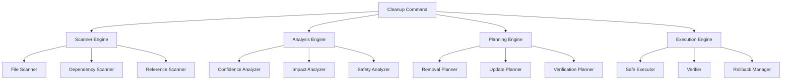

# Cleanup Command - Technical Design

## Architecture Overview

The cleanup system follows a modular, safe-by-default architecture that separates analysis, planning, and execution phases to ensure reliable codebase maintenance.

### Core Components



## Scanner Engine

### File Scanner
**Purpose**: Discover all files and directories in the codebase for analysis.

**Implementation**:
```bash
# Core scanning logic
find . -type f \( -name "*.go" -o -name "*.md" -o -name "*.yml" -o -name "*.yaml" -o -name "*.json" \) \
    -not -path "./.git/*" \
    -not -path "./vendor/*" \
    -not -path "./node_modules/*"
```

**Categories Identified**:
- **Source Files**: .go, .py, .js, .ts files
- **Configuration Files**: .yml, .yaml, .json, .toml, .ini files  
- **Documentation Files**: .md, .rst, .txt files
- **Build Artifacts**: binaries, compiled objects, generated files
- **Empty Directories**: Directories with no files

### Dependency Scanner
**Purpose**: Analyze import statements and file dependencies.

**Go Dependency Analysis**:
```bash
# Find all imports in Go files
grep -r "import" --include="*.go" . | \
    sed 's/.*import \([^"]*\)"\([^"]*\)".*/\2/' | \
    sort | uniq
```

**Reference Tracking**:
- Parse go.mod for declared dependencies
- Scan all .go files for actual import statements
- Cross-reference to identify unused dependencies

### Reference Scanner
**Purpose**: Track file references across documentation and configuration.

**Implementation Strategy**:
```bash
# Find references to specific files
find . -type f \( -name "*.md" -o -name "*.yml" -o -name "*.yaml" \) \
    -exec grep -l "filename" {} \;
```

## Analysis Engine

### Confidence Analyzer
**Purpose**: Assign confidence levels for safe removal decisions.

**Confidence Levels**:

| Level | Criteria | Examples |
|-------|----------|----------|
| **High** | No references, clearly obsolete | Empty directories, build artifacts, disabled scripts |
| **Medium** | Limited references, likely obsolete | Historical docs, superseded configs |
| **Low** | Some references, uncertain usage | Example configs, potential user documentation |

**Analysis Rules**:
```yaml
high_confidence:
  - empty_directories: true
  - build_artifacts_in_vcs: true
  - commented_out_scripts: true
  - superseded_configs: true

medium_confidence:
  - historical_documentation: true
  - unused_test_fixtures: true
  - redundant_examples: true

low_confidence:
  - referenced_but_unused: true
  - user_facing_examples: true
  - legacy_compatibility: true
```

### Impact Analyzer
**Purpose**: Assess potential impact of file removal.

**Impact Categories**:
- **Build Impact**: Files affecting compilation or build process
- **Test Impact**: Files affecting test execution
- **Runtime Impact**: Files affecting application functionality
- **Documentation Impact**: Files affecting user or developer documentation

### Safety Analyzer
**Purpose**: Identify safety constraints and verification requirements.

**Safety Checks**:
- **Git Status**: Ensure no uncommitted changes to files being removed
- **Branch Analysis**: Check if files are modified in other branches
- **Dependency Chain**: Verify no hidden dependencies exist
- **Backup Verification**: Ensure all changes are tracked in version control

## Planning Engine

### Removal Planner
**Purpose**: Create safe execution plan for file removal.

**Planning Phases**:
1. **High Confidence Phase**: Remove obviously dead code
2. **Medium Confidence Phase**: Remove likely obsolete files (with confirmation)
3. **Low Confidence Phase**: Flag for manual review

**Execution Order**:
```yaml
execution_phases:
  phase_1:
    name: "Build Artifacts"
    confidence: high
    verification: build_test
    
  phase_2:
    name: "Empty Directories"
    confidence: high
    verification: structure_check
    
  phase_3:
    name: "Disabled Scripts"
    confidence: high
    verification: makefile_check
    
  phase_4:
    name: "Historical Documentation"
    confidence: medium
    verification: reference_check
```

### Update Planner
**Purpose**: Plan updates to references after file removal.

**Update Types**:
- **Documentation Updates**: Fix broken references in .md files
- **Configuration Updates**: Update config files pointing to removed files
- **Script Updates**: Modify build scripts and Makefiles

### Verification Planner
**Purpose**: Define verification steps for each cleanup phase.

**Verification Steps**:
```bash
# Build verification
make build && echo "✅ Build successful" || echo "❌ Build failed"

# Test verification  
make test-ci && echo "✅ Tests passed" || echo "❌ Tests failed"

# Lint verification
make lint && echo "✅ Linting passed" || echo "❌ Linting failed"
```

## Execution Engine

### Safe Executor
**Purpose**: Execute cleanup operations with built-in safety mechanisms.

**Execution Pattern**:
```bash
# For each cleanup phase
for phase in "${cleanup_phases[@]}"; do
    echo "Starting phase: $phase"
    
    # Create checkpoint
    git add . && git commit -m "Checkpoint before $phase cleanup"
    
    # Execute cleanup
    execute_phase "$phase"
    
    # Verify functionality
    if ! verify_phase "$phase"; then
        echo "Verification failed, rolling back..."
        git reset --hard HEAD~1
        exit 1
    fi
    
    echo "Phase $phase completed successfully"
done
```

### Verifier
**Purpose**: Verify system functionality after each cleanup operation.

**Verification Matrix**:
| Phase | Build Check | Test Check | Lint Check | Structure Check |
|-------|-------------|------------|------------|-----------------|
| Build Artifacts | ✅ | ✅ | ✅ | ❌ |
| Empty Directories | ✅ | ✅ | ❌ | ✅ |
| Configuration | ✅ | ✅ | ✅ | ✅ |
| Documentation | ❌ | ❌ | ❌ | ✅ |

### Rollback Manager
**Purpose**: Provide immediate rollback capability for any failed operation.

**Rollback Strategy**:
- **Git-based Rollback**: Use git commits as checkpoints
- **Incremental Rollback**: Roll back only the failed phase
- **Full Rollback**: Option to revert entire cleanup operation

## Command Interface Design

### CLI Structure
```bash
# Main cleanup command
/cleanup <subcommand> [options]

# Subcommands
/cleanup scan                    # Scan and analyze codebase
/cleanup plan [--confidence=high] # Create cleanup execution plan  
/cleanup execute [--dry-run]    # Execute cleanup operations
/cleanup status                 # Show cleanup status and history
/cleanup rollback [--steps=1]   # Rollback cleanup operations
```

### Configuration File
```yaml
# .claude/cleanup-config.yml
cleanup:
  confidence_threshold: high    # Only process high confidence by default
  verification_required: true   # Require verification after each phase
  backup_before_cleanup: true   # Create git commits as checkpoints
  
  excluded_patterns:
    - "examples/*"              # Never remove example files
    - "docs/README.md"          # Never remove main documentation
    
  build_verification:
    commands:
      - "make build"
      - "make test-ci"
      - "make lint"
      
  categories:
    build_artifacts:
      enabled: true
      patterns: ["bin/*", "*.exe", "*.so", "*.dylib"]
      
    empty_directories:
      enabled: true
      min_age_days: 7           # Only remove directories empty for 7+ days
      
    historical_docs:
      enabled: false            # Require manual confirmation
      patterns: ["*ANALYSIS*.md", "*OVERHAUL*.md"]
```

## Integration Points

### Version Control Integration
- **Git Hooks**: Optional pre-commit hook to prevent committing build artifacts
- **Branch Awareness**: Avoid cleaning files modified in feature branches
- **History Analysis**: Use git log to identify long-unused files

### Build System Integration
- **Makefile Parsing**: Understand build dependencies and targets
- **Go Module Integration**: Sync with `go mod tidy` for dependency cleanup
- **CI Integration**: Ensure cleanup doesn't break existing workflows

### Documentation Integration
- **Cross-Reference Tracking**: Maintain map of all file references
- **Automatic Updates**: Update documentation when files are removed
- **Broken Link Detection**: Identify and fix broken internal links

This design provides a robust, safe, and automated approach to codebase maintenance while preserving all functionality and maintaining developer confidence through comprehensive verification and rollback capabilities.