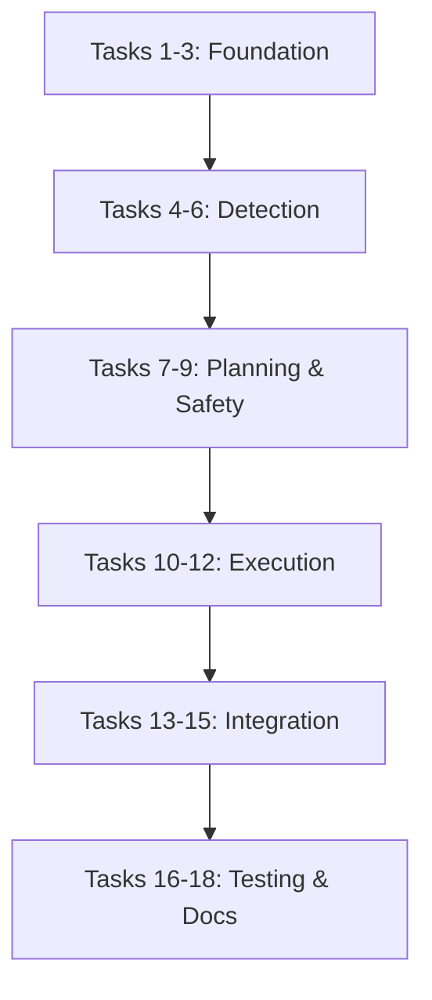

# Cleanup Command - Implementation Tasks

## Task Breakdown

### Phase 1: Core Infrastructure

- [ ] 1. Create cleanup command structure
  - Create `/cleanup` slash command entry point
  - Set up command argument parsing and validation
  - Implement help and usage documentation
  - Establish error handling and logging framework
  - _Leverage: existing CLI patterns from test-manifest command_
  - _Requirements: US-1.1, US-2.1_

- [ ] 2. Implement scanner engine foundation
  - Create file system scanner with configurable patterns
  - Implement directory traversal with exclusion support
  - Add file classification system (source, config, docs, artifacts)
  - Create reference tracking database for cross-file dependencies
  - _Leverage: find command patterns from codebase analysis_
  - _Requirements: US-1.1, US-1.2_

- [ ] 3. Build confidence analysis system
  - Implement confidence level calculation algorithms
  - Create rule-based classification engine
  - Add usage pattern analysis for files and directories
  - Establish confidence thresholds and safety margins
  - _Leverage: existing analysis patterns from manifest system_
  - _Requirements: US-1.3, US-1.4_

### Phase 2: Analysis and Detection

- [ ] 4. Implement dead code detection
  - Create Go import analysis for unused dependencies
  - Add file reference scanning across all documentation
  - Implement empty directory detection with age tracking
  - Build cross-reference validation system
  - _Leverage: grep patterns and find commands from cleanup analysis_
  - _Requirements: US-1.1, US-1.2_

- [ ] 5. Build artifact identification system
  - Create patterns for common build artifacts (binaries, objects)
  - Implement git status integration to identify uncommitted artifacts
  - Add build command parsing to understand generation process
  - Create artifact validation and regeneration verification
  - _Leverage: Makefile analysis and build system understanding_
  - _Requirements: US-3.1, US-3.2, US-3.3_

- [ ] 6. Configuration redundancy detection
  - Implement configuration file parsing and comparison
  - Create conflict detection for overlapping configurations
  - Add superseded configuration identification
  - Build canonical configuration recommendation system
  - _Leverage: YAML/JSON parsing patterns from existing configs_
  - _Requirements: US-4.1, US-4.2, US-4.3_

### Phase 3: Planning and Safety

- [ ] 7. Create cleanup execution planner
  - Design phase-based execution workflow
  - Implement dependency-aware cleanup ordering
  - Add verification step planning for each cleanup phase
  - Create rollback checkpoint planning
  - _Leverage: test execution patterns from manifest system_
  - _Requirements: US-2.1, US-2.2, US-2.3_

- [ ] 8. Implement safety verification system
  - Create build verification integration (make build, make test)
  - Add git integration for checkpoint creation and rollback
  - Implement functionality verification after each cleanup phase
  - Build rollback automation for failed operations
  - _Leverage: existing make targets and git workflow patterns_
  - _Requirements: US-2.2, US-2.3, US-2.4_

- [ ] 9. Build documentation reference updater
  - Create cross-reference tracking system for all documentation
  - Implement automatic reference updating after file removal
  - Add broken link detection and repair suggestions
  - Build documentation consistency validation
  - _Leverage: grep and sed patterns from reference cleanup_
  - _Requirements: US-5.1, US-5.2, US-5.3_

### Phase 4: Execution Engine

- [ ] 10. Implement safe execution engine
  - Create incremental cleanup execution with checkpoints
  - Add real-time verification between cleanup phases
  - Implement automatic rollback on verification failure
  - Build progress reporting and status tracking
  - _Leverage: execution patterns from CI workflows_
  - _Requirements: US-2.1, US-2.2, US-2.3_

- [ ] 11. Add interactive confirmation system
  - Create user confirmation prompts for medium/low confidence items
  - Implement dry-run mode for preview without execution
  - Add selective cleanup execution (by category or confidence)
  - Build cleanup summary and impact reporting
  - _Leverage: interactive patterns from existing tools_
  - _Requirements: US-2.4, US-5.4_

- [ ] 12. Build comprehensive reporting system
  - Create detailed cleanup reports with before/after analysis
  - Implement categorized findings with confidence levels
  - Add impact analysis and verification results
  - Build cleanup history tracking and audit trail
  - _Leverage: reporting patterns from test manifest system_
  - _Requirements: US-1.2, US-5.1_

### Phase 5: Integration and Polish

- [ ] 13. Integrate with version control systems
  - Add git integration for change tracking and history analysis
  - Implement branch awareness to avoid cross-branch conflicts
  - Create automatic commit generation with descriptive messages
  - Build merge conflict prevention for cleanup operations
  - _Leverage: existing git workflow patterns_
  - _Requirements: Integration Requirements - Version Control_

- [ ] 14. Add build system integration
  - Parse Makefiles to understand build dependencies
  - Integrate with go mod tidy for dependency cleanup
  - Add CI/CD compatibility verification
  - Create build artifact lifecycle management
  - _Leverage: existing Makefile patterns and build understanding_
  - _Requirements: Integration Requirements - Build System_

- [ ] 15. Create configuration and customization system
  - Implement .claude/cleanup-config.yml configuration file
  - Add exclusion patterns and custom rules support
  - Create confidence threshold customization
  - Build plugin architecture for custom cleanup rules
  - _Leverage: configuration patterns from test manifest system_
  - _Requirements: Non-functional Requirements - Usability_

### Phase 6: Testing and Documentation

- [ ] 16. Build comprehensive test suite
  - Create unit tests for all scanner and analysis components
  - Add integration tests for complete cleanup workflows
  - Implement safety verification tests with rollback scenarios
  - Build performance tests for large codebase scanning
  - _Leverage: existing test patterns and manifest system_
  - _Requirements: Non-functional Requirements - Performance, Safety_

- [ ] 17. Create user documentation and examples
  - Write comprehensive cleanup command documentation
  - Create usage examples for common cleanup scenarios
  - Add troubleshooting guide for common issues
  - Build best practices guide for cleanup methodology
  - _Leverage: existing documentation patterns_
  - _Requirements: US-5.1, Integration Requirements - Documentation_

- [ ] 18. Add monitoring and metrics
  - Implement cleanup operation metrics collection
  - Create performance monitoring for scan operations  
  - Add success/failure rate tracking
  - Build cleanup impact analysis and reporting
  - _Leverage: metrics patterns from existing monitoring_
  - _Requirements: Non-functional Requirements - Performance_

## Implementation Priority

### High Priority (MVP)
- Tasks 1-8: Core scanning, analysis, and safety infrastructure
- Essential for basic cleanup functionality with safety guarantees

### Medium Priority (Enhancement)
- Tasks 9-15: Advanced features, integration, and user experience
- Improves usability and provides comprehensive cleanup capabilities

### Low Priority (Polish)
- Tasks 16-18: Testing, documentation, and monitoring
- Ensures production readiness and long-term maintainability

## Validation Criteria

Each task must meet these criteria for completion:
- [ ] **Functionality**: Core feature works as specified
- [ ] **Safety**: Cannot break existing functionality
- [ ] **Testing**: Adequate test coverage for the component
- [ ] **Documentation**: Clear usage and API documentation
- [ ] **Integration**: Works seamlessly with existing systems

## Dependencies and Sequencing

This implementation plan provides a comprehensive, phased approach to building a robust cleanup system that maintains the safety and reliability standards established in the freightliner project.