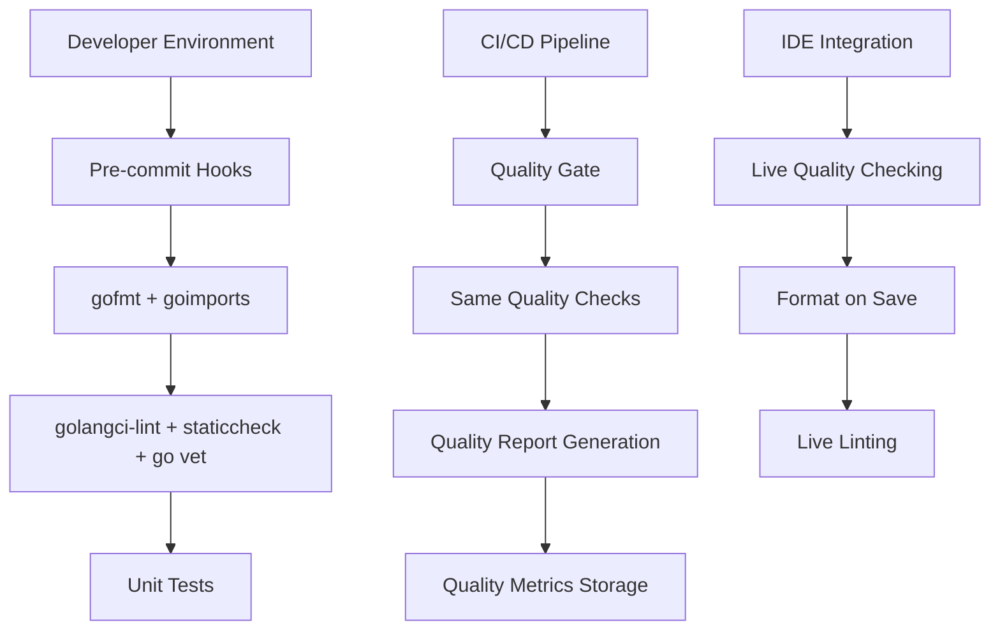
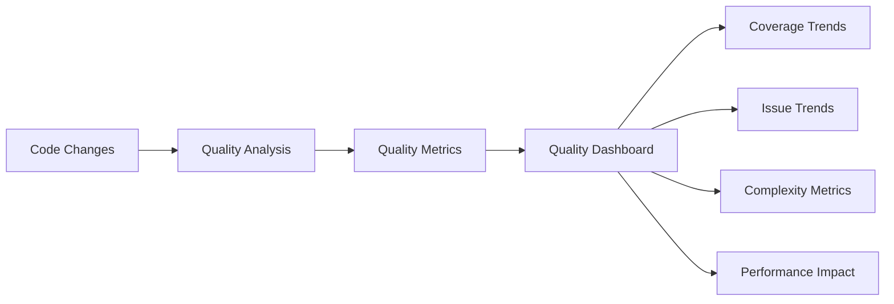

# Code Quality Standards - Design

## Overview

This design addresses the comprehensive code quality standards system for Freightliner, building upon the existing excellent documentation and partial implementation. The system will provide automated, consistent, and comprehensive code quality enforcement across all development environments.

## Current Infrastructure Analysis

### Existing Assets
- **Configuration Files**: `.golangci.yml` with 25+ linters, `staticcheck.conf` with project-specific settings
- **Automation Scripts**: `lint.sh`, `organize_imports.sh`, `vet.sh`, `staticcheck.sh`, `pre-commit`
- **Make Targets**: Comprehensive Makefile with integrated quality workflow
- **Documentation**: Extensive guides for all quality tools and standards

### Implementation Status
✅ **Complete**: Tool configuration, basic automation scripts, comprehensive documentation
🟡 **Partial**: CI integration (documented but status unclear), IDE adoption validation
❌ **Missing**: Quality metrics, exception management process, environment validation

## System Architecture

### 1. Quality Pipeline Architecture



### 2. Tool Integration Design

#### Core Quality Tools Stack
```yaml
Quality Tools:
  Formatting:
    - gofmt: Standard Go formatting
    - goimports: Import organization with local prefix "freightliner"
  
  Static Analysis:
    - golangci-lint: 25+ linters with project configuration
    - staticcheck: Advanced static analysis with custom config
    - go vet: Suspicious construct detection with shadow checking
  
  Additional Checks:
    - Unit tests with coverage reporting
    - Build validation
    - Documentation consistency checking (future)
```

#### Configuration Management
```yaml
Configuration Files:
  .golangci.yml:
    purpose: Comprehensive linter configuration
    linters: 25+ enabled (bodyclose, deadcode, dupl, errcheck, etc.)
    exclusions: Test files, generated code patterns
    
  staticcheck.conf:
    purpose: Advanced static analysis configuration
    checks: ["all"] with specific disables
    initialisms: Project-specific acronyms (AWS, ECR, GCR, etc.)
    
  Makefile:
    purpose: Development workflow automation
    targets: build, test, lint, fmt, imports, vet, staticcheck, check
```

## Component Design

### 1. Automated Quality Enforcement

#### Pre-commit Hook Enhancement
```bash
#!/bin/bash
# Enhanced pre-commit hook with comprehensive checking

# Input validation
validate_environment() {
    check_required_tools
    validate_git_staged_files
    check_tool_versions
}

# Quality pipeline
run_quality_pipeline() {
    format_staged_files
    organize_imports
    run_static_analysis
    run_tests_on_affected_code
    generate_quality_report
}

# Error handling with suggestions
handle_failures() {
    provide_fix_suggestions
    generate_quality_diff
    offer_exception_process
}
```

#### CI/CD Integration Design
```yaml
GitHub Actions Workflow:
  Quality Check Job:
    runs-on: ubuntu-latest
    steps:
      - uses: actions/checkout@v3
      - uses: actions/setup-go@v3
      - name: Install quality tools
        run: make setup
      - name: Run quality checks
        run: make check
      - name: Generate quality report
        run: ./scripts/generate_quality_report.sh
      - name: Upload quality metrics
        if: always()
        uses: actions/upload-artifact@v3
```

### 2. IDE Integration System

#### VS Code Configuration
```json
{
  "go.formatTool": "goimports",
  "go.formatFlags": ["-local", "freightliner"],
  "go.lintTool": "golangci-lint",
  "go.lintFlags": ["--fast"],
  "go.vetFlags": ["-vettool=$(which shadow)"],
  "editor.formatOnSave": true,
  "editor.codeActionsOnSave": {
    "source.organizeImports": true
  },
  "go.buildOnSave": "workspace",
  "go.lintOnSave": "workspace"
}
```

#### GoLand Integration
```xml
<!-- File Watcher Configuration -->
<fileWatcher>
  <option name="name" value="goimports" />
  <option name="program" value="goimports" />
  <option name="arguments" value="-w -local freightliner $FileDir$/$FileName$" />
  <option name="workingDir" value="$ProjectFileDir$" />
</fileWatcher>
```

### 3. Quality Metrics and Reporting

#### Quality Dashboard Design


#### Metrics Collection
```go
type QualityMetrics struct {
    Timestamp        time.Time
    LinterIssues     map[string]int
    TestCoverage     float64
    CyclomaticComplexity int
    TechnicalDebt    time.Duration
    FilesAnalyzed    int
    IssuesFixed      int
    NewIssues        int
}
```

### 4. Exception Management System

#### Exception Request Process
```yaml
Exception Process:
  1. Developer identifies need for quality check exception
  2. Documents justification in code comment
  3. Uses structured nolint comment with reference
  4. Exception tracked in central registry
  5. Periodic review of all exceptions
  
Exception Format:
  //nolint:linter_name // JIRA-123: Justification for exception
  //lint:ignore SA4006 // Legacy API compatibility required
```

## Implementation Strategy

### Phase 1: Foundation Strengthening (Week 1-2)
1. **CI/CD Integration**
   - Implement GitHub Actions workflow with all quality checks
   - Ensure same tool versions and configurations as local environment
   - Set up quality gates that block merges on failures

2. **Environment Validation**
   - Create validation script that checks complete developer setup
   - Implement version checking for all quality tools
   - Add validation to `make setup` target

### Phase 2: Enhanced Automation (Week 3-4)
1. **Quality Metrics Implementation**
   - Create quality metrics collection system
   - Implement quality dashboard for trend tracking
   - Set up automated quality reporting

2. **IDE Integration Validation**
   - Create setup automation for each supported IDE
   - Validate configurations work consistently
   - Document exact setup steps with verification

### Phase 3: Advanced Features (Week 5-6)
1. **Exception Management**
   - Implement structured exception tracking
   - Create exception review process
   - Build exception analytics and reporting

2. **Performance Optimization**
   - Implement incremental quality checking
   - Optimize quality check performance
   - Add parallel execution where safe

## Error Handling and Recovery

### Failure Scenarios and Responses
```yaml
Failure Scenarios:
  Tool Installation Failure:
    response: Automatic retry with fallback installation methods
    
  Configuration Inconsistency:
    response: Configuration validation and automatic sync
    
  CI/CD Quality Gate Failure:
    response: Detailed error reporting with fix suggestions
    
  IDE Integration Issues:
    response: Environment validation with setup guidance
```

### Quality Check Failure Response
```bash
# Enhanced error reporting
generate_quality_report() {
    echo "Quality Check Results:"
    echo "====================="
    
    if [[ $LINT_ISSUES -gt 0 ]]; then
        echo "❌ Linting Issues: $LINT_ISSUES"
        echo "Fix suggestions: ./scripts/fix_suggestions.sh lint"
    fi
    
    if [[ $FORMAT_ISSUES -gt 0 ]]; then
        echo "❌ Formatting Issues: $FORMAT_ISSUES"
        echo "Auto-fix: make fmt imports"
    fi
    
    generate_diff_report
    suggest_next_steps
}
```

## Validation and Testing

### Quality System Validation
1. **Tool Version Consistency**: Validate same tool versions across all environments
2. **Configuration Synchronization**: Ensure all environments use identical configurations
3. **IDE Integration Testing**: Validate setup works across VS Code, GoLand, and Vim
4. **CI/CD Pipeline Testing**: Verify quality gates work correctly
5. **Performance Impact**: Measure quality check performance impact on development workflow

### Success Metrics
- **Developer Satisfaction**: Survey on quality tool integration satisfaction
- **Code Quality Trends**: Track quality metrics over time
- **Setup Success Rate**: Percentage of successful new developer environment setups
- **Exception Rate**: Track and trend quality check exceptions

## Benefits and Value Proposition

### For Developers
- **Consistent Environment**: Same quality standards regardless of IDE or OS
- **Fast Feedback**: Quality issues caught immediately in IDE and pre-commit
- **Automated Fixes**: Many quality issues fixed automatically
- **Clear Guidance**: Specific fix suggestions for remaining issues

### For Team Leads
- **Quality Visibility**: Dashboard showing quality trends and metrics
- **Process Automation**: Quality standards enforced automatically
- **Risk Reduction**: Catch issues before they reach production
- **Developer Productivity**: Reduce time spent on manual quality checking

### For Project Maintenance
- **Consistent Codebase**: All code follows same standards
- **Reduced Technical Debt**: Continuous quality improvement
- **Easier Code Reviews**: Focus on logic rather than style
- **Better Documentation**: Quality standards clearly documented and enforced