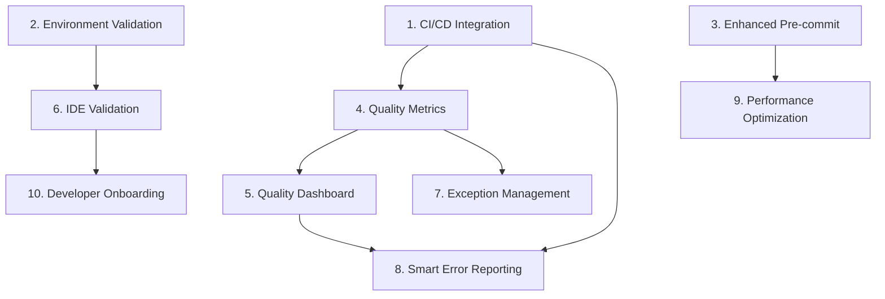

# Code Quality Standards - Implementation Tasks

## Overview

This document breaks down the implementation of comprehensive code quality standards for Freightliner into specific, actionable tasks that build upon the existing excellent foundation of documentation and partial automation.

## Task Breakdown

### Recently Completed (2025-01-26)

- [x] **C1** Fix variable shadowing issues in codebase
  - Resolved all variable shadowing errors detected by `go vet -vettool=$(which shadow)`
  - Fixed 18+ shadowing issues across 8 different packages
  - Improved code quality and eliminated potential bugs from variable confusion
  - Enhanced shell script error handling in `scripts/vet.sh`
  - **Status**: ✅ COMPLETED - All `make vet` checks now pass
  - _Impact: Foundational code quality improvement enabling reliable automated quality checks_

### Phase 1: Foundation Enhancement (High Priority)

- [ ] 1. **Implement Comprehensive CI/CD Integration**
  - Create GitHub Actions workflow that runs all quality checks
  - Ensure identical tool versions and configurations between local and CI
  - Set up quality gates that block pull request merges on failures
  - Add artifact collection for quality reports and metrics
  - _Leverage: Existing .golangci.yml, staticcheck.conf, Make targets_
  - _Requirements: 1.1, 1.4_

- [ ] 2. **Create Environment Validation System**
  - Develop comprehensive environment validation script
  - Add tool version checking and validation
  - Integrate validation into `make setup` target
  - Create validation reporting with actionable fix suggestions
  - _Leverage: Existing setup automation in Makefile_
  - _Requirements: 1.3, 4.1, 4.2_

- [ ] 3. **Enhance Pre-commit Hook System**
  - Improve pre-commit hooks with better error reporting
  - Add fix suggestions and automated remediation where possible
  - Implement incremental checking on staged files only
  - Create pre-commit hook validation and installation verification
  - _Leverage: Existing scripts/pre-commit hook_
  - _Requirements: 1.1, 1.2_

### Phase 2: Quality Metrics and Reporting (Medium Priority)

- [ ] 4. **Implement Quality Metrics Collection**
  - Create quality metrics collection system
  - Track linter issues, test coverage, and complexity trends over time
  - Implement quality score calculation and trending
  - Add performance metrics for quality check execution time
  - _Leverage: Existing tool outputs and configurations_
  - _Requirements: Gap 3_

- [ ] 5. **Build Quality Dashboard and Reporting**
  - Create web-based quality dashboard showing trends and metrics
  - Implement automated quality report generation
  - Add quality regression detection and alerting
  - Create team-level quality scorecards and comparisons
  - _Leverage: Quality metrics from task 4_
  - _Requirements: Gap 3_

- [ ] 6. **Create IDE Configuration Validation**
  - Develop automated IDE setup validation for VS Code, GoLand, and Vim
  - Create IDE configuration templates and setup automation
  - Add validation scripts to confirm IDE integration works correctly
  - Document exact configuration steps with verification procedures
  - _Leverage: Existing IDE configuration documentation_
  - _Requirements: 4.1, 4.2, 4.3, 4.4, Gap 2_

### Phase 3: Advanced Quality Features (Lower Priority)

- [ ] 7. **Implement Quality Exception Management System**
  - Create structured process for documenting quality check exceptions
  - Implement exception tracking and reporting system
  - Add periodic review process for existing exceptions
  - Create exception analytics to identify patterns and improvement opportunities
  - _Leverage: Existing nolint patterns in documentation_
  - _Requirements: Gap 4_

- [ ] 8. **Develop Smart Error Reporting System**
  - Enhance error messages with specific fix suggestions
  - Add links to relevant documentation for each type of issue
  - Implement context-aware help based on specific linter violations
  - Create interactive fix suggestion system where possible
  - _Leverage: Existing linter configurations and documentation_
  - _Requirements: 1.4, Gap 6_

- [ ] 9. **Create Performance-Optimized Quality Checking**
  - Implement parallel execution of independent quality checks
  - Add incremental quality checking for faster local development
  - Create intelligent caching of quality check results
  - Optimize quality check performance for large codebases
  - _Leverage: Existing Make targets and scripts_
  - _Requirements: Gap 7_

### Phase 4: New Developer Experience (Lower Priority)

- [ ] 10. **Build New Developer Onboarding Automation**
  - Create comprehensive new developer setup script
  - Add setup validation that confirms entire development environment
  - Implement guided setup with interactive prompts and validation
  - Create setup troubleshooting guide with common issue resolution
  - _Leverage: Existing make setup target and documentation_
  - _Requirements: Gap 5_

- [ ] 11. **Develop Quality Standards Training Materials**
  - Create interactive examples of quality standards
  - Build coding exercise demonstrating proper patterns
  - Add quality standards reference guide with searchable examples
  - Create quality standards video tutorials and documentation
  - _Leverage: Existing comprehensive documentation in docs/_
  - _Requirements: Gap 5_

## Task Dependencies

## Implementation Priority Guidelines

### Immediate (Week 1-2)
- **Task 1**: CI/CD Integration - Critical for maintaining code quality in production
- **Task 2**: Environment Validation - Essential for consistent developer experience
- **Task 3**: Enhanced Pre-commit - Improves daily developer workflow

### Short-term (Week 3-4) 
- **Task 4**: Quality Metrics - Provides visibility into quality trends
- **Task 6**: IDE Validation - Ensures consistent developer environment setup

### Medium-term (Week 5-8)
- **Task 5**: Quality Dashboard - Enables data-driven quality improvements
- **Task 7**: Exception Management - Provides systematic approach to quality exceptions
- **Task 9**: Performance Optimization - Improves developer productivity

### Long-term (Week 9+)
- **Task 8**: Smart Error Reporting - Enhances developer experience
- **Task 10**: Developer Onboarding - Streamlines new team member integration
- **Task 11**: Training Materials - Supports long-term quality culture

## Success Criteria

### Technical Success Metrics
- **CI/CD Integration**: 100% of pull requests run quality checks successfully
- **Environment Validation**: 95%+ success rate for new developer setup
- **Quality Metrics**: Quality dashboard shows improving trends over time
- **IDE Integration**: All supported IDEs correctly configured and validated

### Developer Experience Metrics
- **Setup Time**: <15 minutes for complete development environment setup
- **Quality Check Speed**: <30 seconds for incremental quality checks
- **Error Resolution**: 80%+ of quality issues include actionable fix suggestions
- **Developer Satisfaction**: Survey shows >90% satisfaction with quality tooling

### Quality Improvement Metrics
- **Issue Detection**: 50%+ reduction in production quality issues
- **Code Consistency**: 95%+ compliance with established quality standards
- **Review Efficiency**: 40%+ reduction in style-related code review comments
- **Technical Debt**: Measurable reduction in quality-related technical debt

## Resource Requirements

### Skills Needed
- **Go Development**: For creating quality tooling and automation
- **Shell Scripting**: For enhancing automation scripts
- **CI/CD Platforms**: GitHub Actions or equivalent platform expertise
- **Web Development**: For quality dashboard (HTML/CSS/JavaScript)
- **Documentation**: Technical writing for developer guides

### Tools and Infrastructure
- **Existing Tools**: Leverage current golangci-lint, staticcheck, gofmt, goimports
- **CI/CD Platform**: GitHub Actions or equivalent
- **Dashboard Hosting**: Simple web hosting for quality dashboard
- **Metrics Storage**: Basic time-series database for quality metrics

### Time Estimates
- **Phase 1 (Foundation)**: 2 weeks, 1-2 developers
- **Phase 2 (Metrics)**: 3 weeks, 1 developer
- **Phase 3 (Advanced)**: 4 weeks, 1-2 developers  
- **Phase 4 (Experience)**: 2 weeks, 1 developer

**Total Effort**: 10-12 weeks, 1-2 developers (can be done in parallel with other work)

## Risk Mitigation

### Technical Risks
- **Tool Compatibility**: Test all tools work together correctly across environments
- **Performance Impact**: Measure and optimize quality check performance impact
- **Configuration Drift**: Ensure automated synchronization of tool configurations

### Process Risks  
- **Developer Adoption**: Gradual rollout with training and support
- **Change Resistance**: Clear communication of benefits and gradual implementation
- **Maintenance Overhead**: Design for minimal ongoing maintenance requirements

### Mitigation Strategies
- **Incremental Rollout**: Implement features gradually with validation at each step
- **Automated Testing**: Comprehensive testing of all quality tooling
- **Documentation**: Clear documentation for all new processes and tools
- **Monitoring**: Active monitoring of quality system health and performance