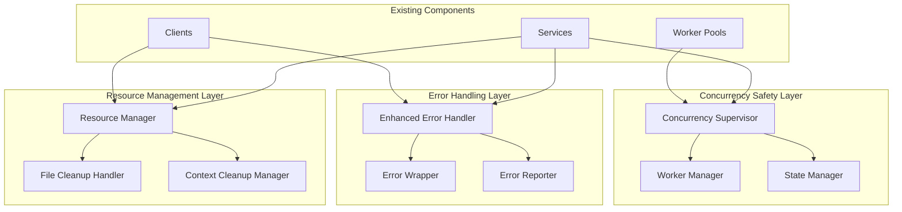

# Design Document: Critical Bug Fixes and Stability Improvements

## Overview

This design addresses critical bugs, race conditions, and stability issues in the Freightliner codebase through systematic fixes that maintain existing functionality while improving reliability, security, and resource management.

## Code Reuse Analysis

### Leveraging Existing Patterns

**Error Handling Infrastructure** (`pkg/helper/errors/errors.go`):
- Extend existing error types with context-aware wrapping
- Build upon established error categorization patterns
- Utilize existing error logging and metrics integration

**Resource Management Patterns** (`pkg/client/common/base_client.go`):
- Apply existing cache cleanup patterns to resource management
- Leverage established lifecycle management approaches
- Build upon existing context cancellation patterns

**Testing Infrastructure** (`test/mocks/`, `test/fixtures/`):
- Extend existing test patterns for race condition testing
- Utilize established mock patterns for failure scenario testing
- Build upon existing integration test frameworks

## System Architecture

### Bug Fix Architecture Strategy



## Critical Bug Fixes

### 1. Temporary File Race Condition Fix

**File**: `pkg/service/replicate.go`
**Issue**: Race condition in temporary credential file handling

**Current Problematic Code**:
```go
defer func() {
    tmpFile.Close()
    os.Remove(tmpFilePath) // Clean up when done
}()

// Later in the function
if _, err := tmpFile.Write(decoded); err == nil {
    os.Setenv("GOOGLE_APPLICATION_CREDENTIALS", tmpFilePath)
}
```

**Design Solution**:
```go
// New secure temporary file manager
type SecureFileManager struct {
    files   map[string]*secureFile
    mutex   sync.RWMutex
    cleanup chan string
}

type secureFile struct {
    path        string
    permissions os.FileMode
    cleanupFunc func() error
}

func (sfm *SecureFileManager) CreateSecureTemp(prefix string, content []byte) (*secureFile, error) {
    // Create file with restrictive permissions (0600)
    tmpFile, err := os.CreateTemp("", prefix)
    if err != nil {
        return nil, errors.Wrap(err, "failed to create temporary file")
    }
    
    // Set restrictive permissions immediately
    if err := tmpFile.Chmod(0600); err != nil {
        tmpFile.Close()
        os.Remove(tmpFile.Name())
        return nil, errors.Wrap(err, "failed to set file permissions")
    }
    
    // Write content before any other operations
    if _, err := tmpFile.Write(content); err != nil {
        tmpFile.Close()
        os.Remove(tmpFile.Name())
        return nil, errors.Wrap(err, "failed to write to temporary file")
    }
    
    if err := tmpFile.Close(); err != nil {
        os.Remove(tmpFile.Name())
        return nil, errors.Wrap(err, "failed to close temporary file")
    }
    
    sf := &secureFile{
        path:        tmpFile.Name(),
        permissions: 0600,
        cleanupFunc: func() error {
            return os.Remove(tmpFile.Name())
        },
    }
    
    // Register for managed cleanup
    sfm.registerFile(sf)
    return sf, nil
}

func (sfm *SecureFileManager) registerFile(sf *secureFile) {
    sfm.mutex.Lock()
    defer sfm.mutex.Unlock()
    sfm.files[sf.path] = sf
}

func (sfm *SecureFileManager) CleanupFile(path string) error {
    sfm.mutex.Lock()
    sf, exists := sfm.files[path]
    if exists {
        delete(sfm.files, path)
    }
    sfm.mutex.Unlock()
    
    if exists && sf.cleanupFunc != nil {
        return sf.cleanupFunc()
    }
    return nil
}
```

**Integration Pattern**:
```go
// In ReplicationService
func (s *ReplicationService) applyRegistryCredentials(creds RegistryCredentials) error {
    if creds.GCR.Credentials != "" {
        decoded, err := base64.StdEncoding.DecodeString(creds.GCR.Credentials)
        if err != nil {
            return errors.Wrap(err, "failed to decode GCP credentials")
        }
        
        sf, err := s.secureFileManager.CreateSecureTemp("gcp-credentials-*.json", decoded)
        if err != nil {
            return errors.Wrap(err, "failed to create secure credentials file")
        }
        
        // Set environment variable only after successful file creation
        os.Setenv("GOOGLE_APPLICATION_CREDENTIALS", sf.path)
        
        // Register cleanup for service shutdown
        s.registerShutdownCleanup(func() error {
            os.Unsetenv("GOOGLE_APPLICATION_CREDENTIALS")
            return s.secureFileManager.CleanupFile(sf.path)
        })
    }
    return nil
}
```

### 2. Worker Pool Context Leak Fix

**File**: `pkg/replication/worker_pool.go`
**Issue**: Goroutine leak in job context management

**Design Solution**:
```go
// Enhanced worker pool with proper context management
type ContextManagedWorkerPool struct {
    *WorkerPool
    contextManager *ContextManager
}

type ContextManager struct {
    contexts map[string]context.CancelFunc
    mutex    sync.RWMutex
    cleanup  chan string
}

func NewContextManager() *ContextManager {
    cm := &ContextManager{
        contexts: make(map[string]context.CancelFunc),
        cleanup:  make(chan string, 100),
    }
    
    // Start cleanup goroutine
    go cm.cleanupLoop()
    return cm
}

func (cm *ContextManager) CreateJobContext(jobID string, parentCtx context.Context) (context.Context, context.CancelFunc) {
    jobCtx, cancel := context.WithCancel(parentCtx)
    
    // Wrap cancel function to handle cleanup
    wrappedCancel := func() {
        cancel()
        cm.cleanup <- jobID
    }
    
    cm.mutex.Lock()
    cm.contexts[jobID] = wrappedCancel
    cm.mutex.Unlock()
    
    return jobCtx, wrappedCancel
}

func (cm *ContextManager) cleanupLoop() {
    for jobID := range cm.cleanup {
        cm.mutex.Lock()
        delete(cm.contexts, jobID)
        cm.mutex.Unlock()
    }
}

func (cm *ContextManager) CancelAll() {
    cm.mutex.Lock()
    for jobID, cancel := range cm.contexts {
        cancel()
        delete(cm.contexts, jobID)
    }
    cm.mutex.Unlock()
}
```

### 3. Scheduler Race Condition Fix

**File**: `pkg/replication/scheduler.go`
**Issue**: Race condition in job state management

**Design Solution**:
```go
// Thread-safe job state manager
type JobStateManager struct {
    jobs  map[string]*JobState
    mutex sync.RWMutex
}

type JobState struct {
    ID      string
    Running atomic.Bool
    Error   atomic.Value // stores error or nil
    mutex   sync.RWMutex
}

func (jsm *JobStateManager) UpdateJobState(id string, updateFunc func(*JobState) error) error {
    jsm.mutex.Lock()
    job, exists := jsm.jobs[id]
    jsm.mutex.Unlock()
    
    if !exists {
        return errors.NotFoundf("job %s not found", id)
    }
    
    job.mutex.Lock()
    defer job.mutex.Unlock()
    
    return updateFunc(job)
}

func (jsm *JobStateManager) SetJobNotRunning(id string, err error) error {
    return jsm.UpdateJobState(id, func(job *JobState) error {
        job.Running.Store(false)
        if err != nil {
            job.Error.Store(err)
        }
        return nil
    })
}
```

### 4. CORS Handler Variable Shadowing Fix

**File**: `pkg/server/server.go`
**Issue**: Variable shadowing breaking CORS validation

**Design Solution**:
```go
// Fixed CORS validation logic
func (s *Server) validateCORSOrigin(origin string) string {
    if len(s.cfg.Server.AllowedOrigins) == 0 || s.cfg.Server.AllowedOrigins[0] == "*" {
        return "*"
    }
    
    for _, allowed := range s.cfg.Server.AllowedOrigins {
        if allowed == origin {
            return origin
        }
    }
    
    return "" // No valid origin found
}

func (s *Server) corsHandler(next http.Handler) http.Handler {
    return http.HandlerFunc(func(w http.ResponseWriter, r *http.Request) {
        origin := r.Header.Get("Origin")
        if origin != "" {
            allowedOrigin := s.validateCORSOrigin(origin)
            if allowedOrigin != "" {
                w.Header().Set("Access-Control-Allow-Origin", allowedOrigin)
                w.Header().Set("Access-Control-Allow-Methods", "GET, POST, PUT, DELETE, OPTIONS")
                w.Header().Set("Access-Control-Allow-Headers", "Content-Type, Authorization")
            } else {
                // Log rejected origin for security monitoring
                s.logger.Warn("CORS origin rejected", map[string]interface{}{
                    "origin": origin,
                    "remote_addr": r.RemoteAddr,
                })
                http.Error(w, "Origin not allowed", http.StatusForbidden)
                return
            }
        }
        
        if r.Method == "OPTIONS" {
            w.WriteHeader(http.StatusOK)
            return
        }
        
        next.ServeHTTP(w, r)
    })
}
```

### 5. HTTP Response Body Leak Fix

**File**: `pkg/client/common/base_transport.go`
**Issue**: Response bodies not properly closed

**Design Solution**:
```go
// Enhanced HTTP transport with guaranteed cleanup
type ResponseCleanupTransport struct {
    base        http.RoundTripper
    logger      *log.Logger
    activeReqs  sync.Map // track active requests
}

type responseWrapper struct {
    *http.Response
    cleanup func()
    closed  atomic.Bool
}

func (rw *responseWrapper) Close() error {
    if rw.closed.CompareAndSwap(false, true) {
        if rw.cleanup != nil {
            rw.cleanup()
        }
        if rw.Response != nil && rw.Response.Body != nil {
            return rw.Response.Body.Close()
        }
    }
    return nil
}

func (t *ResponseCleanupTransport) RoundTrip(req *http.Request) (*http.Response, error) {
    reqID := generateRequestID()
    
    // Register request
    t.activeReqs.Store(reqID, req)
    defer t.activeReqs.Delete(reqID)
    
    resp, err := t.base.RoundTrip(req)
    if err != nil {
        return nil, err
    }
    
    if resp != nil && resp.Body != nil {
        wrapper := &responseWrapper{
            Response: resp,
            cleanup: func() {
                t.logger.Debug("Response body cleaned up", map[string]interface{}{
                    "request_id": reqID,
                    "status": resp.StatusCode,
                })
            },
        }
        
        // Replace the body with a cleanup-aware version
        resp.Body = &bodyWrapper{
            ReadCloser: resp.Body,
            wrapper:    wrapper,
        }
    }
    
    return resp, nil
}

type bodyWrapper struct {
    io.ReadCloser
    wrapper *responseWrapper
}

func (bw *bodyWrapper) Close() error {
    err := bw.ReadCloser.Close()
    bw.wrapper.Close() // Always call cleanup
    return err
}
```

## Error Handling Enhancement

### Comprehensive Error Context

```go
// Enhanced error handling with context
type ContextualError struct {
    error
    Context map[string]interface{}
    Stack   []string
    Code    string
}

func (ce *ContextualError) WithContext(key string, value interface{}) *ContextualError {
    if ce.Context == nil {
        ce.Context = make(map[string]interface{})
    }
    ce.Context[key] = value
    return ce
}

func WrapWithContext(err error, code string, context map[string]interface{}) *ContextualError {
    if err == nil {
        return nil
    }
    
    return &ContextualError{
        error:   err,
        Context: context,
        Stack:   captureStack(),
        Code:    code,
    }
}
```

## Resource Management Framework

### Centralized Resource Cleanup

```go
// Resource manager for centralized cleanup
type ResourceManager struct {
    resources []ManagedResource
    mutex     sync.RWMutex
    shutdown  chan struct{}
    done      chan struct{}
}

type ManagedResource interface {
    Cleanup() error
    Type() string
    ID() string
}

func (rm *ResourceManager) Register(resource ManagedResource) {
    rm.mutex.Lock()
    defer rm.mutex.Unlock()
    rm.resources = append(rm.resources, resource)
}

func (rm *ResourceManager) Shutdown(ctx context.Context) error {
    close(rm.shutdown)
    
    select {
    case <-rm.done:
        return nil
    case <-ctx.Done():
        return ctx.Err()
    }
}

func (rm *ResourceManager) cleanupLoop() {
    defer close(rm.done)
    
    <-rm.shutdown
    
    rm.mutex.Lock()
    resources := make([]ManagedResource, len(rm.resources))
    copy(resources, rm.resources)
    rm.mutex.Unlock()
    
    // Cleanup in reverse order (LIFO)
    for i := len(resources) - 1; i >= 0; i-- {
        if err := resources[i].Cleanup(); err != nil {
            // Log but continue cleanup
            log.Printf("Failed to cleanup resource %s: %v", resources[i].ID(), err)
        }
    }
}
```

## Testing Strategy

### Race Condition Testing

```go
func TestTemporaryFileRaceCondition(t *testing.T) {
    const numGoroutines = 100
    const numIterations = 10
    
    var wg sync.WaitGroup
    errors := make(chan error, numGoroutines*numIterations)
    
    for i := 0; i < numGoroutines; i++ {
        wg.Add(1)
        go func() {
            defer wg.Done()
            for j := 0; j < numIterations; j++ {
                // Test concurrent file operations
                if err := testFileOperation(); err != nil {
                    errors <- err
                }
            }
        }()
    }
    
    wg.Wait()
    close(errors)
    
    var errorList []error
    for err := range errors {
        errorList = append(errorList, err)
    }
    
    if len(errorList) > 0 {
        t.Fatalf("Race condition detected: %v", errorList)
    }
}
```

### Resource Leak Testing

```go
func TestResourceCleanup(t *testing.T) {
    // Capture initial state
    initialGoroutines := runtime.NumGoroutine()
    initialFDs := getOpenFileDescriptors()
    
    // Run operations that should clean up properly
    service := NewReplicationService(config)
    defer service.Close()
    
    // Run multiple operations
    for i := 0; i < 100; i++ {
        err := service.ProcessCredentials(testCredentials)
        assert.NoError(t, err)
    }
    
    // Force garbage collection
    runtime.GC()
    runtime.GC()
    
    // Allow some time for cleanup
    time.Sleep(100 * time.Millisecond)
    
    // Check for leaks
    finalGoroutines := runtime.NumGoroutine()
    finalFDs := getOpenFileDescriptors()
    
    assert.LessOrEqual(t, finalGoroutines, initialGoroutines+2, "Goroutine leak detected")
    assert.LessOrEqual(t, finalFDs, initialFDs+5, "File descriptor leak detected")
}
```

## Performance Considerations

### Memory Management

- Implement object pooling for frequently allocated objects
- Use sync.Pool for temporary objects
- Minimize allocations in hot paths
- Implement proper context cancellation to prevent memory leaks

### Concurrency Optimization

- Use atomic operations where appropriate instead of mutexes
- Implement backpressure mechanisms to prevent resource exhaustion
- Use buffered channels with appropriate sizes
- Implement timeout handling for all blocking operations

## Migration Strategy

### Gradual Rollout

1. **Phase 1**: Fix critical resource leaks (immediate)
2. **Phase 2**: Address race conditions and security issues
3. **Phase 3**: Implement enhanced error handling
4. **Phase 4**: Add comprehensive monitoring and metrics

### Backward Compatibility

- Maintain existing public APIs
- Add new functionality through extension interfaces
- Provide configuration options for new behaviors
- Ensure existing tests continue to pass

This design addresses the most critical stability and security issues while maintaining system functionality and providing a foundation for future improvements.