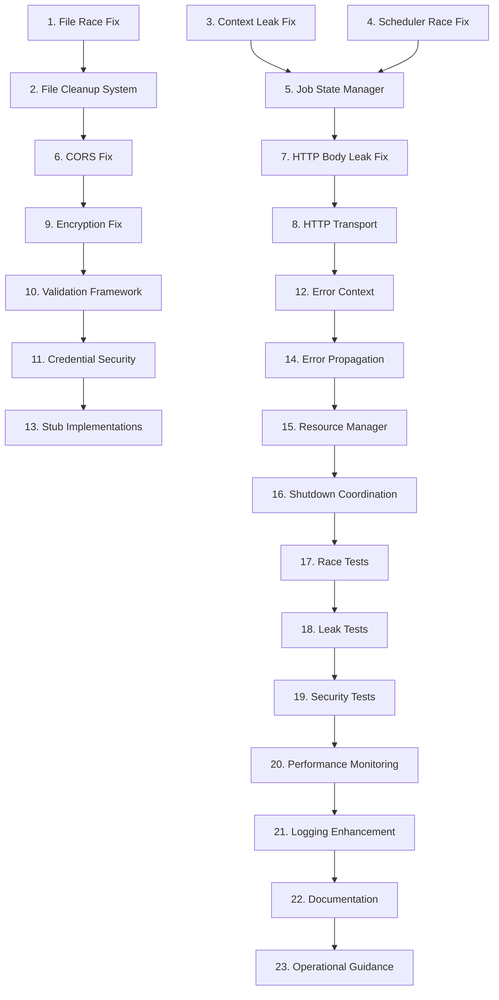

# Implementation Tasks: Critical Bug Fixes and Stability Improvements

## Task Breakdown

### Phase 1: Critical Resource Management Fixes

- [ ] 1. Fix temporary file race condition in credential handling
  - Modify `pkg/service/replicate.go:886-903` to eliminate race condition between file operations and cleanup
  - Create `pkg/helper/util/secure_file_manager.go` with thread-safe temporary file management
  - Implement proper error handling and rollback for failed file operations
  - Add restrictive file permissions (0600) for credential files
  - _Leverage: pkg/helper/errors/errors.go error wrapping, existing cleanup patterns_
  - _Requirements: 1.1, 2.1, 3.1_

- [ ] 2. Implement secure file cleanup system
  - Create secure file cleanup manager with lifecycle tracking
  - Add environment variable cleanup when credential files are removed
  - Implement deferred cleanup with proper error handling
  - Add shutdown hooks for guaranteed resource cleanup
  - _Leverage: existing service shutdown patterns, pkg/config/ lifecycle management_
  - _Requirements: 1.1, 3.1, 3.2_

- [ ] 3. Fix worker pool context leak
  - Modify `pkg/replication/worker_pool.go:116-130` to eliminate goroutine leak
  - Create `pkg/helper/util/context_manager.go` for centralized context lifecycle management
  - Implement proper goroutine cleanup and tracking
  - Add context cancellation monitoring with bounded goroutine usage
  - _Leverage: existing worker pool patterns, context handling utilities_
  - _Requirements: 1.2, 3.1, 3.2_

### Phase 2: Concurrency and Race Condition Fixes

- [ ] 4. Fix scheduler race condition
  - Modify `pkg/replication/scheduler.go:285-291` to eliminate race between job state updates
  - Implement thread-safe job state management using atomic operations
  - Add proper mutex handling for job lifecycle operations
  - Create job state consistency validation and recovery mechanisms
  - _Leverage: existing synchronization patterns, atomic operation utilities_
  - _Requirements: 1.3, 3.1_

- [ ] 5. Implement thread-safe job state manager
  - Create `pkg/replication/job_state_manager.go` with atomic job state operations
  - Add comprehensive job lifecycle tracking and state transitions
  - Implement deadlock prevention and detection mechanisms
  - Add job state recovery and consistency checking
  - _Leverage: existing state management patterns, sync utilities_
  - _Requirements: 1.3, 3.1, 3.2_

- [ ] 6. Fix CORS handler variable shadowing bug
  - Modify `pkg/server/server.go:199-201` to eliminate variable shadowing
  - Implement proper CORS origin validation logic
  - Add comprehensive CORS configuration validation
  - Create CORS rejection logging for security monitoring
  - _Leverage: existing HTTP handler patterns, logging infrastructure_
  - _Requirements: 2.2, 4.1_

### Phase 3: HTTP Client and Network Fixes

- [ ] 7. Fix HTTP response body resource leak
  - Modify `pkg/client/common/base_transport.go:156-158` to ensure response body cleanup
  - Create response wrapper with guaranteed cleanup using defer patterns
  - Implement request tracking and cleanup verification
  - Add HTTP client resource usage monitoring
  - _Leverage: existing HTTP client patterns, resource management utilities_
  - _Requirements: 1.2, 3.1_

- [ ] 8. Implement enhanced HTTP transport with cleanup guarantees
  - Create `pkg/client/common/cleanup_transport.go` with automatic resource management
  - Add request/response lifecycle tracking and cleanup verification
  - Implement connection pool monitoring and health checks
  - Add timeout handling for all HTTP operations
  - _Leverage: existing transport patterns, pkg/helper/util/ utilities_
  - _Requirements: 1.2, 3.1, 3.2_

### Phase 4: Security and Input Validation Fixes

- [ ] 9. Fix encryption buffer underflow vulnerability
  - Modify `pkg/security/encryption/manager.go:187-193` to add proper input validation
  - Implement minimum ciphertext length validation after nonce extraction
  - Add comprehensive input sanitization and bounds checking
  - Create secure error handling that doesn't leak sensitive information
  - _Leverage: existing validation patterns, security utilities_
  - _Requirements: 2.1, 2.2, 4.2_

- [ ] 10. Implement comprehensive input validation framework
  - Create `pkg/helper/validation/` package with reusable validation utilities
  - Add buffer overflow protection and length validation
  - Implement secure input sanitization patterns
  - Add validation error reporting with security-conscious messaging
  - _Leverage: existing error handling patterns, security utilities_
  - _Requirements: 2.1, 2.2, 4.2_

- [ ] 11. Enhance credential security and handling
  - Modify credential handling throughout codebase to use secure patterns
  - Implement credential zero-ing after use to prevent memory dumps
  - Add credential file permission verification and enforcement
  - Create credential exposure monitoring and alerting
  - _Leverage: existing security patterns, logging infrastructure_
  - _Requirements: 2.1, 2.2, 4.1_

### Phase 5: Error Handling and Observability

- [ ] 12. Implement comprehensive error context system
  - Create `pkg/helper/errors/contextual_error.go` extending existing error handling
  - Add error context tracking with structured metadata
  - Implement error correlation and tracing capabilities
  - Add error categorization and severity classification
  - _Leverage: pkg/helper/errors/errors.go patterns, existing logging_
  - _Requirements: 4.1, 4.2, 4.3_

- [ ] 13. Fix incomplete stub implementations
  - Identify and catalog all stub implementations across the codebase
  - Replace stub functions with proper "not implemented" errors
  - Implement missing functionality for critical operations
  - Add feature flags for incomplete implementations
  - _Leverage: existing error patterns, feature flag utilities_
  - _Requirements: 4.2, 4.3_

- [ ] 14. Enhance error propagation and reporting
  - Modify error handling throughout service layer to ensure proper propagation
  - Implement consistent error logging with structured context
  - Add error metrics and monitoring integration
  - Create error aggregation and reporting dashboards
  - _Leverage: pkg/metrics/metrics.go patterns, existing Prometheus integration_
  - _Requirements: 4.1, 4.2, 4.3_

### Phase 6: Resource Management Framework

- [ ] 15. Create centralized resource management system
  - Implement `pkg/helper/util/resource_manager.go` for lifecycle management
  - Add resource registration, tracking, and cleanup coordination
  - Implement resource leak detection and prevention
  - Create resource usage monitoring and alerting
  - _Leverage: existing service patterns, lifecycle management utilities_
  - _Requirements: 3.1, 3.2, 4.3_

- [ ] 16. Implement graceful shutdown coordination
  - Add shutdown hooks and coordination across all service components
  - Implement timeout-based shutdown with escalation (graceful -> forceful)
  - Add shutdown state broadcasting and coordination
  - Create shutdown completion verification and reporting
  - _Leverage: existing service shutdown patterns, context utilities_
  - _Requirements: 3.1, 3.2_

### Phase 7: Testing and Verification

- [ ] 17. Create comprehensive race condition tests
  - Implement stress tests for all identified race conditions
  - Add concurrent operation testing with multiple goroutines
  - Create race detection integration with Go race detector
  - Add performance regression testing for concurrency fixes
  - _Leverage: existing test patterns, test/mocks/ infrastructure_
  - _Requirements: All concurrency-related requirements_

- [ ] 18. Implement resource leak detection tests
  - Create tests for goroutine leak detection and prevention
  - Add file descriptor leak testing and monitoring
  - Implement memory leak detection and verification
  - Add resource cleanup verification testing
  - _Leverage: existing test utilities, test/fixtures/ patterns_
  - _Requirements: All resource management requirements_

- [ ] 19. Add security vulnerability tests
  - Create tests for credential exposure prevention
  - Add input validation testing with malicious inputs
  - Implement security regression testing
  - Add penetration testing for fixed vulnerabilities
  - _Leverage: existing security test patterns, validation utilities_
  - _Requirements: All security-related requirements_

### Phase 8: Performance and Monitoring

- [ ] 20. Implement performance monitoring for fixes
  - Add metrics for resource usage patterns and cleanup efficiency
  - Implement performance benchmarks for critical path operations
  - Create alerting for resource exhaustion and performance degradation
  - Add performance regression detection and reporting
  - _Leverage: pkg/metrics/metrics.go patterns, existing monitoring_
  - _Requirements: Performance requirements, monitoring needs_

- [ ] 21. Add comprehensive logging and observability
  - Enhance logging for all resource operations and state changes
  - Add structured logging for debugging race conditions and resource issues
  - Implement audit logging for security-sensitive operations
  - Create operational dashboards for system health monitoring
  - _Leverage: pkg/helper/log/logger.go patterns, existing structured logging_
  - _Requirements: Observability requirements, debugging needs_

### Phase 9: Documentation and Operational Support

- [ ] 22. Create troubleshooting guides and runbooks
  - Document all fixed issues with symptoms and resolution steps
  - Create operational runbooks for resource management and monitoring
  - Add debugging guides for race conditions and resource leaks
  - Implement incident response procedures for stability issues
  - _Leverage: docs/ structure, existing documentation patterns_
  - _Requirements: Operational requirements, documentation needs_

- [ ] 23. Update configuration and deployment guidance
  - Update configuration documentation with new resource management options
  - Add deployment guidance for rolling out stability fixes
  - Create monitoring and alerting configuration examples
  - Document performance tuning and resource management best practices
  - _Leverage: examples/ configuration patterns, existing deployment docs_
  - _Requirements: Operational requirements, deployment needs_

## Task Dependencies

## Critical Path Priority

### Immediate (Deploy ASAP)
1. **Temporary File Race Condition** (Task 1-2)
2. **Worker Pool Context Leak** (Task 3)
3. **Scheduler Race Condition** (Task 4-5)

### High Priority (Next Sprint)
4. **CORS Handler Bug** (Task 6)
5. **HTTP Response Body Leak** (Task 7-8)
6. **Encryption Buffer Underflow** (Task 9-10)

### Medium Priority (Following Sprints)
7. **Error Handling Enhancement** (Task 12-14)
8. **Resource Management Framework** (Task 15-16)
9. **Testing and Verification** (Task 17-19)

## Implementation Guidelines

### Code Quality Standards
- All fixes must include comprehensive unit tests
- Race condition fixes must be verified with Go race detector
- Resource cleanup must be verified with resource leak tests
- Security fixes must include penetration testing

### Performance Requirements
- Resource cleanup must complete within 1 second
- Error handling overhead must be <1ms
- Memory usage must not grow unbounded
- HTTP connection pools must not be exhausted

### Testing Strategy
- Each fix must include failure scenario testing
- Concurrency testing with high load simulation
- Resource exhaustion testing and recovery
- Security vulnerability testing with malicious inputs

### Deployment Strategy
- Critical fixes deployed with immediate rollback capability
- Gradual rollout with monitoring and health checks
- Resource usage monitoring during deployment
- Performance regression testing in staging environment

## Risk Mitigation

### High-Risk Tasks
- **Task 1**: File system operations and cleanup timing
- **Task 3**: Worker pool lifecycle and goroutine management
- **Task 4**: Job state transitions and race conditions
- **Task 9**: Cryptographic operations and input validation

### Mitigation Strategies
- Extensive testing in isolated environments
- Load testing with resource monitoring
- Security testing with threat modeling
- Gradual rollout with immediate rollback procedures
- Comprehensive monitoring and alerting for all fixes

The critical nature of these fixes requires careful implementation with extensive testing and monitoring to ensure system stability while resolving the identified issues.