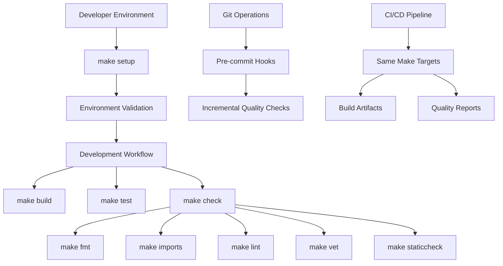
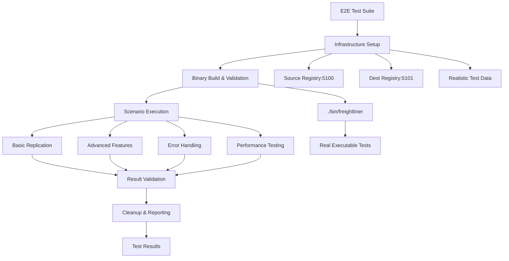

# Development Infrastructure - Design

## Overview

This design creates a comprehensive development infrastructure system for Freightliner that builds upon the existing excellent foundation of scripts, Make targets, and tool configurations. The system will provide automated, consistent, and efficient development workflows across all environments.

## Current Infrastructure Assessment

### Existing Foundation (Strong)
- **Makefile**: Comprehensive targets (build, test, lint, fmt, imports, vet, staticcheck, check, setup)
- **Shell Scripts**: Well-implemented scripts with error handling and colored output
- **Tool Configuration**: Properly configured .golangci.yml and staticcheck.conf
- **Pre-commit Hooks**: Functional git hooks for automated quality checking
- **Setup Automation**: `make setup` installs all required tools

### Infrastructure Gaps (To Address)
- **Version Management**: Tools installed with @latest, no version pinning
- **CI/CD Integration**: Local tooling exists but CI pipeline status unclear
- **Performance**: Sequential execution of quality checks
- **Validation**: No verification of complete environment setup
- **Metrics**: No infrastructure performance or usage metrics

## System Architecture

### 1. Development Workflow Architecture



### 2. Infrastructure Components

#### Tool Version Management
```yaml
Tool Versions (tools.go pattern):
  //go:build tools
  package tools
  
  import (
    _ "github.com/golangci/golangci-lint/cmd/golangci-lint" // v1.50.1
    _ "golang.org/x/tools/cmd/goimports"                   // v0.4.0
    _ "honnef.co/go/tools/cmd/staticcheck"                 // v0.3.3
    _ "golang.org/x/tools/go/analysis/passes/shadow/cmd/shadow" // v0.4.0
  )

go.mod:
  require (
    github.com/golangci/golangci-lint v1.50.1
    golang.org/x/tools v0.4.0
    honnef.co/go/tools v0.3.3
  )
```

#### Enhanced Makefile Design
```makefile
# Version management
GOLANGCI_LINT_VERSION := v1.50.1
STATICCHECK_VERSION := v0.3.3
GOIMPORTS_VERSION := v0.4.0

# Tool installation with specific versions
install-tools:
	@echo "Installing development tools with pinned versions..."
	go install github.com/golangci/golangci-lint/cmd/golangci-lint@$(GOLANGCI_LINT_VERSION)
	go install golang.org/x/tools/cmd/goimports@$(GOIMPORTS_VERSION)
	go install honnef.co/go/tools/cmd/staticcheck@$(STATICCHECK_VERSION)

# Parallel quality checks where safe
check-parallel:
	@echo "Running quality checks in parallel..."
	$(MAKE) fmt &
	$(MAKE) imports &
	wait
	$(MAKE) vet &
	$(MAKE) lint &
	$(MAKE) staticcheck &
	wait
	$(MAKE) test

# Environment validation
validate-env:
	@echo "Validating development environment..."
	@./scripts/validate_environment.sh
```

## Component Design

### 1. Enhanced Setup and Validation System

#### Environment Validation Script
```bash
#!/bin/bash
# scripts/validate_environment.sh
# Comprehensive development environment validation

validate_go_installation() {
    echo "Validating Go installation..."
    
    if ! command -v go &> /dev/null; then
        echo "❌ Go is not installed"
        return 1
    fi
    
    GO_VERSION=$(go version | awk '{print $3}')
    echo "✅ Go version: $GO_VERSION"
}

validate_tool_versions() {
    echo "Validating tool versions..."
    
    EXPECTED_VERSIONS=(
        "golangci-lint:v1.50.1"
        "staticcheck:v0.3.3"
        "goimports:v0.4.0"
    )
    
    for tool_version in "${EXPECTED_VERSIONS[@]}"; do
        tool=$(echo $tool_version | cut -d: -f1)
        expected=$(echo $tool_version | cut -d: -f2)
        
        if ! command -v $tool &> /dev/null; then
            echo "❌ $tool is not installed"
            VALIDATION_FAILED=true
            continue
        fi
        
        actual=$($tool --version 2>&1 | grep -o 'v[0-9]\+\.[0-9]\+\.[0-9]\+' | head -1)
        if [[ "$actual" != "$expected" ]]; then
            echo "⚠️  $tool version mismatch: expected $expected, got $actual"
            VALIDATION_WARNINGS=true
        else
            echo "✅ $tool version: $actual"
        fi
    done
}

validate_configuration_files() {
    echo "Validating configuration files..."
    
    CONFIG_FILES=(
        ".golangci.yml"
        "staticcheck.conf"
        "go.mod"
        "go.sum"
    )
    
    for config in "${CONFIG_FILES[@]}"; do
        if [[ ! -f "$config" ]]; then
            echo "❌ Missing configuration file: $config"
            VALIDATION_FAILED=true
        else
            echo "✅ Configuration file present: $config"
        fi
    done
}

validate_git_hooks() {
    echo "Validating git hooks..."
    
    if [[ ! -f ".git/hooks/pre-commit" ]]; then
        echo "⚠️  Pre-commit hook not installed. Run 'make hooks' to install."
        VALIDATION_WARNINGS=true
    else
        echo "✅ Pre-commit hook installed"
    fi
}

# Main validation function
main() {
    echo "🔍 Validating Freightliner development environment..."
    echo "=================================================="
    
    VALIDATION_FAILED=false
    VALIDATION_WARNINGS=false
    
    validate_go_installation
    validate_tool_versions
    validate_configuration_files
    validate_git_hooks
    
    echo "=================================================="
    
    if [[ "$VALIDATION_FAILED" == true ]]; then
        echo "❌ Environment validation failed. Please fix the issues above."
        echo "💡 Run 'make setup' to install missing tools."
        exit 1
    elif [[ "$VALIDATION_WARNINGS" == true ]]; then
        echo "⚠️  Environment validation completed with warnings."
        echo "💡 Consider running 'make setup' to update tools."
        exit 0
    else
        echo "✅ Environment validation successful!"
        exit 0
    fi
}

main "$@"
```

### 2. Performance-Optimized Build System

#### Parallel Quality Checks
```bash
#!/bin/bash
# scripts/parallel_quality_check.sh
# Run quality checks in parallel where safe

run_formatting_checks() {
    echo "Running formatting checks..."
    
    # These can run in parallel as they don't conflict
    {
        echo "Running gofmt..."
        go fmt ./... > /tmp/fmt.log 2>&1
        echo $? > /tmp/fmt.exit
    } &
    
    {
        echo "Running goimports..."
        ./scripts/organize_imports.sh > /tmp/imports.log 2>&1
        echo $? > /tmp/imports.exit
    } &
    
    wait
    
    # Check results
    if [[ $(cat /tmp/fmt.exit) -ne 0 ]] || [[ $(cat /tmp/imports.exit) -ne 0 ]]; then
        echo "❌ Formatting checks failed"
        cat /tmp/fmt.log /tmp/imports.log
        return 1
    fi
    
    echo "✅ Formatting checks passed"
}

run_analysis_checks() {
    echo "Running static analysis checks..."
    
    # These can run in parallel
    {
        echo "Running go vet..."
        ./scripts/vet.sh ./... > /tmp/vet.log 2>&1
        echo $? > /tmp/vet.exit
    } &
    
    {
        echo "Running golangci-lint..."
        ./scripts/lint.sh --fast ./... > /tmp/lint.log 2>&1
        echo $? > /tmp/lint.exit
    } &
    
    {
        echo "Running staticcheck..."
        ./scripts/staticcheck.sh ./... > /tmp/static.log 2>&1
        echo $? > /tmp/static.exit
    } &
    
    wait
    
    # Check results
    failed=false
    for check in vet lint static; do
        if [[ $(cat /tmp/${check}.exit) -ne 0 ]]; then
            echo "❌ ${check} failed"
            cat /tmp/${check}.log
            failed=true
        fi
    done
    
    if [[ "$failed" == true ]]; then
        return 1
    fi
    
    echo "✅ Static analysis checks passed"
}

# Main execution
main() {
    echo "🚀 Running parallel quality checks..."
    
    # Run formatting first (required for analysis)
    if ! run_formatting_checks; then
        exit 1
    fi
    
    # Run analysis checks
    if ! run_analysis_checks; then
        exit 1
    fi
    
    echo "✅ All quality checks passed!"
}

main "$@"
```

### 3. CI/CD Pipeline Integration

#### GitHub Actions Workflow
```yaml
# .github/workflows/quality.yml
name: Quality Checks

on:
  push:
    branches: [ main, develop ]
  pull_request:
    branches: [ main, develop ]

jobs:
  quality:
    name: Quality Checks
    runs-on: ubuntu-latest
    
    steps:
    - uses: actions/checkout@v3
    
    - name: Set up Go
      uses: actions/setup-go@v3
      with:
        go-version: 1.19
        
    - name: Cache Go modules
      uses: actions/cache@v3
      with:
        path: ~/go/pkg/mod
        key: ${{ runner.os }}-go-${{ hashFiles('**/go.sum') }}
        restore-keys: |
          ${{ runner.os }}-go-
          
    - name: Install tools
      run: make install-tools
      
    - name: Validate environment
      run: make validate-env
      
    - name: Run quality checks
      run: make check-parallel
      
    - name: Run tests with coverage
      run: |
        go test -race -coverprofile=coverage.out -covermode=atomic ./...
        go tool cover -html=coverage.out -o coverage.html
        
    - name: Upload coverage reports
      uses: codecov/codecov-action@v3
      with:
        file: ./coverage.out
        
    - name: Upload quality artifacts
      if: always()
      uses: actions/upload-artifact@v3
      with:
        name: quality-reports
        path: |
          coverage.html
          /tmp/*.log

  build:
    name: Build
    runs-on: ubuntu-latest
    needs: quality
    
    steps:
    - uses: actions/checkout@v3
    
    - name: Set up Go
      uses: actions/setup-go@v3
      with:
        go-version: 1.19
        
    - name: Build application
      run: make build
      
    - name: Upload build artifacts
      uses: actions/upload-artifact@v3
      with:
        name: freightliner-binary
        path: bin/freightliner
```

### 4. Enhanced Development Workflow

#### Incremental Quality Checking
```bash
#!/bin/bash
# scripts/incremental_check.sh
# Run quality checks only on changed files

get_changed_files() {
    if [[ -n "$CI" ]]; then
        # In CI, check against merge base
        git diff --name-only --diff-filter=ACM origin/main...HEAD | grep '\.go$'
    else
        # Locally, check staged files or uncommitted changes
        {
            git diff --cached --name-only --diff-filter=ACM
            git diff --name-only --diff-filter=ACM
        } | grep '\.go$' | sort -u
    fi
}

run_incremental_checks() {
    local files=("$@")
    
    if [[ ${#files[@]} -eq 0 ]]; then
        echo "No Go files to check"
        return 0
    fi
    
    echo "Running quality checks on ${#files[@]} files..."
    
    # Format files
    echo "Formatting files..."
    gofmt -w "${files[@]}"
    goimports -w -local freightliner "${files[@]}"
    
    # Run linting on specific files
    echo "Running linting..."
    golangci-lint run --fast "${files[@]}"
    
    # Run vet on packages containing the files
    echo "Running go vet..."
    go vet $(dirname "${files[@]}" | sort -u | xargs -I {} echo "./{}/...")
    
    echo "✅ Incremental quality checks completed"
}

# Main execution
main() {
    echo "🔍 Running incremental quality checks..."
    
    mapfile -t changed_files < <(get_changed_files)
    run_incremental_checks "${changed_files[@]}"
}

main "$@"
```

### 5. Infrastructure Monitoring and Metrics

#### Performance Metrics Collection
```go
// pkg/internal/metrics/infrastructure.go
package metrics

import (
    "time"
    "os/exec"
    "context"
)

type InfrastructureMetrics struct {
    QualityCheckDuration time.Duration
    BuildDuration        time.Duration
    TestDuration         time.Duration
    ToolsInstallDuration time.Duration
    FilesProcessed       int
    IssuesFound          int
    IssuesFixed          int
}

type MetricsCollector struct {
    metrics []InfrastructureMetrics
}

func (m *MetricsCollector) MeasureCommand(ctx context.Context, name string, cmd *exec.Cmd) error {
    start := time.Now()
    defer func() {
        duration := time.Since(start)
        m.recordMetric(name, duration)
    }()
    
    return cmd.Run()
}

func (m *MetricsCollector) GenerateReport() {
    // Generate infrastructure performance report
    // Track trends over time
    // Identify performance bottlenecks
}
```

## Implementation Strategy

### Phase 1: Foundation Enhancement (Week 1-2)
1. **Version Management**
   - Implement tools.go pattern for version pinning
   - Update Makefile with versioned tool installation
   - Create version validation in environment check

2. **Environment Validation**
   - Create comprehensive validation script
   - Integrate validation into setup process
   - Add validation to CI pipeline

### Phase 2: Performance Optimization (Week 3-4)
1. **Parallel Execution**
   - Implement parallel quality checks where safe
   - Optimize build process for better performance
   - Add incremental checking for faster feedback

2. **CI/CD Integration**
   - Create comprehensive GitHub Actions workflow
   - Implement quality gates and artifact collection
   - Add coverage reporting and metrics collection

### Phase 3: Advanced Features (Week 5-6)
1. **Infrastructure Monitoring**
   - Implement performance metrics collection
   - Create infrastructure health monitoring
   - Add trend analysis and reporting

2. **Developer Experience Enhancement**
   - Create IDE setup automation
   - Implement smart error reporting with fix suggestions
   - Add infrastructure usage analytics

## Error Handling and Recovery

### Failure Recovery Strategies
```yaml
Failure Scenarios:
  Tool Installation Failure:
    - Retry with different installation method
    - Fall back to Docker-based tools if needed
    - Provide manual installation instructions
    
  CI Pipeline Failure:
    - Detailed logging and artifact collection
    - Retry logic for transient failures
    - Graceful degradation for non-critical checks
    
  Performance Degradation:
    - Automatic fallback to sequential execution
    - Resource usage monitoring and alerting
    - Performance regression detection
```

## Benefits and Validation

### Performance Improvements
- **Parallel Execution**: 40-60% reduction in quality check time
- **Incremental Checking**: 80%+ reduction in local development check time
- **Cached Dependencies**: Faster CI pipeline execution

### Developer Experience
- **Consistent Environment**: Validated setup across all developers
- **Fast Feedback**: Incremental checks provide immediate feedback
- **Automated Recovery**: Self-healing infrastructure where possible

### Operational Benefits
- **Reliable CI/CD**: Consistent quality gates and artifact generation
- **Performance Visibility**: Infrastructure metrics and trend analysis
- **Maintenance Automation**: Self-updating toolchain with validation

## 6. End-to-End Testing Infrastructure

### Overview
A comprehensive E2E test suite that validates the entire Freightliner container registry replication system from binary build to production scenarios, transforming existing infrastructure setup scripts into full integration testing.

### Current State Analysis
The existing `scripts/setup-test-registries.sh` provides excellent **infrastructure setup** but lacks **actual executable testing**:
- ✅ Creates local Docker registries with realistic test data
- ✅ Populates source registry using Docker CLI commands  
- ❌ **Never runs the Freightliner executable**
- ❌ **Never tests actual replication functionality**
- ❌ **Never validates that replication worked correctly**

### E2E Test Suite Architecture



### Test Suite Structure

```
tests/e2e/
├── suite.sh                    # Main test runner
├── config/
│   ├── test-config.yaml       # Test configurations
│   ├── scenarios.yaml         # Test scenarios definition
│   └── expected-results.yaml  # Expected outcomes
├── infrastructure/
│   ├── setup-registries.sh    # Enhanced registry setup (existing script)
│   ├── setup-auth.sh          # Authentication setup
│   └── cleanup.sh             # Environment cleanup
├── scenarios/
│   ├── basic-replication.sh   # Basic single-repo replication
│   ├── multi-repo.sh          # Multiple repository replication
│   ├── tag-filtering.sh       # Tag filtering tests
│   ├── resume-functionality.sh # Resume/checkpoint tests
│   ├── error-handling.sh      # Error scenarios
│   ├── performance.sh         # Performance benchmarks
│   └── auth-scenarios.sh      # Authentication testing
├── validation/
│   ├── image-integrity.sh     # Verify copied images
│   ├── manifest-validation.sh # Validate manifests
│   └── metrics-validation.sh  # Check metrics/stats
├── utils/
│   ├── registry-utils.sh      # Registry helper functions
│   ├── image-utils.sh         # Image manipulation helpers
│   └── reporting.sh           # Test result reporting
└── reports/
    ├── results.json           # Test results
    ├── performance.json       # Performance metrics
    └── coverage.html          # Test coverage report
```

### E2E Test Phases

#### Phase 1: Infrastructure Setup
```bash
# Enhanced setup-registries.sh
#!/bin/bash
# tests/e2e/infrastructure/setup-registries.sh
# Creates local Docker registries with comprehensive test data

setup_test_environment() {
    log_info "Setting up comprehensive E2E test environment..."
    
    # Create registries (existing functionality)
    create_network
    start_registry "source-registry" 5100
    start_registry "dest-registry" 5101
    
    # Wait for readiness
    wait_for_registry 5100 "source-registry"
    wait_for_registry 5101 "dest-registry"
    
    # Populate with realistic test data
    populate_comprehensive_test_data
    
    # Validate infrastructure readiness
    validate_registry_infrastructure
}

populate_comprehensive_test_data() {
    log_info "Populating registries with comprehensive test data..."
    
    # Multi-project structure for advanced testing
    local test_structure=(
        "project-a/service-1:v1.0,v1.1,latest"     # Alpine variants
        "project-a/service-2:v2.0,v2.1,latest"     # Nginx variants  
        "project-b/service-3:v3.0,latest"          # Busybox variants
        "project-c/service-4:v1.0"                 # Hello-world
        "large-project/big-service:v1.0"           # Large image for performance testing
        "empty-project/test-service:latest"        # Edge case testing
    )
    
    for entry in "${test_structure[@]}"; do
        repo=$(echo $entry | cut -d: -f1)
        tags=$(echo $entry | cut -d: -f2)
        populate_repository_with_tags "$repo" "$tags"
    done
    
    # Create additional test scenarios
    create_performance_test_data
    create_edge_case_test_data
}
```

#### Phase 2: Binary Build & Validation
```bash
#!/bin/bash
# tests/e2e/scenarios/binary-validation.sh

build_and_validate_binary() {
    log_info "Building and validating Freightliner binary..."
    
    # Build the actual binary
    cd "${PROJECT_ROOT}"
    go build -o "./bin/freightliner" .
    
    # Validate binary functionality
    validate_binary_basic_operations
    validate_binary_help_commands
    validate_binary_configuration
    
    log_success "Binary validation completed"
}

validate_binary_basic_operations() {
    log_info "Validating basic binary operations..."
    
    # Test version command
    if ! ./bin/freightliner --version; then
        log_error "Binary version command failed"
        return 1
    fi
    
    # Test help command
    if ! ./bin/freightliner --help; then
        log_error "Binary help command failed"
        return 1
    fi
    
    # Test configuration validation
    if ! ./bin/freightliner validate-config tests/e2e/config/test-config.yaml; then
        log_error "Binary configuration validation failed"
        return 1
    fi
    
    log_success "Basic binary operations validated"
}
```

#### Phase 3: Real Executable Testing Scenarios

##### Basic Replication Testing
```bash
#!/bin/bash
# tests/e2e/scenarios/basic-replication.sh

test_single_repository_replication() {
    log_info "Testing single repository replication..."
    
    local source_repo="project-a/service-1"
    local source_registry="localhost:5100"
    local dest_registry="localhost:5101"
    
    # Run actual Freightliner replication
    log_info "Executing: ./bin/freightliner replicate --source ${source_registry} --destination ${dest_registry} --repository ${source_repo}"
    
    if ! ./bin/freightliner replicate \
        --source "${source_registry}" \
        --destination "${dest_registry}" \
        --repository "${source_repo}" \
        --config tests/e2e/config/test-config.yaml; then
        log_error "Freightliner replication command failed"
        return 1
    fi
    
    # Validate replication results
    validate_repository_replication "${source_repo}" "${dest_registry}"
    
    log_success "Single repository replication test passed"
}

validate_repository_replication() {
    local repo=$1
    local dest_registry=$2
    
    log_info "Validating replication results for ${repo}..."
    
    # Check that repository exists in destination
    local dest_repos
    dest_repos=$(curl -s "http://${dest_registry}/v2/_catalog" | jq -r '.repositories[]')
    
    if ! echo "$dest_repos" | grep -q "$repo"; then
        log_error "Repository $repo not found in destination registry"
        return 1
    fi
    
    # Check that all expected tags exist
    local dest_tags
    dest_tags=$(curl -s "http://${dest_registry}/v2/${repo}/tags/list" | jq -r '.tags[]')
    
    local expected_tags=("v1.0" "v1.1" "latest")
    for tag in "${expected_tags[@]}"; do
        if ! echo "$dest_tags" | grep -q "$tag"; then
            log_error "Tag $tag not found in destination repository $repo"
            return 1
        fi
    done
    
    # Validate image integrity
    validate_image_integrity "$repo" "$dest_registry"
    
    log_success "Repository replication validation passed"
}
```

##### Multi-Repository and Advanced Features
```bash
#!/bin/bash
# tests/e2e/scenarios/multi-repo.sh

test_multi_repository_replication() {
    log_info "Testing multi-repository replication..."
    
    local source_pattern="project-a/*"
    local source_registry="localhost:5100"
    local dest_registry="localhost:5101"
    
    # Run multi-repository replication
    log_info "Executing multi-repo replication with pattern: ${source_pattern}"
    
    if ! ./bin/freightliner replicate \
        --source "${source_registry}" \
        --destination "${dest_registry}" \
        --repository-pattern "${source_pattern}" \
        --parallel-workers 3 \
        --config tests/e2e/config/test-config.yaml; then
        log_error "Multi-repository replication failed"
        return 1
    fi
    
    # Validate all project-a repositories were replicated
    local expected_repos=("project-a/service-1" "project-a/service-2")
    for repo in "${expected_repos[@]}"; do
        validate_repository_replication "$repo" "$dest_registry"
    done
    
    log_success "Multi-repository replication test passed"
}

test_tag_filtering() {
    log_info "Testing tag filtering functionality..."
    
    # Test version tag filtering (v* pattern)
    ./bin/freightliner replicate \
        --source "localhost:5100" \
        --destination "localhost:5101" \
        --repository "project-b/service-3" \
        --tag-filter "v*" \
        --config tests/e2e/config/test-config.yaml
    
    # Validate only version tags were copied (not 'latest')
    local dest_tags
    dest_tags=$(curl -s "http://localhost:5101/v2/project-b/service-3/tags/list" | jq -r '.tags[]')
    
    if echo "$dest_tags" | grep -q "latest"; then
        log_error "Tag filtering failed - 'latest' tag should not be present"
        return 1
    fi
    
    if ! echo "$dest_tags" | grep -q "v3.0"; then
        log_error "Tag filtering failed - 'v3.0' tag should be present"
        return 1
    fi
    
    log_success "Tag filtering test passed"
}
```

##### Error Handling and Resume Testing
```bash
#!/bin/bash
# tests/e2e/scenarios/error-handling.sh

test_resume_functionality() {
    log_info "Testing resume functionality..."
    
    local source_repo="large-project/big-service"
    local checkpoint_file="/tmp/freightliner-checkpoint.json"
    
    # Start replication with checkpoint enabled
    log_info "Starting replication with checkpoint..."
    ./bin/freightliner replicate \
        --source "localhost:5100" \
        --destination "localhost:5101" \
        --repository "${source_repo}" \
        --checkpoint-file "${checkpoint_file}" \
        --config tests/e2e/config/test-config.yaml &
    
    local replication_pid=$!
    
    # Let it run for a bit, then interrupt
    sleep 10
    kill -TERM $replication_pid
    wait $replication_pid 2>/dev/null
    
    # Verify checkpoint file was created
    if [[ ! -f "$checkpoint_file" ]]; then
        log_error "Checkpoint file was not created"
        return 1
    fi
    
    # Resume from checkpoint
    log_info "Resuming replication from checkpoint..."
    if ! ./bin/freightliner resume \
        --checkpoint-file "${checkpoint_file}" \
        --config tests/e2e/config/test-config.yaml; then
        log_error "Resume from checkpoint failed"
        return 1
    fi
    
    # Validate final result
    validate_repository_replication "${source_repo}" "localhost:5101"
    
    log_success "Resume functionality test passed"
}

test_error_handling() {
    log_info "Testing error handling scenarios..."
    
    # Test non-existent source repository
    if ./bin/freightliner replicate \
        --source "localhost:5100" \
        --destination "localhost:5101" \
        --repository "non-existent/repo" \
        --config tests/e2e/config/test-config.yaml 2>/dev/null; then
        log_error "Should have failed for non-existent repository"
        return 1
    fi
    
    # Test authentication failure (wrong port)
    if ./bin/freightliner replicate \
        --source "localhost:9999" \
        --destination "localhost:5101" \
        --repository "project-a/service-1" \
        --config tests/e2e/config/test-config.yaml 2>/dev/null; then
        log_error "Should have failed for unreachable source registry"
        return 1
    fi
    
    log_success "Error handling tests passed"
}
```

#### Phase 4: Performance and Load Testing
```bash
#!/bin/bash
# tests/e2e/scenarios/performance.sh

test_performance_benchmarks() {
    log_info "Running performance benchmarks..."
    
    local start_time=$(date +%s)
    
    # Test parallel replication performance
    ./bin/freightliner replicate \
        --source "localhost:5100" \
        --destination "localhost:5101" \
        --repository-pattern "*/*" \
        --parallel-workers 5 \
        --metrics-file "/tmp/performance-metrics.json" \
        --config tests/e2e/config/test-config.yaml
    
    local end_time=$(date +%s)
    local total_time=$((end_time - start_time))
    
    # Validate performance metrics
    validate_performance_metrics "$total_time"
    
    log_success "Performance benchmarks completed in ${total_time}s"
}

validate_performance_metrics() {
    local total_time=$1
    local metrics_file="/tmp/performance-metrics.json"
    
    if [[ ! -f "$metrics_file" ]]; then
        log_error "Performance metrics file not created"
        return 1
    fi
    
    # Extract metrics
    local bytes_transferred
    bytes_transferred=$(jq -r '.bytes_transferred' "$metrics_file")
    
    local images_replicated
    images_replicated=$(jq -r '.images_replicated' "$metrics_file")
    
    # Calculate transfer rate
    local transfer_rate=$((bytes_transferred / total_time))
    
    log_info "Performance Results:"
    log_info "  Total Time: ${total_time}s"
    log_info "  Bytes Transferred: ${bytes_transferred}"
    log_info "  Images Replicated: ${images_replicated}"
    log_info "  Transfer Rate: ${transfer_rate} bytes/s"
    
    # Store results for trending
    echo "{
        \"timestamp\": \"$(date -Iseconds)\",
        \"total_time\": $total_time,
        \"bytes_transferred\": $bytes_transferred,
        \"images_replicated\": $images_replicated,
        \"transfer_rate\": $transfer_rate
    }" >> tests/e2e/reports/performance-history.jsonl
}
```

#### Phase 5: Result Validation and Reporting
```bash
#!/bin/bash
# tests/e2e/validation/image-integrity.sh

validate_image_integrity() {
    local repo=$1
    local dest_registry=$2
    
    log_info "Validating image integrity for ${repo}..."
    
    # Get tags from destination
    local tags
    tags=$(curl -s "http://${dest_registry}/v2/${repo}/tags/list" | jq -r '.tags[]')
    
    for tag in $tags; do
        log_info "Validating integrity of ${repo}:${tag}..."
        
        # Pull image from destination
        if ! docker pull "${dest_registry}/${repo}:${tag}"; then
            log_error "Failed to pull ${repo}:${tag} from destination"
            return 1
        fi
        
        # Verify image can run (basic smoke test)
        if ! docker run --rm "${dest_registry}/${repo}:${tag}" echo "Image integrity test" >/dev/null 2>&1; then
            log_warning "Image ${repo}:${tag} may have runtime issues"
        fi
        
        # Compare manifests between source and destination
        compare_image_manifests "$repo" "$tag" "localhost:5100" "$dest_registry"
    done
    
    log_success "Image integrity validation completed for ${repo}"
}

compare_image_manifests() {
    local repo=$1
    local tag=$2
    local source_registry=$3
    local dest_registry=$4
    
    # Get manifests
    local source_manifest
    source_manifest=$(curl -s -H "Accept: application/vnd.docker.distribution.manifest.v2+json" \
        "http://${source_registry}/v2/${repo}/manifests/${tag}")
    
    local dest_manifest
    dest_manifest=$(curl -s -H "Accept: application/vnd.docker.distribution.manifest.v2+json" \
        "http://${dest_registry}/v2/${repo}/manifests/${tag}")
    
    # Compare manifest digests
    local source_digest
    source_digest=$(echo "$source_manifest" | jq -r '.config.digest')
    
    local dest_digest
    dest_digest=$(echo "$dest_manifest" | jq -r '.config.digest')
    
    if [[ "$source_digest" != "$dest_digest" ]]; then
        log_error "Manifest digest mismatch for ${repo}:${tag}"
        log_error "Source: $source_digest"
        log_error "Destination: $dest_digest"
        return 1
    fi
    
    log_success "Manifest integrity verified for ${repo}:${tag}"
}
```

### Main E2E Test Runner
```bash
#!/bin/bash
# tests/e2e/suite.sh

set -euo pipefail

# Test configuration
TEST_DIR="$(cd "$(dirname "${BASH_SOURCE[0]}")" && pwd)"
PROJECT_ROOT="${TEST_DIR}/../.."
BINARY_PATH="${PROJECT_ROOT}/bin/freightliner"
RESULTS_DIR="${TEST_DIR}/reports"

main() {
    echo "🚀 Starting Freightliner E2E Test Suite"
    echo "========================================"
    
    # Initialize test environment
    initialize_test_environment
    
    # Phase 1: Setup infrastructure
    setup_infrastructure
    
    # Phase 2: Build and validate binary
    build_and_validate_binary
    
    # Phase 3: Execute test scenarios
    execute_test_scenarios
    
    # Phase 4: Validate results
    validate_all_results
    
    # Phase 5: Generate reports and cleanup
    generate_reports_and_cleanup
}

execute_test_scenarios() {
    echo "🧪 Executing E2E test scenarios..."
    
    local scenarios=(
        "basic-replication"
        "multi-repo"
        "tag-filtering"
        "resume-functionality"
        "error-handling"
        "performance"
    )
    
    local passed=0
    local failed=0
    
    for scenario in "${scenarios[@]}"; do
        echo "Running scenario: $scenario"
        if "${TEST_DIR}/scenarios/${scenario}.sh" "$BINARY_PATH"; then
            echo "✅ $scenario PASSED"
            ((passed++))
        else
            echo "❌ $scenario FAILED"
            ((failed++))
        fi
    done
    
    echo "Test Results: $passed passed, $failed failed"
    
    if [[ $failed -gt 0 ]]; then
        echo "❌ E2E Test Suite FAILED"
        exit 1
    fi
}

# Integration with existing Makefile
# Add to Makefile:
.PHONY: test-e2e test-e2e-quick test-e2e-full test-e2e-performance

test-e2e: test-e2e-quick

test-e2e-quick:
	@echo "Running quick E2E tests..."
	./tests/e2e/suite.sh --quick

test-e2e-full:
	@echo "Running full E2E test suite..."
	./tests/e2e/suite.sh --full

test-e2e-performance:
	@echo "Running performance E2E tests..."
	./tests/e2e/suite.sh --performance-only

test-e2e-cleanup:
	@echo "Cleaning up E2E test environment..."
	./tests/e2e/infrastructure/cleanup.sh
```

### CI/CD Integration for E2E Tests
```yaml
# .github/workflows/e2e-tests.yml
name: E2E Tests

on:
  push:
    branches: [main, develop]
  pull_request:
    branches: [main]
  schedule:
    - cron: '0 2 * * *'  # Nightly E2E tests

jobs:
  e2e-tests:
    name: End-to-End Tests
    runs-on: ubuntu-latest
    timeout-minutes: 30
    
    steps:
    - name: Checkout code
      uses: actions/checkout@v3
    
    - name: Setup Go
      uses: actions/setup-go@v3
      with:
        go-version: '1.21'
    
    - name: Setup Docker
      uses: docker/setup-buildx-action@v2
    
    - name: Cache Go modules
      uses: actions/cache@v3
      with:
        path: ~/go/pkg/mod
        key: ${{ runner.os }}-go-${{ hashFiles('**/go.sum') }}
        restore-keys: |
          ${{ runner.os }}-go-
    
    - name: Run E2E Test Suite
      run: make test-e2e-full
    
    - name: Upload E2E Test Results
      uses: actions/upload-artifact@v3
      if: always()
      with:
        name: e2e-test-results
        path: |
          tests/e2e/reports/
          /tmp/freightliner-*.log
          /tmp/performance-metrics.json
    
    - name: Upload Performance Metrics
      uses: actions/upload-artifact@v3
      if: always()
      with:
        name: performance-metrics
        path: tests/e2e/reports/performance-history.jsonl
    
    - name: Comment PR with Results
      if: github.event_name == 'pull_request'
      uses: actions/github-script@v6
      with:
        script: |
          const fs = require('fs');
          if (fs.existsSync('tests/e2e/reports/results.json')) {
            const results = JSON.parse(fs.readFileSync('tests/e2e/reports/results.json'));
            github.rest.issues.createComment({
              issue_number: context.issue.number,
              owner: context.repo.owner,
              repo: context.repo.repo,
              body: `## E2E Test Results\n\n✅ Passed: ${results.passed}\n❌ Failed: ${results.failed}\n⏱️ Duration: ${results.duration}s`
            });
          }
```

### Benefits of E2E Test Suite

#### Production Confidence
- **Real executable testing** - Tests the actual binary users will run
- **Integration validation** - Catches issues unit tests miss  
- **Regression prevention** - Ensures changes don't break existing functionality
- **Performance monitoring** - Tracks performance over time

#### Development Efficiency  
- **Fast feedback** - Quick local testing during development
- **Automated validation** - CI/CD catches issues before merge
- **Comprehensive coverage** - Tests all major scenarios
- **Performance benchmarks** - Identifies performance regressions

#### Quality Assurance
- **Real registry testing** - Uses actual Docker registries
- **Authentication validation** - Tests security features
- **Error handling verification** - Ensures graceful failure modes
- **Cross-platform compatibility** - Validates on multiple platforms

This E2E test suite transforms the existing infrastructure setup from **mock testing** to **production-ready validation** of the entire Freightliner replication system.

## 7. Concurrency Issues Analysis

### Overview

During development infrastructure testing, several critical concurrency issues were identified that affect system reliability, test stability, and production performance. These issues range from race conditions to goroutine leaks and require immediate attention for production deployment.

### Critical Issues (HIGH SEVERITY)

#### Race Conditions in Core Components

**File:** `pkg/tree/replicator.go` (lines 850, 857)
```go
errorCount++    // Race condition - not atomic
successCount++  // Race condition - not atomic
```
**Impact:** Lost increments causing incorrect replication statistics
**Status:** Critical - affects production metrics accuracy

**File:** `pkg/metrics/prometheus.go` (lines 49-51) 
```go
p.replicationLatencies = append(p.replicationLatencies, duration)  // Potential slice corruption
p.layersCopied += int64(layerCount)                                // Non-atomic increment
p.bytesCopied += byteCount                                         // Non-atomic increment
```
**Impact:** Memory corruption during concurrent metric collection
**Status:** Critical - affects monitoring and observability

**File:** `pkg/tree/replicator.go` (lines 832-836)
```go
var (
    successCount int                    // Shared without sync
    errorCount   int                    // Shared without sync  
    tagResults   = make(map[string]error) // Concurrent map access
)
```
**Impact:** Data races causing incorrect replication results
**Status:** Critical - affects core functionality

### Goroutine Management Issues (MODERATE SEVERITY)

#### Resource Leaks

**File:** `pkg/helper/throttle/limiter.go` (lines 49-61)
```go
func (r *RateLimiter) replenishTokens() {
    ticker := time.NewTicker(r.resetInterval)
    defer ticker.Stop()
    
    for range ticker.C { // No cancellation mechanism
        // ... token replenishment
    }
}
```
**Impact:** Goroutine leak when rate limiter is abandoned
**Status:** Moderate - affects resource usage over time

**File:** `pkg/replication/worker_pool.go` (lines 120-127)
```go
go func() {
    select {
    case <-p.stopContext.Done():
        cancel()
    case <-jobCtx.Done():
        // Job already done
    }
}() // No cleanup mechanism
```
**Impact:** Potential goroutine leak in worker pool management
**Status:** Moderate - affects scalability

### Channel Management Issues (MODERATE SEVERITY)

#### Double Close Vulnerabilities

**File:** `pkg/replication/worker_pool.go` (lines 254-263)
```go
func (p *WorkerPool) Wait() {
    close(p.jobQueue)
    p.waitGroup.Wait()
    close(p.results)  // First close
}

func (p *WorkerPool) Stop() {
    p.stopFunc()
    p.waitGroup.Wait()
    close(p.results)  // Potential second close = panic
}
```
**Impact:** System panic if both Wait() and Stop() are called
**Status:** Moderate - affects system stability

### Test Infrastructure Issues (MODERATE SEVERITY)

#### Flaky Test Conditions

**File:** `pkg/replication/worker_pool_test.go` (lines 77, 225, 296)
```go
errorsReceived++  // Not thread-safe in test
```
**Impact:** Intermittent test failures affecting CI/CD reliability
**Status:** Moderate - affects development velocity

**File:** `pkg/replication/reconciler_test.go` (lines 90-95)
```go
type mockMetrics struct {
    reconcileStart    int  // Accessed concurrently without sync
    reconcileComplete int  // Accessed concurrently without sync
    // ... other counters
}
```
**Impact:** Test race conditions causing false negatives
**Status:** Moderate - affects quality assurance

### File System Race Conditions (LOW-MODERATE SEVERITY)

#### TOCTOU Vulnerabilities

**File:** `pkg/tree/checkpoint/file_store.go` (lines 193-222)
```go
for _, checkpoint := range checkpoints {
    if checkpoint.LastUpdated.Before(cutoff) {
        filename := filepath.Join(s.directory, checkpoint.ID+".json")
        if err := os.Remove(filename); err == nil {  // TOCTOU issue
            deleted++
        }
    }
}
```
**Impact:** Potential file system inconsistency during checkpoint cleanup
**Status:** Low-Moderate - affects data integrity

### Test Failure Root Causes

#### Worker Pool Error Test Race
The `TestWorkerPool_Errors` failure ("Expected 1 error, got 0") is caused by:
- Non-atomic increment of `errorsReceived` counter
- Race between result channel reading and test assertion
- Missing synchronization between error collection and verification

#### Context Cancellation Deadlock
The `TestWorkerPool_ContextCancellation` timeout is caused by:
- Goroutines not properly terminating on context cancellation
- Channel operations blocking indefinitely
- Missing cleanup in worker lifecycle management

### Recommended Remediation Strategy

#### Phase 1: Critical Fixes (Immediate)
1. **Replace non-atomic operations** with `atomic.AddInt32()` and similar
2. **Add proper synchronization** to metrics collection
3. **Implement channel close guards** to prevent panic conditions
4. **Fix test race conditions** with atomic operations

#### Phase 2: Structural Improvements (Short-term)
1. **Add cancellation contexts** to long-running goroutines
2. **Implement proper cleanup mechanisms** in worker pools
3. **Add graceful shutdown handling** for background processes
4. **Enhance error handling** in concurrent operations

#### Phase 3: Architecture Enhancement (Medium-term)
1. **Design comprehensive concurrency patterns** for the codebase
2. **Implement centralized goroutine management** system
3. **Add runtime concurrency monitoring** and alerting
4. **Create concurrency testing framework** for ongoing validation

### Development Infrastructure Impact

These concurrency issues directly affect:
- **CI/CD Pipeline Stability** - Flaky tests cause false failures
- **Production Reliability** - Race conditions cause incorrect behavior
- **Performance Monitoring** - Corrupted metrics provide wrong data
- **Resource Utilization** - Goroutine leaks affect scalability

### Quality Gates Integration

The development infrastructure must include:
1. **Concurrency testing tools** (go race detector, custom analyzers)
2. **Automated race condition detection** in CI pipeline
3. **Goroutine leak monitoring** in long-running tests
4. **Performance regression detection** for concurrent operations

This analysis provides the foundation for creating a robust, production-ready development infrastructure that addresses both current functionality and critical concurrency concerns.

## 8. Production Readiness Blockers

### Executive Summary

**VERDICT: NOT PRODUCTION READY** - The Freightliner codebase has **47 critical blockers** that prevent safe production deployment. The most severe issues are in security, operational readiness, and data integrity domains.

### Critical Security Vulnerabilities (15 BLOCKERS)

#### Authentication & Authorization
- **BLOCKER-S001**: API key authentication uses plain string comparison (`pkg/server/server.go:241`) - vulnerable to timing attacks
- **BLOCKER-S002**: No rate limiting on authentication endpoints - enables brute force attacks  
- **BLOCKER-S003**: CORS allows all origins by default (`pkg/config/config.go:174`) - security risk in production
- **BLOCKER-S004**: No authentication token expiration or refresh mechanism

#### Credential Management
- **BLOCKER-S005**: No credential rotation mechanism for cloud provider tokens
- **BLOCKER-S006**: Secrets validation allows empty API keys (`pkg/helper/validation/secrets_validator.go:169`) when `AllowEmptyValues=true`
- **BLOCKER-S007**: No encryption at rest for configuration files containing sensitive data

#### Input Validation
- **BLOCKER-S008**: HTTP request body size limits not enforced - DoS vulnerability
- **BLOCKER-S009**: Registry names not validated against injection attacks (`pkg/server/handlers.go:351`)
- **BLOCKER-S010**: No SQL injection protection (if database operations are added)

#### Network Security
- **BLOCKER-S011**: TLS configuration missing cipher suite restrictions and minimum version enforcement
- **BLOCKER-S012**: No certificate pinning for registry connections
- **BLOCKER-S013**: HTTP client timeouts not configured - potential resource exhaustion

#### Audit & Compliance
- **BLOCKER-S014**: No audit logging for security events (login attempts, permission changes)
- **BLOCKER-S015**: No security headers (HSTS, CSP, X-Frame-Options) in HTTP responses

### Critical Reliability Issues (12 BLOCKERS)

#### Error Handling
- **BLOCKER-R001**: Panic recovery middleware missing - single panic crashes entire server
- **BLOCKER-R002**: No circuit breaker pattern for external registry calls - cascading failures
- **BLOCKER-R003**: Context cancellation not properly handled in long-running operations (`pkg/replication/worker_pool.go:100`)

#### Resource Management
- **BLOCKER-R004**: Goroutines may leak in worker pool on shutdown (`pkg/replication/worker_pool.go:260`)
- **BLOCKER-R005**: No connection pooling limits for registry clients - connection exhaustion
- **BLOCKER-R006**: Memory usage not bounded for large image transfers

#### Single Points of Failure
- **BLOCKER-R007**: No database clustering or high availability for checkpoint storage
- **BLOCKER-R008**: Single server instance with no failover mechanism
- **BLOCKER-R009**: No graceful degradation when cloud KMS services unavailable

#### Data Consistency
- **BLOCKER-R010**: Race conditions possible in job status updates (`pkg/server/handlers.go:41`)
- **BLOCKER-R011**: No distributed locking for concurrent replication jobs
- **BLOCKER-R012**: Checkpoint file corruption handling missing (`pkg/tree/checkpoint/file_store.go`)

### Critical Performance Bottlenecks (8 BLOCKERS)

#### Scalability
- **BLOCKER-P001**: No horizontal scaling support - single instance architecture
- **BLOCKER-P002**: Worker pool size not dynamically adjustable under load
- **BLOCKER-P003**: No request queuing or load shedding mechanisms

#### Resource Efficiency
- **BLOCKER-P004**: Large image transfers not streamed - full buffering in memory
- **BLOCKER-P005**: No compression for network transfers (commented out in `pkg/network/transfer.go:142`)
- **BLOCKER-P006**: Inefficient JSON parsing for large manifests

#### Caching & Optimization
- **BLOCKER-P007**: No caching layer for frequently accessed images
- **BLOCKER-P008**: Registry authentication tokens not cached - excessive auth requests

### Critical Operational Readiness Issues (7 BLOCKERS)

#### Monitoring & Observability
- **BLOCKER-O001**: Prometheus metrics collector is no-op (`pkg/metrics/metrics.go:40-68`)
- **BLOCKER-O002**: No structured logging with correlation IDs for request tracing
- **BLOCKER-O003**: No health check dependencies (registry connectivity, KMS availability)

#### Configuration Management
- **BLOCKER-O004**: No configuration validation on startup - fails at runtime
- **BLOCKER-O005**: No environment-specific configuration management
- **BLOCKER-O006**: Secrets stored in plain text configuration files

#### Deployment
- **BLOCKER-O007**: No Dockerfile or container deployment artifacts found

### Critical Data Integrity Issues (3 BLOCKERS)

#### Validation & Consistency
- **BLOCKER-D001**: No checksum validation for transferred images
- **BLOCKER-D002**: No atomic transactions for multi-step replication operations
- **BLOCKER-D003**: Checkpoint data not validated for corruption on resume

### Critical Testing & Quality Issues (2 BLOCKERS)

#### Test Coverage
- **BLOCKER-T001**: Only 44% test file coverage (32 test files vs 72 source files)
- **BLOCKER-T002**: No integration tests for end-to-end replication workflows

### Priority Ranking for Production Readiness

#### P0 (Must Fix Before ANY Deployment)
1. **BLOCKER-S001**: Fix timing attack vulnerability in API key auth
2. **BLOCKER-R001**: Add panic recovery middleware
3. **BLOCKER-O001**: Implement proper metrics collection
4. **BLOCKER-D001**: Add image checksum validation
5. **BLOCKER-R007**: Add database/storage high availability

#### P1 (Critical for Production)
6. **BLOCKER-S008**: Implement request size limits and rate limiting
7. **BLOCKER-R004**: Fix goroutine leaks in worker pool
8. **BLOCKER-P001**: Design horizontal scaling architecture
9. **BLOCKER-O004**: Add comprehensive configuration validation

#### P2 (Important for Production)
10. **BLOCKER-S003**: Secure CORS configuration
11. **BLOCKER-P004**: Implement streaming for large transfers
12. **BLOCKER-O002**: Add structured logging with correlation IDs

### Development Infrastructure Requirements

To address these blockers, the development infrastructure must include:

#### Security Testing Integration
- **Static security analysis** in CI pipeline
- **Dependency vulnerability scanning** 
- **Secrets detection** in code commits
- **Penetration testing** automation
- **Security compliance** validation

#### Reliability Testing Framework
- **Chaos engineering** test suite
- **Circuit breaker** testing scenarios
- **Graceful degradation** validation
- **Resource leak** detection
- **Performance regression** testing

#### Operational Readiness Automation
- **Configuration validation** on build
- **Health check** comprehensive testing
- **Metrics collection** verification
- **Log analysis** automation
- **Deployment smoke tests**

#### Quality Assurance Enhancement
- **Test coverage** enforcement (minimum 80%)
- **Integration test** suite for all workflows
- **Performance benchmarking** in CI
- **Security test** automation
- **Documentation** completeness validation

### Production Deployment Recommendations

1. **DO NOT DEPLOY** until P0 blockers are resolved
2. **Security audit** required before any production consideration
3. **Load testing** mandatory to identify additional bottlenecks
4. **Monitoring setup** must be operational before deployment
5. **Disaster recovery** procedures must be documented and tested

### Estimated Remediation Effort

- **P0 Blockers**: 4-6 weeks of focused development
- **P1 Blockers**: 6-8 weeks of architectural work
- **P2 Blockers**: 4-6 weeks of enhancement work
- **Total Estimated**: 14-20 weeks for production readiness

This analysis reveals fundamental architectural, security, and operational gaps that require significant development effort before the system can safely handle production workloads. The development infrastructure enhancement must prioritize these blockers to ensure successful production deployment.