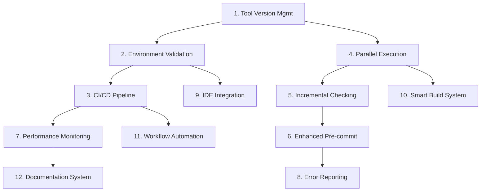

# Development Infrastructure - Implementation Tasks

## Overview

This document breaks down the implementation of enhanced development infrastructure for Freightliner into specific, actionable tasks that build upon the excellent existing foundation of Makefile, scripts, and tool configurations.

## Task Breakdown

### Phase 1: Foundation Enhancement (High Priority)

- [ ] 1. **Implement Tool Version Management**
  - Create tools.go file with pinned tool versions
  - Update Makefile to use specific versions instead of @latest
  - Add version validation to environment checks
  - Create automated tool version update process with testing
  - _Leverage: Existing make setup target and tool installation scripts_
  - _Requirements: 4.1, 4.2, 4.3, Gap 2_

- [ ] 2. **Create Comprehensive Environment Validation**
  - Develop validate_environment.sh script with comprehensive checks
  - Add validation for Go installation, tool versions, and configurations
  - Integrate validation into make setup and CI pipeline
  - Create validation reporting with colored output and fix suggestions
  - _Leverage: Existing tool installation and configuration patterns_
  - _Requirements: 1.4, Gap 4_

- [ ] 3. **Enhance CI/CD Pipeline Integration**
  - Create GitHub Actions workflow using same Make targets as local development
  - Implement artifact collection for build outputs and quality reports
  - Add caching for Go modules and tool installations
  - Create comprehensive CI reporting with build status and metrics
  - _Leverage: Existing Make targets and tool configurations_
  - _Requirements: 6.1, 6.2, 6.3, Gap 1_

### Phase 2: Performance and Workflow Optimization (Medium Priority)

- [ ] 4. **Implement Parallel Quality Check Execution**
  - Create parallel_quality_check.sh script for safe parallel execution
  - Update Makefile with parallel targets (check-parallel)
  - Add intelligent dependency management for quality checks
  - Implement fallback to sequential execution if parallel fails
  - _Leverage: Existing quality check scripts and Make targets_
  - _Requirements: Gap 5_

- [ ] 5. **Create Incremental Quality Checking System**
  - Develop incremental_check.sh for changed files only
  - Add git integration to identify modified files
  - Create smart dependency tracking for affected packages
  - Implement incremental checking in pre-commit hooks
  - _Leverage: Existing pre-commit hook and quality scripts_
  - _Requirements: Gap 7_

- [ ] 6. **Build Enhanced Pre-commit Hook System**
  - Enhance existing pre-commit hook with better error reporting
  - Add support for incremental checking and parallel execution
  - Implement fix suggestions and automated remediation
  - Create pre-commit hook validation and self-repair
  - _Leverage: Existing scripts/pre-commit hook_
  - _Requirements: 2.1, 2.2, 2.3_

### Phase 3: Advanced Infrastructure Features (Medium Priority)

- [ ] 7. **Implement Infrastructure Performance Monitoring**
  - Create metrics collection for build and quality check performance
  - Add infrastructure health monitoring and alerting
  - Implement performance trend analysis and regression detection
  - Create infrastructure performance dashboard
  - _Leverage: Existing Make targets and script outputs_
  - _Requirements: Gap 3_

- [ ] 8. **Create Enhanced Error Reporting System**
  - Develop smart error reporting with fix suggestions
  - Add contextual help and links to documentation
  - Implement error categorization and common solutions database
  - Create interactive error resolution assistance
  - _Leverage: Existing script error handling patterns_
  - _Requirements: Gap 6_

- [ ] 9. **Build Advanced IDE Integration**
  - Create automated IDE setup scripts for VS Code, GoLand, and Vim
  - Add IDE configuration validation and synchronization
  - Implement project settings templates and setup automation
  - Create IDE integration testing and validation
  - _Leverage: Existing IDE configuration documentation_
  - _Requirements: 5.1, 5.2, 5.3, 5.4_

### Phase 4: Developer Experience Enhancement (Lower Priority)

- [ ] 10. **Implement Smart Build System**
  - Add intelligent build dependency tracking
  - Create cached build system with incremental compilation
  - Implement build performance optimization and profiling
  - Add cross-platform build support and validation
  - _Leverage: Existing make build target and Go build system_
  - _Requirements: 3.1, 3.2, 3.3_

- [ ] 11. **Create Development Workflow Automation**
  - Build automated development task orchestration
  - Add workflow customization and configuration management
  - Implement development lifecycle automation (setup, develop, test, deploy)
  - Create workflow analytics and optimization suggestions
  - _Leverage: Existing comprehensive Make targets_
  - _Requirements: 1.1, 1.2, 1.3_

- [ ] 12. **Build Infrastructure Documentation System**
  - Create interactive infrastructure documentation
  - Add automated documentation generation from configurations
  - Implement searchable troubleshooting knowledge base
  - Create infrastructure onboarding guide with validation
  - _Leverage: Existing comprehensive documentation and configurations_
  - _Requirements: Gap 4_

## Task Dependencies



## Implementation Priority Guidelines

### Critical Path (Week 1-2)
- **Task 1**: Tool Version Management - Foundation for consistent environments
- **Task 2**: Environment Validation - Essential for reliable setup
- **Task 3**: CI/CD Pipeline - Critical for automated quality assurance

### High Impact (Week 3-4)
- **Task 4**: Parallel Execution - Significant developer productivity improvement
- **Task 5**: Incremental Checking - Major speed improvement for daily workflow
- **Task 6**: Enhanced Pre-commit - Better developer experience

### Value-Add (Week 5-8)
- **Task 7**: Performance Monitoring - Infrastructure health and optimization
- **Task 8**: Error Reporting - Improved troubleshooting experience
- **Task 9**: IDE Integration - Consistent developer environment

### Enhancement (Week 9+)  
- **Task 10**: Smart Build System - Advanced build optimization
- **Task 11**: Workflow Automation - Advanced development lifecycle support
- **Task 12**: Documentation System - Long-term maintainability

## Detailed Task Specifications

### Task 1: Tool Version Management
```go
// tools.go - Version management approach
//go:build tools

package main

import (
    _ "github.com/golangci/golangci-lint/cmd/golangci-lint" // v1.50.1
    _ "golang.org/x/tools/cmd/goimports"                   // v0.4.0
    _ "honnef.co/go/tools/cmd/staticcheck"                 // v0.3.3
    _ "golang.org/x/tools/go/analysis/passes/shadow/cmd/shadow" // v0.4.0
)
```

**Makefile Enhancement:**
```makefile
# Tool versions
GOLANGCI_LINT_VERSION := v1.50.1
GOIMPORTS_VERSION := v0.4.0
STATICCHECK_VERSION := v0.3.3

install-tools:
	@echo "Installing tools with pinned versions..."
	go install github.com/golangci/golangci-lint/cmd/golangci-lint@$(GOLANGCI_LINT_VERSION)
	go install golang.org/x/tools/cmd/goimports@$(GOIMPORTS_VERSION)
	go install honnef.co/go/tools/cmd/staticcheck@$(STATICCHECK_VERSION)
```

### Task 4: Parallel Quality Check Implementation
```bash
#!/bin/bash
# scripts/parallel_quality_check.sh

run_parallel_checks() {
    echo "🚀 Running quality checks in parallel..."
    
    # Phase 1: Formatting (can run in parallel)
    {
        echo "Running gofmt..."
        make fmt > /tmp/fmt.log 2>&1
        echo $? > /tmp/fmt.exit
    } &
    
    {
        echo "Running goimports..."
        make imports > /tmp/imports.log 2>&1
        echo $? > /tmp/imports.exit
    } &
    
    wait
    
    # Check formatting results
    check_results "fmt" "imports" || return 1
    
    # Phase 2: Analysis (can run in parallel after formatting)
    {
        echo "Running go vet..."
        make vet > /tmp/vet.log 2>&1
        echo $? > /tmp/vet.exit
    } &
    
    {
        echo "Running golangci-lint..."
        make lint > /tmp/lint.log 2>&1
        echo $? > /tmp/lint.exit
    } &
    
    {
        echo "Running staticcheck..."
        make staticcheck > /tmp/static.log 2>&1
        echo $? > /tmp/static.exit
    } &
    
    wait
    
    # Check analysis results
    check_results "vet" "lint" "static" || return 1
    
    echo "✅ All parallel quality checks passed!"
}
```

### Task 5: Incremental Checking System
```bash
#!/bin/bash
# scripts/incremental_check.sh

get_changed_files() {
    if [[ -n "$CI" ]]; then
        # In CI, check against merge base
        git diff --name-only --diff-filter=ACM origin/main...HEAD | grep '\.go$'
    else
        # Locally, check staged and modified files
        {
            git diff --cached --name-only --diff-filter=ACM
            git diff --name-only --diff-filter=ACM
        } | grep '\.go$' | sort -u
    fi
}

run_incremental_checks() {
    local files=("$@")
    
    if [[ ${#files[@]} -eq 0 ]]; then
        echo "✅ No Go files to check"
        return 0
    fi
    
    echo "🔍 Running incremental checks on ${#files[@]} files..."
    
    # Format specific files
    gofmt -w "${files[@]}"
    goimports -w -local freightliner "${files[@]}"
    
    # Run linting on specific files
    golangci-lint run --fast "${files[@]}"
    
    # Run vet on packages containing the files
    local packages=$(dirname "${files[@]}" | sort -u | xargs -I {} echo "./{}/...")
    go vet $packages
    
    echo "✅ Incremental checks completed"
}
```

## Success Criteria

### Performance Metrics
- **Parallel Execution**: 40-60% reduction in quality check time
- **Incremental Checking**: 80%+ reduction in local development check time
- **Build Performance**: <30 seconds for incremental builds
- **Setup Time**: <5 minutes for complete environment setup

### Reliability Metrics
- **Environment Consistency**: 100% success rate for validated environment setup
- **CI/CD Stability**: 95%+ success rate for CI pipeline execution
- **Tool Version Consistency**: Zero version mismatch issues across environments
- **Build Reproducibility**: 100% reproducible builds across environments

### Developer Experience Metrics
- **Setup Success Rate**: 95%+ successful new developer onboarding
- **Daily Workflow Speed**: 50%+ improvement in common development tasks
- **Error Resolution Time**: 60%+ reduction in time to resolve build/quality issues
- **IDE Integration Success**: 90%+ of developers successfully using integrated tools

## Production Readiness Tasks

### Recently Completed (2025-01-26)

- [x] **C1** Fix shell script errors in vet.sh with unary operator issues
  - Fixed bash script variable initialization and quoting issues
  - Resolved "unary operator expected" errors in conditional checks
  - Improved error handling and variable management in scripts/vet.sh
  - **Status**: ✅ COMPLETED - Shell script now runs without errors
  - _Leverage: Existing shell script infrastructure_

- [x] **C2** Fix variable shadowing issues detected by go vet shadow tool
  - Fixed 18+ variable shadowing errors across multiple packages
  - Improved code quality and readability
  - Eliminated potential variable shadowing bugs
  - Updated files: `pkg/client/ecr/client.go`, `pkg/secrets/gcp/provider.go`, `pkg/client/gcr/repository.go`, `pkg/service/replicate.go`, `pkg/service/tree_replicate.go`, `pkg/tree/checkpoint/file_store_test.go`, `pkg/tree/checkpoint/resume_test.go`, `pkg/security/encryption/manager.go`
  - **Status**: ✅ COMPLETED - All `make vet` checks now pass
  - _Leverage: Existing shell scripts and Go vet tooling_

### Phase 1: Critical Security Fixes (P0 - Must Complete Before Any Deployment)

- [ ] **1.1** Fix timing attack vulnerability in API key authentication
  - Replace string comparison with `crypto/subtle.ConstantTimeCompare`
  - Update authentication middleware in `pkg/server/server.go:241`
  - Add unit tests for timing attack prevention
  - _Requirements: Security-1.1, Security-1.2_
  - _Leverage: existing authentication middleware_

- [ ] **1.2** Implement comprehensive rate limiting
  - Add rate limiting middleware for all authentication endpoints
  - Configure different limits for different endpoint types
  - Add distributed rate limiting for multi-instance deployments
  - _Requirements: Security-2.1, Security-2.2_
  - _Leverage: existing middleware patterns_

- [ ] **1.3** Add panic recovery middleware
  - Implement panic recovery for all HTTP handlers
  - Add structured logging for panic events
  - Ensure graceful error responses during panics
  - _Requirements: Reliability-1.1, Reliability-1.2_
  - _Leverage: existing middleware stack_

- [ ] **1.4** Implement functional Prometheus metrics collection
  - Replace no-op metrics collector with functional implementation
  - Add all required business and system metrics
  - Integrate with existing logging infrastructure
  - _Requirements: Operations-1.1, Operations-1.2_
  - _Leverage: existing metrics interfaces in `pkg/metrics/`_

- [ ] **1.5** Add image checksum validation
  - Implement SHA256 validation for all transferred images
  - Add corruption detection and recovery mechanisms
  - Update copy operations to validate checksums
  - _Requirements: DataIntegrity-1.1, DataIntegrity-1.2_
  - _Leverage: existing copy package in `pkg/copy/`_

### Phase 2: Critical Infrastructure (P0 - Database & High Availability)

- [ ] **2.1** Design high availability architecture for checkpoint storage
  - Evaluate database clustering options (PostgreSQL HA, etcd cluster)
  - Design data replication and backup strategies
  - Plan failover and recovery mechanisms
  - _Requirements: Reliability-4.1, Reliability-4.2_
  - _Leverage: existing checkpoint interfaces in `pkg/tree/checkpoint/`_

- [ ] **2.2** Implement database clustering
  - Set up clustered database deployment
  - Add connection failover logic
  - Implement backup and recovery procedures
  - _Requirements: Reliability-4.3, Reliability-4.4_
  - _Leverage: existing checkpoint store patterns_

### Phase 3: Security Hardening (P1 - Critical for Production)

- [ ] **3.1** Implement comprehensive input validation
  - Add request body size limits and validation
  - Implement registry name injection attack prevention
  - Add comprehensive parameter validation
  - _Requirements: Security-3.1, Security-3.2, Security-3.3_
  - _Leverage: existing validation patterns in `pkg/helper/validation/`_

- [ ] **3.2** Secure CORS configuration
  - Replace wildcard CORS with specific origin allowlists
  - Implement environment-specific CORS configurations
  - Add CORS preflight handling
  - _Requirements: Security-1.3, Security-1.4_
  - _Leverage: existing configuration system_

- [ ] **3.3** Implement TLS security hardening
  - Configure minimum TLS versions and cipher suites
  - Add certificate pinning for registry connections
  - Implement proper certificate validation
  - _Requirements: Security-4.1, Security-4.2, Security-4.3_
  - _Leverage: existing HTTP client configurations_

### Phase 4: Reliability & Resource Management (P1)

- [ ] **4.1** Fix goroutine leaks in worker pools
  - Add proper goroutine lifecycle management
  - Implement graceful shutdown procedures
  - Add goroutine leak detection in tests
  - _Requirements: Reliability-2.1, Reliability-2.2_
  - _Leverage: existing worker pool in `pkg/replication/worker_pool.go`_

- [ ] **4.2** Implement circuit breaker pattern
  - Add circuit breakers for external registry calls
  - Configure failure thresholds and recovery timeouts
  - Add circuit breaker metrics and monitoring
  - _Requirements: Reliability-1.3, Reliability-1.4_
  - _Leverage: existing client interfaces in `pkg/client/`_

- [ ] **4.3** Add comprehensive error handling
  - Implement proper context cancellation handling
  - Add graceful degradation for resource exhaustion
  - Enhance error propagation and recovery
  - _Requirements: Reliability-1.5, Reliability-1.6_
  - _Leverage: existing error handling patterns_

### Phase 5: Performance & Scalability (P1)

- [ ] **5.1** Design horizontal scaling architecture
  - Design stateless service architecture
  - Plan load balancing and service discovery
  - Design distributed coordination mechanisms
  - _Requirements: Performance-1.1, Performance-1.2_
  - _Leverage: existing service interfaces_

- [ ] **5.2** Implement streaming for large transfers
  - Replace buffered transfers with streaming
  - Add progressive transfer with resume capability
  - Implement bandwidth limiting and optimization
  - _Requirements: Performance-2.1, Performance-2.2_
  - _Leverage: existing transfer logic in `pkg/copy/copier.go`_

- [ ] **5.3** Add caching layer
  - Implement registry authentication token caching
  - Add image metadata caching
  - Design cache invalidation strategies
  - _Requirements: Performance-3.1, Performance-3.2_
  - _Leverage: existing client authentication patterns_

### Phase 6: Operational Excellence (P1-P2)

- [ ] **6.1** Implement comprehensive configuration validation
  - Add startup configuration validation
  - Implement environment-specific configuration management
  - Add configuration schema and documentation
  - _Requirements: Operations-2.1, Operations-2.2_
  - _Leverage: existing configuration system in `pkg/config/`_

- [ ] **6.2** Add structured logging with correlation IDs
  - Implement correlation ID tracking across requests
  - Add structured logging for all operations
  - Integrate with log aggregation systems
  - _Requirements: Operations-1.3, Operations-1.4_
  - _Leverage: existing logging infrastructure in `pkg/helper/log/`_

- [ ] **6.3** Implement comprehensive health checks
  - Add health checks for all external dependencies
  - Implement readiness and liveness probes
  - Add health check metrics and alerting
  - _Requirements: Operations-1.5, Operations-1.6_
  - _Leverage: existing service monitoring patterns_

### Phase 7: Testing & Quality Assurance (P2)

- [ ] **7.1** Achieve 80% test coverage
  - Add comprehensive unit tests for all packages
  - Implement integration tests for critical workflows
  - Add performance regression tests
  - _Requirements: Testing-1.1, Testing-1.2_
  - _Leverage: existing test infrastructure_

- [ ] **7.2** Implement end-to-end test suite
  - Create comprehensive E2E test scenarios
  - Add chaos engineering test cases
  - Implement security penetration testing
  - _Requirements: Testing-1.3, Testing-1.4_
  - _Leverage: existing registry test infrastructure in `scripts/`_

### Phase 8: Deployment & DevOps (P2)

- [ ] **8.1** Create production deployment artifacts
  - Design and implement Dockerfile for containerization
  - Create Kubernetes deployment manifests
  - Implement CI/CD pipeline for production deployment
  - _Requirements: Operations-3.1, Operations-3.2_
  - _Leverage: existing Makefile and build infrastructure_

- [ ] **8.2** Implement security scanning integration
  - Add static security analysis to CI pipeline
  - Implement dependency vulnerability scanning
  - Add secrets detection in code commits
  - _Requirements: Security-5.1, Security-5.2_
  - _Leverage: existing CI/CD patterns_

## Production Readiness Validation Tasks

### Security Validation
- [ ] **V1** Conduct comprehensive security audit
- [ ] **V2** Perform penetration testing
- [ ] **V3** Validate all security controls

### Performance Validation  
- [ ] **V4** Execute comprehensive load testing
- [ ] **V5** Validate horizontal scaling performance
- [ ] **V6** Benchmark against performance requirements

### Operational Validation
- [ ] **V7** Validate monitoring and alerting systems
- [ ] **V8** Test disaster recovery procedures
- [ ] **V9** Validate backup and restore capabilities

### Integration Validation
- [ ] **V10** Execute full end-to-end test suite
- [ ] **V11** Validate all external integrations
- [ ] **V12** Test configuration management across environments

## Success Criteria for Production Readiness

### Security Metrics
- **Zero P0 security vulnerabilities** in production code
- **Rate limiting effectiveness**: >99% malicious request blocking
- **Authentication security**: Zero timing attack vulnerabilities
- **Input validation coverage**: 100% of external inputs validated

### Reliability Metrics  
- **System uptime**: 99.9% availability target
- **Graceful error handling**: Zero system crashes from panics
- **Resource management**: Zero memory/connection leaks
- **Circuit breaker effectiveness**: <5% cascading failure rate

### Performance Metrics
- **Horizontal scaling**: Linear performance scaling to 10x load
- **Memory efficiency**: <2GB memory usage for 1000 concurrent transfers
- **Transfer performance**: >100MB/s sustained transfer rates
- **Response latency**: <100ms API response times at scale

### Operational Metrics
- **Monitoring coverage**: 100% of critical components monitored
- **Alert accuracy**: <5% false positive alert rate
- **Deployment success**: 99% successful production deployments
- **Recovery time**: <5 minutes mean time to recovery

## Resource Requirements

### Technical Skills
- **Shell Scripting**: Advanced bash scripting for automation
- **Go Development**: For tool integration and validation scripts
- **CI/CD Platforms**: GitHub Actions expertise
- **Build Systems**: Make and Go build system knowledge
- **Performance Optimization**: Profiling and optimization techniques

### Infrastructure Needs
- **CI/CD Platform**: GitHub Actions or equivalent
- **Artifact Storage**: For build outputs and reports
- **Performance Monitoring**: Basic metrics collection and storage
- **Documentation Hosting**: For infrastructure documentation

### Time Estimates
- **Phase 1 (Foundation)**: 2 weeks, 1 developer
- **Phase 2 (Performance)**: 3 weeks, 1-2 developers
- **Phase 3 (Advanced)**: 4 weeks, 1 developer
- **Phase 4 (Enhancement)**: 3 weeks, 1 developer

**Total Effort**: 12 weeks, 1-2 developers (can be parallelized)

## Risk Mitigation

### Technical Risks
- **Tool Compatibility**: Comprehensive testing of tool interactions
- **Performance Regression**: Continuous monitoring and benchmarking
- **Platform Dependencies**: Cross-platform testing and validation

### Process Risks
- **Developer Workflow Disruption**: Gradual rollout with fallback options
- **Learning Curve**: Comprehensive documentation and training
- **Maintenance Overhead**: Design for minimal ongoing maintenance

### Mitigation Strategies
- **Incremental Deployment**: Roll out features gradually with validation
- **Automated Testing**: Comprehensive testing of all infrastructure components
- **Rollback Capability**: Easy rollback for any problematic changes
- **Documentation**: Clear documentation for all new infrastructure features
- **Monitoring**: Active monitoring of infrastructure health and performance