# Design Document: Missing Implementations and Stub Completions

## Overview

This design provides comprehensive solutions for all stub implementations in Freightliner, transforming incomplete placeholders into fully functional, production-ready components. The design maintains architectural consistency while adding robust error handling, performance optimization, and complete feature sets.

## Code Reuse Analysis

### Leveraging Existing Infrastructure

**Secrets Management Foundation**:
- Build upon existing AWS SDK integration in `pkg/service/replicate.go`
- Extend current GCP client patterns from `pkg/secrets/gcp/provider.go`
- Leverage established error handling from `pkg/helper/errors/errors.go`
- Use existing configuration patterns from `pkg/config/config.go`

**Replication Architecture**:
- Extend current worker pool implementation in `pkg/replication/worker_pool.go`
- Build upon existing registry client interfaces in `pkg/interfaces/repository.go`
- Leverage established metrics collection from `pkg/metrics/metrics.go`

**Network and Compression**:
- Utilize existing HTTP transport patterns in `pkg/client/common/base_transport.go`
- Build upon network optimization framework in `pkg/network/`
- Extend existing streaming patterns for large data handling

## System Architecture

### Implementation Architecture Overview

```mermaid
graph TB
    subgraph "Secrets Management Layer"
        SM[Secrets Manager]
        AWS_SM[AWS Secrets Implementation]
        GCP_SM[GCP Secrets Implementation]
        SM_Cache[Secrets Cache]
    end
    
    subgraph "Tree Replication Engine"
        TRE[Tree Replication Engine]
        RP[Repository Processor]
        PP[Parallel Processor]
        PS[Progress Scheduler]
    end
    
    subgraph "Resume System"
        RS[Resume Manager]
        CP[Checkpoint Processor]
        SS[State Serializer]
        IV[Integrity Validator]
    end
    
    subgraph "Compression Engine"
        CE[Compression Engine]
        CA[Compression Algorithms]
        CM[Compression Metrics]
        CF[Compression Fallback]
    end
    
    subgraph "Enhanced Repository Features"
        ERF[Enhanced Repository]
        TC[Tag Cache Manager]
        IC[Image Cache Manager]
        ML[Manifest Lister]
    end
    
    subgraph "Existing Infrastructure"
        WP[Worker Pools]
        RC[Registry Clients]
        MT[Metrics]
        LOG[Logging]
    end
    
    SM --> AWS_SM
    SM --> GCP_SM
    SM --> SM_Cache
    
    TRE --> RP
    TRE --> PP
    TRE --> PS
    
    RS --> CP
    RS --> SS
    RS --> IV
    
    CE --> CA
    CE --> CM
    CE --> CF
    
    ERF --> TC
    ERF --> IC
    ERF --> ML
    
    TRE --> WP
    RS --> WP
    CE --> RC
    ERF --> RC
    
    SM --> MT
    TRE --> MT
    RS --> LOG
    CE --> LOG
```



## Critical Implementation Designs

### 1. Complete Secrets Management Implementation

#### AWS Secrets Manager Implementation

```go
// Complete AWS Secrets Provider implementation
type AWSSecretsProvider struct {
    client    *secretsmanager.Client
    logger    *log.Logger
    metrics   *metrics.SecretsMetrics
    validator *SecretsValidator
}

// PutSecret creates or updates a secret in AWS Secrets Manager
func (p *AWSSecretsProvider) PutSecret(ctx context.Context, secretName, secretValue string) error {
    startTime := time.Now()
    defer func() {
        p.metrics.RecordOperation("put_secret", "aws", time.Since(startTime))
    }()
    
    // Validate input
    if err := p.validator.ValidateSecretName(secretName); err != nil {
        return errors.Wrap(err, "invalid secret name")
    }
    
    if err := p.validator.ValidateSecretValue(secretValue); err != nil {
        return errors.Wrap(err, "invalid secret value")
    }
    
    // Check if secret exists
    exists, err := p.secretExists(ctx, secretName)
    if err != nil {
        return errors.Wrap(err, "failed to check if secret exists")
    }
    
    if exists {
        // Update existing secret
        input := &secretsmanager.UpdateSecretInput{
            SecretId:     aws.String(secretName),
            SecretString: aws.String(secretValue),
        }
        
        _, err = p.client.UpdateSecret(ctx, input)
        if err != nil {
            p.metrics.RecordError("update_secret", "aws")
            return errors.Wrap(err, "failed to update secret in AWS Secrets Manager")
        }
        
        p.logger.Info("Secret updated successfully", map[string]interface{}{
            "secret_name": secretName,
            "provider":    "aws",
        })
    } else {
        // Create new secret
        input := &secretsmanager.CreateSecretInput{
            Name:         aws.String(secretName),
            SecretString: aws.String(secretValue),
            Description:  aws.String("Created by Freightliner"),
        }
        
        _, err = p.client.CreateSecret(ctx, input)
        if err != nil {
            p.metrics.RecordError("create_secret", "aws")
            return errors.Wrap(err, "failed to create secret in AWS Secrets Manager")
        }
        
        p.logger.Info("Secret created successfully", map[string]interface{}{
            "secret_name": secretName,
            "provider":    "aws",
        })
    }
    
    p.metrics.RecordSuccess("put_secret", "aws")
    return nil
}

// PutJSONSecret marshals an object to JSON and stores it as a secret
func (p *AWSSecretsProvider) PutJSONSecret(ctx context.Context, secretName string, v interface{}) error {
    jsonData, err := json.Marshal(v)
    if err != nil {
        return errors.Wrap(err, "failed to marshal object to JSON")
    }
    
    return p.PutSecret(ctx, secretName, string(jsonData))
}

// DeleteSecret removes a secret from AWS Secrets Manager
func (p *AWSSecretsProvider) DeleteSecret(ctx context.Context, secretName string) error {
    startTime := time.Now()
    defer func() {
        p.metrics.RecordOperation("delete_secret", "aws", time.Since(startTime))
    }()
    
    // Validate input
    if err := p.validator.ValidateSecretName(secretName); err != nil {
        return errors.Wrap(err, "invalid secret name")
    }
    
    // Schedule secret for deletion (AWS requires this approach)
    input := &secretsmanager.DeleteSecretInput{
        SecretId:             aws.String(secretName),
        ForceDeleteWithoutRecovery: aws.Bool(false), // Allow 30-day recovery period
    }
    
    _, err := p.client.DeleteSecret(ctx, input)
    if err != nil {
        var resourceNotFound *types.ResourceNotFoundException
        if errors.As(err, &resourceNotFound) {
            p.logger.Warn("Secret not found for deletion", map[string]interface{}{
                "secret_name": secretName,
                "provider":    "aws",
            })
            return errors.NotFoundf("secret %s not found", secretName)
        }
        
        p.metrics.RecordError("delete_secret", "aws")
        return errors.Wrap(err, "failed to delete secret from AWS Secrets Manager")
    }
    
    p.logger.Info("Secret scheduled for deletion", map[string]interface{}{
        "secret_name": secretName,
        "provider":    "aws",
    })
    
    p.metrics.RecordSuccess("delete_secret", "aws")
    return nil
}

// Helper method to check if secret exists
func (p *AWSSecretsProvider) secretExists(ctx context.Context, secretName string) (bool, error) {
    input := &secretsmanager.DescribeSecretInput{
        SecretId: aws.String(secretName),
    }
    
    _, err := p.client.DescribeSecret(ctx, input)
    if err != nil {
        var resourceNotFound *types.ResourceNotFoundException
        if errors.As(err, &resourceNotFound) {
            return false, nil
        }
        return false, err
    }
    
    return true, nil
}
```

#### GCP Secret Manager Implementation

```go
// Complete GCP Secrets Provider implementation
type GCPSecretsProvider struct {
    client    *secretmanager.Client
    project   string
    logger    *log.Logger
    metrics   *metrics.SecretsMetrics
    validator *SecretsValidator
}

// PutSecret creates or updates a secret in Google Secret Manager
func (p *GCPSecretsProvider) PutSecret(ctx context.Context, secretName, secretValue string) error {
    startTime := time.Now()
    defer func() {
        p.metrics.RecordOperation("put_secret", "gcp", time.Since(startTime))
    }()
    
    // Validate input
    if err := p.validator.ValidateSecretName(secretName); err != nil {
        return errors.Wrap(err, "invalid secret name")
    }
    
    if err := p.validator.ValidateSecretValue(secretValue); err != nil {
        return errors.Wrap(err, "invalid secret value")
    }
    
    secretPath := fmt.Sprintf("projects/%s/secrets/%s", p.project, secretName)
    
    // Check if secret exists
    exists, err := p.secretExists(ctx, secretPath)
    if err != nil {
        return errors.Wrap(err, "failed to check if secret exists")
    }
    
    if !exists {
        // Create the secret first
        createReq := &secretmanagerpb.CreateSecretRequest{
            Parent:   fmt.Sprintf("projects/%s", p.project),
            SecretId: secretName,
            Secret: &secretmanagerpb.Secret{
                Labels: map[string]string{
                    "created-by": "freightliner",
                    "managed":    "true",
                },
            },
        }
        
        _, err = p.client.CreateSecret(ctx, createReq)
        if err != nil {
            p.metrics.RecordError("create_secret", "gcp")
            return errors.Wrap(err, "failed to create secret in Google Secret Manager")
        }
    }
    
    // Add secret version with the actual value
    addVersionReq := &secretmanagerpb.AddSecretVersionRequest{
        Parent: secretPath,
        Payload: &secretmanagerpb.SecretPayload{
            Data: []byte(secretValue),
        },
    }
    
    _, err = p.client.AddSecretVersion(ctx, addVersionReq)
    if err != nil {
        p.metrics.RecordError("add_secret_version", "gcp")
        return errors.Wrap(err, "failed to add secret version in Google Secret Manager")
    }
    
    p.logger.Info("Secret created/updated successfully", map[string]interface{}{
        "secret_name": secretName,
        "provider":    "gcp",
        "project":     p.project,
    })
    
    p.metrics.RecordSuccess("put_secret", "gcp")
    return nil
}

// DeleteSecret removes a secret from Google Secret Manager
func (p *GCPSecretsProvider) DeleteSecret(ctx context.Context, secretName string) error {
    startTime := time.Now()
    defer func() {
        p.metrics.RecordOperation("delete_secret", "gcp", time.Since(startTime))
    }()
    
    // Validate input
    if err := p.validator.ValidateSecretName(secretName); err != nil {
        return errors.Wrap(err, "invalid secret name")
    }
    
    secretPath := fmt.Sprintf("projects/%s/secrets/%s", p.project, secretName)
    
    deleteReq := &secretmanagerpb.DeleteSecretRequest{
        Name: secretPath,
    }
    
    err := p.client.DeleteSecret(ctx, deleteReq)
    if err != nil {
        if status.Code(err) == codes.NotFound {
            p.logger.Warn("Secret not found for deletion", map[string]interface{}{
                "secret_name": secretName,
                "provider":    "gcp",
            })
            return errors.NotFoundf("secret %s not found", secretName)
        }
        
        p.metrics.RecordError("delete_secret", "gcp")
        return errors.Wrap(err, "failed to delete secret from Google Secret Manager")
    }
    
    p.logger.Info("Secret deleted successfully", map[string]interface{}{
        "secret_name": secretName,
        "provider":    "gcp",
        "project":     p.project,
    })
    
    p.metrics.RecordSuccess("delete_secret", "gcp")
    return nil
}
```

### 2. Production Tree Replication Engine

#### Core Tree Replicator Implementation

```go
// ProductionTreeReplicator replaces the mock implementation
type ProductionTreeReplicator struct {
    sourceClient      interfaces.RegistryClient
    destinationClient interfaces.RegistryClient
    logger           *log.Logger
    metrics          *metrics.ReplicationMetrics
    workerPool       *replication.WorkerPool
    progressTracker  *ProgressTracker
    config          TreeReplicationConfig
}

type TreeReplicationConfig struct {
    MaxConcurrency    int           `yaml:"max_concurrency"`
    ProgressInterval  time.Duration `yaml:"progress_interval"`
    RetryAttempts     int           `yaml:"retry_attempts"`
    RetryDelay        time.Duration `yaml:"retry_delay"`
    SkipExisting     bool          `yaml:"skip_existing"`
}

// ReplicateRepository performs actual repository-to-repository replication
func (r *ProductionTreeReplicator) ReplicateRepository(ctx context.Context, sourceRepo, destRepo string) error {
    startTime := time.Now()
    replicationID := generateReplicationID()
    
    r.logger.Info("Starting repository replication", map[string]interface{}{
        "replication_id":   replicationID,
        "source_repo":      sourceRepo,
        "destination_repo": destRepo,
    })
    
    // Track progress
    progress := r.progressTracker.StartReplication(replicationID, sourceRepo, destRepo)
    defer progress.Complete()
    
    // Get source repository
    sourceRepository, err := r.sourceClient.GetRepository(ctx, sourceRepo)
    if err != nil {
        return errors.Wrap(err, "failed to get source repository")
    }
    
    // Get or create destination repository
    destRepository, err := r.getOrCreateDestinationRepository(ctx, destRepo)
    if err != nil {
        return errors.Wrap(err, "failed to get or create destination repository")
    }
    
    // List all tags in source repository
    sourceTags, err := sourceRepository.ListTags(ctx)
    if err != nil {
        return errors.Wrap(err, "failed to list source tags")
    }
    
    if len(sourceTags) == 0 {
        r.logger.Info("No tags found in source repository", map[string]interface{}{
            "source_repo": sourceRepo,
        })
        return nil
    }
    
    progress.SetTotalTags(len(sourceTags))
    
    // Process tags in parallel using worker pool
    results := make(chan TagReplicationResult, len(sourceTags))
    
    for _, tag := range sourceTags {
        currentTag := tag
        err := r.workerPool.Submit(replicationID+"-"+currentTag, func(ctx context.Context) error {
            result := r.replicateTag(ctx, sourceRepository, destRepository, currentTag)
            results <- result
            return result.Error
        })
        
        if err != nil {
            r.logger.Error("Failed to submit tag replication job", err, map[string]interface{}{
                "tag": currentTag,
            })
        }
    }
    
    // Collect results
    var successCount, errorCount int
    var totalBytesTransferred int64
    
    for i := 0; i < len(sourceTags); i++ {
        result := <-results
        
        if result.Error != nil {
            errorCount++
            r.logger.Error("Tag replication failed", result.Error, map[string]interface{}{
                "tag":              result.Tag,
                "source_repo":      sourceRepo,
                "destination_repo": destRepo,
            })
        } else {
            successCount++
            totalBytesTransferred += result.BytesTransferred
            progress.IncrementCompleted()
        }
        
        // Update progress
        progress.UpdateProgress(i+1, len(sourceTags))
    }
    
    duration := time.Since(startTime)
    
    // Record metrics
    r.metrics.RecordReplication(sourceRepo, destRepo, successCount, errorCount, totalBytesTransferred, duration)
    
    r.logger.Info("Repository replication completed", map[string]interface{}{
        "replication_id":       replicationID,
        "source_repo":          sourceRepo,
        "destination_repo":     destRepo,
        "tags_successful":      successCount,
        "tags_failed":          errorCount,
        "bytes_transferred":    totalBytesTransferred,
        "duration_seconds":     duration.Seconds(),
    })
    
    if errorCount > 0 {
        return errors.InvalidInputf("replication completed with %d errors out of %d tags", errorCount, len(sourceTags))
    }
    
    return nil
}

type TagReplicationResult struct {
    Tag               string
    BytesTransferred  int64
    Error            error
}

// replicateTag handles individual tag replication with retry logic
func (r *ProductionTreeReplicator) replicateTag(ctx context.Context, sourceRepo, destRepo interfaces.Repository, tag string) TagReplicationResult {
    var lastErr error
    
    for attempt := 0; attempt < r.config.RetryAttempts; attempt++ {
        if attempt > 0 {
            // Wait before retry
            select {
            case <-ctx.Done():
                return TagReplicationResult{Tag: tag, Error: ctx.Err()}
            case <-time.After(r.config.RetryDelay * time.Duration(attempt)):
                // Continue with retry
            }
        }
        
        // Check if tag already exists in destination
        if r.config.SkipExisting {
            destManifest, err := destRepo.GetManifest(ctx, tag)
            if err == nil && destManifest != nil {
                r.logger.Debug("Tag already exists in destination, skipping", map[string]interface{}{
                    "tag": tag,
                })
                return TagReplicationResult{Tag: tag, BytesTransferred: 0, Error: nil}
            }
        }
        
        // Get source image
        sourceImage, err := sourceRepo.GetImage(ctx, tag)
        if err != nil {
            lastErr = errors.Wrap(err, "failed to get source image")
            continue
        }
        
        // Copy image to destination
        bytesTransferred, err := r.copyImageToDestination(ctx, sourceImage, destRepo, tag)
        if err != nil {
            lastErr = errors.Wrap(err, "failed to copy image to destination")
            continue
        }
        
        // Success
        return TagReplicationResult{
            Tag:              tag,
            BytesTransferred: bytesTransferred,
            Error:           nil,
        }
    }
    
    // All attempts failed
    return TagReplicationResult{
        Tag:   tag,
        Error: errors.Wrap(lastErr, "all retry attempts failed"),
    }
}
```

### 3. Complete Resume System Implementation

#### Checkpoint System Design

```go
// CheckpointManager handles checkpoint creation, validation, and loading
type CheckpointManager struct {
    store     CheckpointStore
    validator *CheckpointValidator
    logger    *log.Logger
    metrics   *metrics.CheckpointMetrics
}

type CheckpointData struct {
    ID                string                 `json:"id"`
    CreatedAt         time.Time              `json:"created_at"`
    UpdatedAt         time.Time             `json:"updated_at"`
    Version           string                 `json:"version"`
    ReplicationType   string                 `json:"replication_type"`
    SourceRegistry    string                 `json:"source_registry"`
    DestRegistry      string                 `json:"dest_registry"`
    TotalRepositories int                    `json:"total_repositories"`
    CompletedRepos    []string               `json:"completed_repos"`
    FailedRepos       []FailedRepository     `json:"failed_repos"`
    CurrentRepo       *CurrentRepoState      `json:"current_repo,omitempty"`
    Metadata          map[string]interface{} `json:"metadata"`
    Checksum          string                 `json:"checksum"`
}

type FailedRepository struct {
    Name         string    `json:"name"`
    Error        string    `json:"error"`
    AttemptCount int       `json:"attempt_count"`
    LastAttempt  time.Time `json:"last_attempt"`
}

type CurrentRepoState struct {
    Repository       string   `json:"repository"`
    TotalTags        int      `json:"total_tags"`
    CompletedTags    []string `json:"completed_tags"`
    CurrentTag       string   `json:"current_tag,omitempty"`
    StartedAt        time.Time `json:"started_at"`
}

// SaveCheckpoint creates or updates a checkpoint with integrity validation
func (cm *CheckpointManager) SaveCheckpoint(ctx context.Context, data *CheckpointData) error {
    startTime := time.Now()
    defer func() {
        cm.metrics.RecordOperation("save_checkpoint", time.Since(startTime))
    }()
    
    // Validate checkpoint data
    if err := cm.validator.ValidateCheckpoint(data); err != nil {
        return errors.Wrap(err, "checkpoint validation failed")
    }
    
    // Update metadata
    data.UpdatedAt = time.Now()
    data.Version = getCurrentVersion()
    
    // Calculate checksum for integrity
    checksum, err := cm.calculateChecksum(data)
    if err != nil {
        return errors.Wrap(err, "failed to calculate checkpoint checksum")
    }
    data.Checksum = checksum
    
    // Serialize checkpoint data
    serializedData, err := json.Marshal(data)
    if err != nil {
        return errors.Wrap(err, "failed to serialize checkpoint data")
    }
    
    // Save to store
    if err := cm.store.Save(ctx, data.ID, serializedData); err != nil {
        cm.metrics.RecordError("save_checkpoint")
        return errors.Wrap(err, "failed to save checkpoint to store")
    }
    
    cm.logger.Info("Checkpoint saved successfully", map[string]interface{}{
        "checkpoint_id":    data.ID,
        "completed_repos":  len(data.CompletedRepos),
        "failed_repos":     len(data.FailedRepos),
        "total_repos":      data.TotalRepositories,
    })
    
    cm.metrics.RecordSuccess("save_checkpoint")
    return nil
}

// LoadCheckpoint retrieves and validates a checkpoint
func (cm *CheckpointManager) LoadCheckpoint(ctx context.Context, checkpointID string) (*CheckpointData, error) {
    startTime := time.Now()
    defer func() {
        cm.metrics.RecordOperation("load_checkpoint", time.Since(startTime))
    }()
    
    // Load from store
    serializedData, err := cm.store.Load(ctx, checkpointID)
    if err != nil {
        cm.metrics.RecordError("load_checkpoint")
        return nil, errors.Wrap(err, "failed to load checkpoint from store")
    }
    
    // Deserialize checkpoint data
    var data CheckpointData
    if err := json.Unmarshal(serializedData, &data); err != nil {
        return nil, errors.Wrap(err, "failed to deserialize checkpoint data")
    }
    
    // Validate integrity
    if err := cm.validateCheckpointIntegrity(&data); err != nil {
        return nil, errors.Wrap(err, "checkpoint integrity validation failed")
    }
    
    // Validate checkpoint structure
    if err := cm.validator.ValidateCheckpoint(&data); err != nil {
        return nil, errors.Wrap(err, "checkpoint structure validation failed")
    }
    
    cm.logger.Info("Checkpoint loaded successfully", map[string]interface{}{
        "checkpoint_id":   data.ID,
        "created_at":      data.CreatedAt,
        "updated_at":      data.UpdatedAt,
        "completed_repos": len(data.CompletedRepos),
        "version":         data.Version,
    })
    
    cm.metrics.RecordSuccess("load_checkpoint")
    return &data, nil
}

// ResumeFromCheckpoint implements actual resume logic
func (r *ProductionTreeReplicator) ResumeFromCheckpoint(ctx context.Context, checkpointID string) error {
    r.logger.Info("Starting resume from checkpoint", map[string]interface{}{
        "checkpoint_id": checkpointID,
    })
    
    // Load checkpoint data
    checkpoint, err := r.checkpointManager.LoadCheckpoint(ctx, checkpointID)
    if err != nil {
        return errors.Wrap(err, "failed to load checkpoint")
    }
    
    // Validate that we can resume this checkpoint
    if err := r.validateResumeCapability(checkpoint); err != nil {
        return errors.Wrap(err, "cannot resume from this checkpoint")
    }
    
    // Get list of all repositories that need to be processed
    allRepos, err := r.getAllRepositories(ctx, checkpoint.SourceRegistry)
    if err != nil {
        return errors.Wrap(err, "failed to get repository list")
    }
    
    // Filter out already completed repositories
    remainingRepos := r.filterRemainingRepositories(allRepos, checkpoint.CompletedRepos)
    
    r.logger.Info("Resume analysis complete", map[string]interface{}{
        "total_repositories":     len(allRepos),
        "completed_repositories": len(checkpoint.CompletedRepos),
        "remaining_repositories": len(remainingRepos),
        "failed_repositories":    len(checkpoint.FailedRepos),
    })
    
    // Update checkpoint with resume start
    checkpoint.Metadata["resume_started_at"] = time.Now()
    if err := r.checkpointManager.SaveCheckpoint(ctx, checkpoint); err != nil {
        r.logger.Warn("Failed to update checkpoint with resume start", map[string]interface{}{
            "error": err.Error(),
        })
    }
    
    // Process remaining repositories
    for _, repo := range remainingRepos {
        select {
        case <-ctx.Done():
            r.logger.Info("Resume operation cancelled", map[string]interface{}{
                "checkpoint_id": checkpointID,
            })
            return ctx.Err()
        default:
            // Continue processing
        }
        
        err := r.processRepositoryWithCheckpoint(ctx, repo, checkpoint)
        if err != nil {
            r.logger.Error("Repository processing failed during resume", err, map[string]interface{}{
                "repository": repo,
            })
            
            // Add to failed repositories
            checkpoint.FailedRepos = append(checkpoint.FailedRepos, FailedRepository{
                Name:         repo,
                Error:        err.Error(),
                AttemptCount: 1,
                LastAttempt:  time.Now(),
            })
        } else {
            // Add to completed repositories
            checkpoint.CompletedRepos = append(checkpoint.CompletedRepos, repo)
        }
        
        // Update checkpoint periodically
        if err := r.checkpointManager.SaveCheckpoint(ctx, checkpoint); err != nil {
            r.logger.Warn("Failed to update checkpoint during resume", map[string]interface{}{
                "error": err.Error(),
            })
        }
    }
    
    r.logger.Info("Resume operation completed", map[string]interface{}{
        "checkpoint_id":          checkpointID,
        "completed_repositories": len(checkpoint.CompletedRepos),
        "failed_repositories":    len(checkpoint.FailedRepos),
    })
    
    return nil
}
```

### 4. Network Compression Implementation

#### Production Compression Engine

```go
// CompressionEngine provides actual compression functionality
type CompressionEngine struct {
    algorithm CompressionAlgorithm
    level     int
    metrics   *metrics.CompressionMetrics
    logger    *log.Logger
    config    CompressionConfig
}

type CompressionConfig struct {
    Algorithm           string  `yaml:"algorithm"`           // "gzip", "zlib", "lz4"
    Level              int     `yaml:"level"`               // 1-9 for gzip/zlib
    MinSizeThreshold   int64   `yaml:"min_size_threshold"`  // Don't compress smaller files
    MaxSizeThreshold   int64   `yaml:"max_size_threshold"`  // Don't compress larger files
    MinCompressionRatio float64 `yaml:"min_compression_ratio"` // Skip if ratio too low
    BufferSize         int     `yaml:"buffer_size"`
}

// CompressStream compresses data during transfer with fallback
func (ce *CompressionEngine) CompressStream(ctx context.Context, reader io.Reader, writer io.Writer) (*CompressionResult, error) {
    startTime := time.Now()
    
    // Create compression writer
    compressor, err := ce.createCompressor(writer)
    if err != nil {
        return nil, errors.Wrap(err, "failed to create compressor")
    }
    defer compressor.Close()
    
    // Stream data with progress tracking
    var bytesRead, bytesWritten int64
    buffer := make([]byte, ce.config.BufferSize)
    
    for {
        select {
        case <-ctx.Done():
            return nil, ctx.Err()
        default:
            // Continue processing
        }
        
        n, err := reader.Read(buffer)
        if err != nil && err != io.EOF {
            return nil, errors.Wrap(err, "failed to read data for compression")
        }
        
        if n > 0 {
            bytesRead += int64(n)
            
            written, writeErr := compressor.Write(buffer[:n])
            if writeErr != nil {
                return nil, errors.Wrap(writeErr, "failed to write compressed data")
            }
            bytesWritten += int64(written)
        }
        
        if err == io.EOF {
            break
        }
    }
    
    // Finalize compression
    if err := compressor.Close(); err != nil {
        return nil, errors.Wrap(err, "failed to finalize compression")
    }
    
    duration := time.Since(startTime)
    compressionRatio := float64(bytesWritten) / float64(bytesRead)
    
    result := &CompressionResult{
        OriginalSize:     bytesRead,
        CompressedSize:   bytesWritten,
        CompressionRatio: compressionRatio,
        Duration:         duration,
        Algorithm:        ce.algorithm.Name(),
        Savings:          bytesRead - bytesWritten,
    }
    
    // Check if compression was beneficial
    if compressionRatio > (1.0 - ce.config.MinCompressionRatio) {
        ce.logger.Debug("Compression ratio too low, may fallback to uncompressed", map[string]interface{}{
            "ratio":     compressionRatio,
            "threshold": ce.config.MinCompressionRatio,
        })
    }
    
    // Record metrics
    ce.metrics.RecordCompression(ce.algorithm.Name(), bytesRead, bytesWritten, duration)
    
    ce.logger.Debug("Compression completed", map[string]interface{}{
        "original_size":     bytesRead,
        "compressed_size":   bytesWritten,
        "compression_ratio": compressionRatio,
        "savings_bytes":     result.Savings,
        "duration_ms":       duration.Milliseconds(),
        "algorithm":         ce.algorithm.Name(),
    })
    
    return result, nil
}

type CompressionResult struct {
    OriginalSize     int64         `json:"original_size"`
    CompressedSize   int64         `json:"compressed_size"`
    CompressionRatio float64       `json:"compression_ratio"`
    Duration         time.Duration `json:"duration"`
    Algorithm        string        `json:"algorithm"`
    Savings          int64         `json:"savings"`
}

// CompressWithFallback attempts compression with fallback to uncompressed
func (ce *CompressionEngine) CompressWithFallback(ctx context.Context, data []byte) ([]byte, *CompressionResult, error) {
    // Check size thresholds
    if int64(len(data)) < ce.config.MinSizeThreshold {
        ce.logger.Debug("Data too small for compression", map[string]interface{}{
            "size":      len(data),
            "threshold": ce.config.MinSizeThreshold,
        })
        return data, nil, nil // Return original data
    }
    
    if int64(len(data)) > ce.config.MaxSizeThreshold {
        ce.logger.Debug("Data too large for compression", map[string]interface{}{
            "size":      len(data),
            "threshold": ce.config.MaxSizeThreshold,
        })
        return data, nil, nil // Return original data
    }
    
    // Attempt compression
    var compressedBuffer bytes.Buffer
    reader := bytes.NewReader(data)
    
    result, err := ce.CompressStream(ctx, reader, &compressedBuffer)
    if err != nil {
        ce.logger.Warn("Compression failed, falling back to uncompressed", map[string]interface{}{
            "error": err.Error(),
        })
        return data, nil, nil // Fallback to original data
    }
    
    // Check if compression was beneficial
    if result.CompressionRatio > (1.0 - ce.config.MinCompressionRatio) {
        ce.logger.Debug("Compression ratio too low, using original data", map[string]interface{}{
            "ratio":     result.CompressionRatio,
            "threshold": ce.config.MinCompressionRatio,
        })
        return data, result, nil // Return original data but include stats
    }
    
    return compressedBuffer.Bytes(), result, nil
}

// Compression algorithm implementations
type GzipAlgorithm struct {
    level int
}

func (ga *GzipAlgorithm) Name() string {
    return "gzip"
}

func (ga *GzipAlgorithm) CreateWriter(w io.Writer) (io.WriteCloser, error) {
    writer, err := gzip.NewWriterLevel(w, ga.level)
    if err != nil {
        return nil, errors.Wrap(err, "failed to create gzip writer")
    }
    return writer, nil
}
```

This design provides complete, production-ready implementations for all stub functionality while maintaining architectural consistency and adding robust error handling, monitoring, and performance optimization.