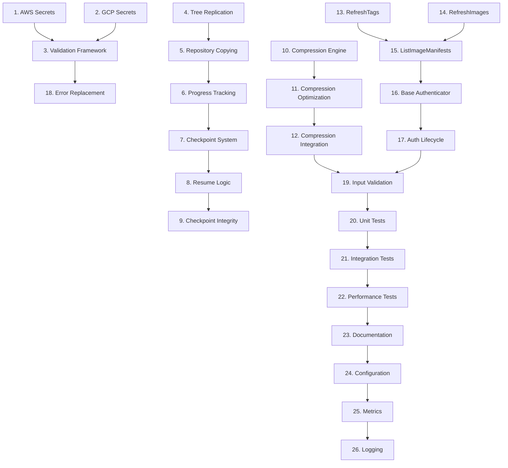

# Implementation Tasks: Missing Implementations and Stub Completions

## Task Breakdown

### Phase 1: Critical Secrets Management Implementation

- [ ] 1. Implement AWS Secrets Manager write operations
  - Replace stub implementations in `pkg/service/replicate.go:601-614` with complete AWS SDK integration
  - Implement `PutSecret` with proper error handling and validation
  - Implement `PuTJSONSecret` with JSON marshaling and size validation
  - Implement `DeleteSecret` with proper AWS deletion workflow
  - Add input validation and IAM permissions error handling
  - _Leverage: existing AWS SDK patterns, pkg/helper/errors/errors.go error handling_
  - _Requirements: 1.1, 2.1, 4.1_

- [ ] 2. Implement GCP Secret Manager write operations
  - Replace stub implementations in `pkg/service/replicate.go:658-671` with complete GCP client integration
  - Implement `PutSecret` with proper GCP Secret Manager API calls
  - Implement `PutJSONSecret` with structured data support
  - Implement `DeleteSecret` with version management
  - Add service account permissions validation and error handling
  - _Leverage: existing GCP client patterns, pkg/secrets/gcp/ infrastructure_
  - _Requirements: 1.1, 2.1, 4.1_

- [ ] 3. Create comprehensive secrets validation framework
  - Create `pkg/helper/validation/secrets_validator.go` for input validation
  - Implement secret name validation with cloud provider naming rules
  - Add secret value size and format validation
  - Implement JSON structure validation for structured secrets
  - Add comprehensive error messages for validation failures
  - _Leverage: existing validation patterns, input sanitization utilities_
  - _Requirements: 2.1, 4.1, 4.2_

### Phase 2: Production Tree Replication Engine

- [ ] 4. Replace mock tree replication with production implementation
  - Replace mock implementation in `pkg/tree/replicator.go:765-774` with actual replication logic
  - Implement parallel repository processing using existing worker pool patterns
  - Add real progress tracking instead of artificial delays
  - Implement comprehensive error handling and retry logic
  - Add repository enumeration and filtering capabilities
  - _Leverage: pkg/replication/worker_pool.go patterns, existing registry client interfaces_
  - _Requirements: 2.1, 2.2, 3.1_

- [ ] 5. Implement production-ready repository copying logic
  - Create actual repository-to-repository copying in tree replicator
  - Implement tag enumeration and individual tag replication
  - Add image manifest and layer copying with integrity validation
  - Implement skip-existing logic for incremental replication
  - Add comprehensive metrics and progress reporting
  - _Leverage: existing image copying patterns, pkg/copy/ infrastructure_
  - _Requirements: 2.1, 2.2, 3.1_

- [ ] 6. Add real-time progress tracking system
  - Create `pkg/tree/progress_tracker.go` for operation progress monitoring
  - Implement progress state management with repository and tag granularity
  - Add progress persistence for long-running operations
  - Implement progress query API for external monitoring
  - Add estimated completion time calculations
  - _Leverage: existing metrics patterns, progress tracking utilities_
  - _Requirements: 2.2, 3.2, 5.1_

### Phase 3: Complete Resume System Implementation

- [ ] 7. Implement complete checkpoint system
  - Replace placeholder implementation in `pkg/tree/resume.go:210` with full checkpoint logic
  - Create comprehensive checkpoint data structure with integrity validation
  - Implement checkpoint serialization and deserialization with versioning
  - Add checkpoint integrity verification with checksums
  - Implement checkpoint store abstraction with file and database backends
  - _Leverage: existing checkpoint patterns, serialization utilities_
  - _Requirements: 3.1, 3.2, 4.2_

- [ ] 8. Complete resume functionality implementation
  - Replace placeholder in `pkg/service/tree_replicate.go:337` with actual resume logic
  - Implement state analysis and resume capability validation
  - Add completed work detection and filtering
  - Implement resume progress reconciliation with current registry state
  - Add resume failure recovery and state correction
  - _Leverage: existing state management patterns, validation utilities_
  - _Requirements: 3.1, 3.2, 4.1_

- [ ] 9. Create checkpoint integrity and validation system
  - Implement checkpoint data validation with schema verification
  - Add checkpoint version compatibility checking
  - Create checkpoint corruption detection and recovery
  - Implement checkpoint cleanup and maintenance procedures
  - Add checkpoint metrics and monitoring
  - _Leverage: existing validation patterns, integrity checking utilities_
  - _Requirements: 3.2, 4.2, 5.1_

### Phase 4: Network Compression Implementation

- [ ] 10. Implement production compression engine
  - Replace placeholder in `pkg/network/transfer.go:142` with actual compression implementation
  - Create pluggable compression algorithm support (gzip, zlib, lz4)
  - Implement streaming compression with configurable buffer sizes
  - Add compression ratio monitoring and adaptive compression
  - Implement compression fallback for incompressible data
  - _Leverage: existing streaming patterns, network transfer infrastructure_
  - _Requirements: 4.1, 4.2, 5.1_

- [ ] 11. Add compression performance optimization
  - Implement compression level configuration and auto-tuning
  - Add compression threshold management (min/max file sizes)
  - Create compression benefit analysis and decision logic
  - Implement compression performance metrics and monitoring
  - Add compression memory management and resource controls
  - _Leverage: existing performance monitoring, resource management patterns_
  - _Requirements: 4.2, 5.1, 5.2_

- [ ] 12. Create compression integration with transfer system
  - Integrate compression engine with existing transfer mechanisms
  - Implement transparent compression/decompression in network layer
  - Add compression header management for transfer protocols
  - Create compression compatibility detection and negotiation
  - Add compression error handling and recovery mechanisms
  - _Leverage: pkg/network/ transfer patterns, existing protocol handling_
  - _Requirements: 4.1, 4.2, 5.1_

### Phase 5: Enhanced Repository Features

- [ ] 13. Implement RefreshTags functionality
  - Replace stub in `pkg/client/common/enhanced_repository.go:85` with actual implementation
  - Create tag cache invalidation and refresh logic
  - Implement registry API integration for tag list updates
  - Add incremental tag refresh with change detection
  - Create tag refresh scheduling and automatic updates
  - _Leverage: existing caching patterns, registry client interfaces_
  - _Requirements: 5.1, 5.2_

- [ ] 14. Implement RefreshImages functionality
  - Replace stub in `pkg/client/common/enhanced_repository.go:91` with actual implementation
  - Create image metadata cache refresh and updates
  - Implement image manifest and layer information updates
  - Add image metadata validation and consistency checking
  - Create batch image refresh for efficiency
  - _Leverage: existing image handling patterns, metadata management_
  - _Requirements: 5.1, 5.2_

- [ ] 15. Implement ListImageManifests functionality
  - Replace stub in `pkg/client/common/enhanced_repository.go:169` with full implementation
  - Create comprehensive manifest listing with metadata
  - Implement manifest type detection and categorization
  - Add manifest relationship mapping for multi-arch images
  - Create manifest filtering and search capabilities
  - _Leverage: existing manifest handling, registry client patterns_
  - _Requirements: 5.1, 5.2_

### Phase 6: Authentication System Implementation

- [ ] 16. Implement complete base authenticator
  - Replace empty implementation in `pkg/client/common/base_authenticator.go:24` with functional auth
  - Create authentication method detection and selection
  - Implement credential validation and refresh logic
  - Add authentication caching and token management
  - Create authentication failure handling and retry mechanisms
  - _Leverage: existing authentication patterns, credential management_
  - _Requirements: 6.1, 6.2_

- [ ] 17. Add authentication lifecycle management
  - Implement credential expiration detection and refresh
  - Create authentication session management
  - Add authentication method fallback and escalation
  - Implement authentication audit logging and monitoring
  - Create authentication configuration validation
  - _Leverage: existing lifecycle management, security patterns_
  - _Requirements: 6.1, 6.2, 4.3_

### Phase 7: Error Handling and Validation Enhancement

- [ ] 18. Replace all "not implemented" errors with proper functionality
  - Identify and catalog all remaining NotImplementedf calls across codebase
  - Replace with actual implementations or meaningful error messages
  - Add feature flag support for incomplete implementations
  - Create comprehensive error documentation and troubleshooting guides
  - Implement graceful degradation for optional features
  - _Leverage: existing error handling patterns, feature flag utilities_
  - _Requirements: 4.1, 4.2, 4.3_

- [ ] 19. Implement comprehensive input validation framework
  - Create unified input validation system for all new implementations
  - Add parameter validation with descriptive error messages
  - Implement data sanitization and bounds checking
  - Create validation rule configuration and customization
  - Add validation performance optimization and caching
  - _Leverage: existing validation patterns, input sanitization utilities_
  - _Requirements: 4.2, 6.2, 2.1_

### Phase 8: Testing and Quality Assurance

- [ ] 20. Create comprehensive unit tests for all implementations
  - Create test suites for all secrets management operations
  - Implement tests for tree replication and resume functionality
  - Add compression algorithm and performance tests
  - Create enhanced repository feature tests
  - Implement authentication system tests with mocks
  - _Leverage: existing test patterns, test/mocks/ infrastructure_
  - _Requirements: All functional requirements for testing coverage_

- [ ] 21. Implement integration tests for end-to-end functionality
  - Create integration tests for complete secrets management workflows
  - Add end-to-end tree replication tests with real registries
  - Implement resume functionality tests with checkpoint scenarios
  - Create compression integration tests with various data types
  - Add authentication integration tests with multiple providers
  - _Leverage: test/integration/ patterns, existing test fixtures_
  - _Requirements: All functional requirements for integration testing_

- [ ] 22. Add performance and load testing
  - Create performance benchmarks for all new implementations
  - Implement load testing for secrets operations and rate limiting
  - Add compression performance testing with various file sizes
  - Create tree replication scalability tests
  - Implement memory and resource usage testing
  - _Leverage: existing performance testing patterns, benchmarking utilities_
  - _Requirements: Performance requirements, scalability needs_

### Phase 9: Documentation and Configuration

- [ ] 23. Create comprehensive feature documentation
  - Document all new secrets management capabilities and configuration
  - Create tree replication and resume functionality guides
  - Add compression configuration and tuning documentation
  - Document enhanced repository features and usage patterns
  - Create authentication configuration and troubleshooting guides
  - _Leverage: docs/ structure, existing documentation patterns_
  - _Requirements: Documentation requirements, user guides_

- [ ] 24. Update configuration system for new features
  - Extend configuration schema for all new implementations
  - Add configuration validation for new feature options
  - Create configuration migration utilities for existing deployments
  - Implement configuration examples and templates
  - Add configuration testing and validation tools
  - _Leverage: pkg/config/ patterns, existing configuration management_
  - _Requirements: Configuration requirements, operational needs_

### Phase 10: Monitoring and Observability

- [ ] 25. Implement comprehensive metrics for all new features
  - Add metrics for secrets management operations and performance
  - Create tree replication and resume operation metrics
  - Implement compression efficiency and performance metrics
  - Add enhanced repository feature usage metrics
  - Create authentication success/failure and performance metrics
  - _Leverage: pkg/metrics/metrics.go patterns, existing Prometheus integration_
  - _Requirements: Monitoring requirements, observability needs_

- [ ] 26. Add structured logging for all implementations
  - Implement comprehensive logging for secrets operations with audit trails
  - Add detailed logging for tree replication and resume operations
  - Create compression operation logging with performance data
  - Add enhanced repository feature operation logging
  - Implement authentication event logging with security context
  - _Leverage: pkg/helper/log/logger.go patterns, existing structured logging_
  - _Requirements: Logging requirements, audit needs_

## Task Dependencies

## Critical Path Priority

### Immediate (Critical Business Impact)
1. **Secrets Management** (Tasks 1-3) - Unblocks complete secrets workflows
2. **Tree Replication Core** (Tasks 4-6) - Replaces mock implementation
3. **Resume System** (Tasks 7-9) - Enables reliable large operations

### High Priority (Core Functionality)
4. **Compression Engine** (Tasks 10-12) - Performance optimization
5. **Enhanced Repository** (Tasks 13-15) - Advanced functionality
6. **Authentication System** (Tasks 16-17) - Security foundation

### Medium Priority (Quality and Operations)
7. **Error Handling** (Tasks 18-19) - User experience improvement
8. **Testing** (Tasks 20-22) - Quality assurance
9. **Documentation and Config** (Tasks 23-24) - Operational support
10. **Observability** (Tasks 25-26) - Monitoring and debugging

## Implementation Guidelines

### Development Standards
- All implementations must include comprehensive error handling
- New features must include feature flags for gradual rollout
- Performance impact must be measured and optimized
- Security considerations must be addressed in all implementations

### Testing Requirements
- Unit tests required for all new functionality
- Integration tests required for external service interactions
- Performance tests required for optimization features
- Security tests required for authentication and secrets handling

### Code Quality Standards
- Follow existing architectural patterns and interfaces
- Implement proper resource cleanup and lifecycle management
- Add comprehensive logging and metrics for all operations
- Include detailed documentation and usage examples

### Deployment Strategy
- Implement feature flags for controlled rollout
- Provide configuration migration utilities
- Include rollback procedures for all changes
- Add monitoring and alerting for new functionality

## Risk Mitigation

### High-Risk Areas
- **Secrets Management**: Direct cloud provider integration with sensitive data
- **Tree Replication**: Complex state management with parallel operations
- **Resume Logic**: Data consistency across interruption scenarios
- **Compression**: Performance impact on core replication operations

### Mitigation Strategies
- Extensive testing with real cloud services and error injection
- Gradual rollout with comprehensive monitoring
- Performance benchmarking and optimization validation
- Security review and penetration testing for sensitive operations

This comprehensive implementation plan transforms Freightliner from a prototype with mock implementations into a fully-featured, production-ready container registry replication system.