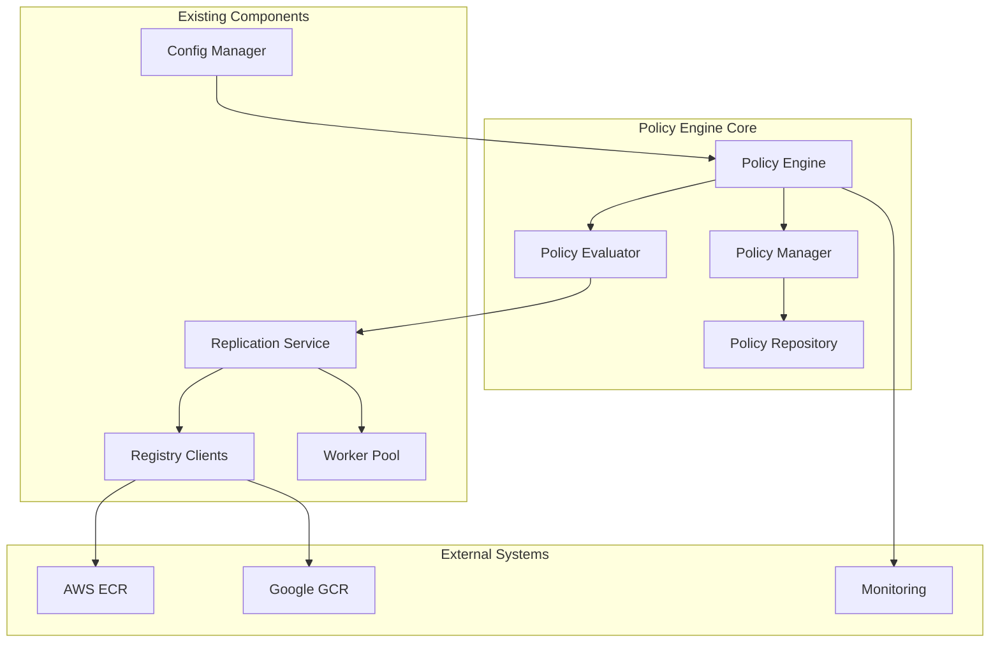

# Design Document: Multi-Registry Policy Engine

## Overview

The Multi-Registry Policy Engine extends Freightliner's existing replication capabilities with intelligent, policy-driven decision making. The design builds upon existing architecture patterns while introducing a flexible rule evaluation system that can automatically determine replication strategies based on image metadata, organizational policies, and runtime conditions.

## Code Reuse Analysis

### Leveraging Existing Architecture

**Base Policy Infrastructure** (`pkg/replication/config.go`):
- Extend `ReplicationRule` struct with policy-specific fields
- Build upon `ReplicationConfig` for policy storage and management
- Utilize existing pattern matching functions (`MatchPattern`, `ShouldReplicate`)

**Service Integration** (`pkg/service/replicate.go`):
- Enhance `ReplicationService` with policy evaluation capabilities
- Leverage existing `createRegistryClients` for multi-registry operations
- Build upon `ReplicationResult` for policy execution metrics

**Worker Pool Pattern** (`pkg/replication/worker_pool.go`):
- Reuse existing worker pool infrastructure for parallel policy evaluation
- Extend worker pattern for policy-driven replication orchestration

**Configuration Framework** (`pkg/config/`):
- Extend existing YAML configuration structure with policy definitions
- Leverage configuration validation and loading mechanisms

## System Architecture

### High-Level Architecture



### Component Design

#### 1. Policy Engine (`pkg/policy/engine.go`)

**Purpose**: Central orchestrator for policy evaluation and execution

```go
type PolicyEngine struct {
    repository   PolicyRepository
    evaluator    PolicyEvaluator
    scheduler    PolicyScheduler
    metrics      *metrics.PolicyMetrics
    logger       *log.Logger
}

type PolicyEngineOptions struct {
    ConfigPath        string
    MetricsEnabled    bool
    EvaluationTimeout time.Duration
    MaxConcurrency    int
}

func NewPolicyEngine(opts PolicyEngineOptions) (*PolicyEngine, error)
func (pe *PolicyEngine) EvaluateReplicationPolicy(ctx context.Context, image ImageMetadata) (*ReplicationDecision, error)
func (pe *PolicyEngine) StartScheduler(ctx context.Context) error
func (pe *PolicyEngine) ReloadPolicies(ctx context.Context) error
```

**Design Rationale**: Follows the existing service pattern in `pkg/service/` with options-based configuration and structured logging.

#### 2. Policy Repository (`pkg/policy/repository.go`)

**Purpose**: Storage and retrieval of policy definitions with caching

```go
type PolicyRepository interface {
    LoadPolicies(ctx context.Context) ([]Policy, error)
    GetPolicy(ctx context.Context, id string) (*Policy, error)
    SavePolicy(ctx context.Context, policy *Policy) error
    DeletePolicy(ctx context.Context, id string) error
    ListPolicies(ctx context.Context, filter PolicyFilter) ([]Policy, error)
}

type FileBasedRepository struct {
    configPath string
    cache      map[string]*Policy
    cacheMutex sync.RWMutex
    logger     *log.Logger
}
```

**Code Reuse**: Implements caching pattern similar to `pkg/client/common/base_client.go` repository caching.

#### 3. Policy Evaluator (`pkg/policy/evaluator.go`)

**Purpose**: Core policy evaluation logic with condition matching

```go
type PolicyEvaluator interface {
    Evaluate(ctx context.Context, policy *Policy, image ImageMetadata) (*EvaluationResult, error)
    EvaluateCondition(ctx context.Context, condition PolicyCondition, image ImageMetadata) (bool, error)
}

type StandardEvaluator struct {
    conditionHandlers map[string]ConditionHandler
    logger           *log.Logger
}

type ConditionHandler interface {
    Handle(ctx context.Context, condition PolicyCondition, image ImageMetadata) (bool, error)
}
```

**Design Rationale**: Uses interface-based design consistent with existing patterns in `pkg/interfaces/` for extensibility and testability.

#### 4. Policy Scheduler (`pkg/policy/scheduler.go`)

**Purpose**: Scheduled policy evaluation and maintenance tasks

```go
type PolicyScheduler struct {
    cron     *cron.Cron
    engine   *PolicyEngine
    logger   *log.Logger
    metrics  *metrics.PolicyMetrics
}

func NewPolicyScheduler(engine *PolicyEngine, logger *log.Logger) *PolicyScheduler
func (ps *PolicyScheduler) Start(ctx context.Context) error
func (ps *PolicyScheduler) Stop() error
func (ps *PolicyScheduler) AddScheduledPolicy(policy *Policy) error
```

**Code Reuse**: Leverages existing `github.com/robfig/cron/v3` dependency already used in the project.

## Data Models

### Core Policy Types

```go
// Policy represents a complete replication policy
type Policy struct {
    ID            string                 `yaml:"id" json:"id"`
    Name          string                 `yaml:"name" json:"name"`
    Description   string                 `yaml:"description,omitempty" json:"description,omitempty"`
    Enabled       bool                   `yaml:"enabled" json:"enabled"`
    Priority      int                    `yaml:"priority" json:"priority"`
    Schedule      string                 `yaml:"schedule,omitempty" json:"schedule,omitempty"`
    Conditions    []PolicyCondition      `yaml:"conditions" json:"conditions"`
    Actions       []ReplicationAction    `yaml:"actions" json:"actions"`
    Metadata      map[string]interface{} `yaml:"metadata,omitempty" json:"metadata,omitempty"`
    CreatedAt     time.Time              `yaml:"created_at" json:"created_at"`
    UpdatedAt     time.Time              `yaml:"updated_at" json:"updated_at"`
}

// PolicyCondition defines when a policy should be applied
type PolicyCondition struct {
    Type      string      `yaml:"type" json:"type"`           // "tag", "label", "registry", "metadata"
    Operator  string      `yaml:"operator" json:"operator"`   // "equals", "matches", "contains", "in"
    Value     interface{} `yaml:"value" json:"value"`
    LogicalOp string      `yaml:"logical_op,omitempty" json:"logical_op,omitempty"` // "AND", "OR"
}

// ReplicationAction defines what should happen when conditions match
type ReplicationAction struct {
    Type            string            `yaml:"type" json:"type"`                       // "replicate", "block", "notify"
    TargetRegistry  string            `yaml:"target_registry" json:"target_registry"`
    TargetRepo      string            `yaml:"target_repo,omitempty" json:"target_repo,omitempty"`
    Parameters      map[string]string `yaml:"parameters,omitempty" json:"parameters,omitempty"`
    RetryPolicy     *RetryPolicy      `yaml:"retry_policy,omitempty" json:"retry_policy,omitempty"`
}

// ImageMetadata contains information about an image for policy evaluation
type ImageMetadata struct {
    Registry     string            `json:"registry"`
    Repository   string            `json:"repository"`
    Tag          string            `json:"tag"`
    Digest       string            `json:"digest"`
    Labels       map[string]string `json:"labels"`
    Annotations  map[string]string `json:"annotations"`
    Size         int64             `json:"size"`
    CreatedAt    time.Time         `json:"created_at"`
    Architecture string            `json:"architecture"`
    OS           string            `json:"os"`
}

// ReplicationDecision contains the result of policy evaluation
type ReplicationDecision struct {
    ShouldReplicate bool                    `json:"should_replicate"`
    Actions         []ReplicationAction     `json:"actions"`
    MatchedPolicies []string                `json:"matched_policies"`
    Reason          string                  `json:"reason"`
    Metadata        map[string]interface{}  `json:"metadata"`
}

// EvaluationResult contains detailed policy evaluation results
type EvaluationResult struct {
    PolicyID        string                 `json:"policy_id"`
    Matched         bool                   `json:"matched"`
    ConditionResults []ConditionResult     `json:"condition_results"`
    Actions         []ReplicationAction    `json:"actions"`
    EvaluationTime  time.Duration          `json:"evaluation_time"`
    Error           error                  `json:"error,omitempty"`
}

// ConditionResult contains the result of evaluating a single condition
type ConditionResult struct {
    Condition PolicyCondition `json:"condition"`
    Matched   bool            `json:"matched"`
    Reason    string          `json:"reason"`
    Error     error           `json:"error,omitempty"`
}
```

**Design Rationale**: 
- Extends existing configuration patterns from `pkg/config/config.go`
- Uses YAML tags for configuration file compatibility
- Includes comprehensive metadata for observability and debugging

### Policy Configuration Extension

```yaml
# Extension to existing config.yaml
policy:
  enabled: true
  configPath: "/etc/freightliner/policies"
  evaluationTimeout: 30s
  maxConcurrency: 10
  cacheSize: 1000
  
  # Default policies (embedded in config)
  policies:
    - id: "production-replication"
      name: "Production Image Replication"
      enabled: true
      priority: 100
      conditions:
        - type: "tag"
          operator: "matches"
          value: "^prod-.*"
        - type: "label"
          operator: "equals"
          value: "environment=production"
          logical_op: "AND"
      actions:
        - type: "replicate"
          target_registry: "ecr"
          target_repo: "production/{repository}"
        - type: "replicate"
          target_registry: "gcr"
          target_repo: "prod-mirror/{repository}"
          
    - id: "compliance-blocking"
      name: "Block Non-Compliant Images"
      enabled: true
      priority: 200
      conditions:
        - type: "label"
          operator: "not_exists"
          value: "security.scan.status"
      actions:
        - type: "block"
          parameters:
            reason: "Missing security scan"
```

## Integration Points

### 1. Service Layer Integration

**Modification to `pkg/service/replicate.go`**:

```go
// Enhanced ReplicationService with policy support
type ReplicationService struct {
    cfg           *freightlinerConfig.Config
    logger        *log.Logger
    policyEngine  *policy.PolicyEngine  // New field
}

// Modified ReplicateRepository method
func (s *ReplicationService) ReplicateRepository(ctx context.Context, source, destination string) (*ReplicationResult, error) {
    // Get image metadata
    imageMetadata, err := s.getImageMetadata(ctx, source)
    if err != nil {
        return nil, err
    }
    
    // Evaluate policies if policy engine is enabled
    if s.policyEngine != nil {
        decision, err := s.policyEngine.EvaluateReplicationPolicy(ctx, imageMetadata)
        if err != nil {
            s.logger.Warn("Policy evaluation failed, proceeding with default behavior", map[string]interface{}{
                "error": err.Error(),
                "source": source,
            })
        } else if !decision.ShouldReplicate {
            return &ReplicationResult{
                TagsSkipped: 1,
                Errors:      0,
            }, fmt.Errorf("replication blocked by policy: %s", decision.Reason)
        }
        
        // Use policy-determined actions if available
        if len(decision.Actions) > 0 {
            return s.executePolicyActions(ctx, decision.Actions, imageMetadata)
        }
    }
    
    // Fall back to existing replication logic
    return s.replicateRepositoryLegacy(ctx, source, destination)
}
```

### 2. Configuration Integration

**Extension to `pkg/config/config.go`**:

```go
// Config extension
type Config struct {
    // ... existing fields ...
    Policy PolicyConfig `mapstructure:"policy" yaml:"policy"`
}

type PolicyConfig struct {
    Enabled            bool          `mapstructure:"enabled" yaml:"enabled"`
    ConfigPath         string        `mapstructure:"configPath" yaml:"configPath"`
    EvaluationTimeout  time.Duration `mapstructure:"evaluationTimeout" yaml:"evaluationTimeout"`
    MaxConcurrency     int           `mapstructure:"maxConcurrency" yaml:"maxConcurrency"`
    CacheSize          int           `mapstructure:"cacheSize" yaml:"cacheSize"`
    Policies           []Policy      `mapstructure:"policies" yaml:"policies"`
}
```

### 3. Metrics Integration

**Extension to `pkg/metrics/metrics.go`**:

```go
// PolicyMetrics extends existing metrics
type PolicyMetrics struct {
    evaluationsTotal    prometheus.CounterVec
    evaluationDuration  prometheus.HistogramVec
    policyMatches       prometheus.CounterVec
    actionExecutions    prometheus.CounterVec
    errors              prometheus.CounterVec
}

func NewPolicyMetrics() *PolicyMetrics {
    return &PolicyMetrics{
        evaluationsTotal: prometheus.NewCounterVec(
            prometheus.CounterOpts{
                Name: "freightliner_policy_evaluations_total",
                Help: "Total number of policy evaluations",
            },
            []string{"policy_id", "result"},
        ),
        // ... other metrics ...
    }
}
```

## Error Handling Strategy

### Policy Evaluation Errors

**Graceful Degradation**:
- Policy evaluation errors should not block replication operations
- Fall back to existing replication logic when policy engine fails
- Log policy errors with appropriate severity levels

**Error Categories**:
```go
// Policy-specific error types building on existing error package
type PolicyError struct {
    Type     string
    PolicyID string
    Cause    error
}

// Error types
var (
    ErrPolicyNotFound     = errors.NewPolicyError("POLICY_NOT_FOUND", "policy not found")
    ErrConditionEvalError = errors.NewPolicyError("CONDITION_EVAL_ERROR", "condition evaluation failed")
    ErrActionExecError    = errors.NewPolicyError("ACTION_EXEC_ERROR", "action execution failed")
    ErrPolicyConflict     = errors.NewPolicyError("POLICY_CONFLICT", "conflicting policies found")
)
```

### Retry and Circuit Breaker Patterns

**Leveraging Existing Patterns**:
- Use existing retry logic from `pkg/helper/util/retry.go`
- Implement circuit breaker for policy service dependencies
- Exponential backoff for policy evaluation failures

## Testing Strategy

### Unit Testing

**Policy Engine Core**:
```go
func TestPolicyEngine_EvaluateReplicationPolicy(t *testing.T) {
    testCases := []struct {
        name           string
        policy         Policy
        imageMetadata  ImageMetadata
        expectedResult *ReplicationDecision
        expectError    bool
    }{
        {
            name: "production tag matches policy",
            policy: Policy{
                ID: "prod-policy",
                Conditions: []PolicyCondition{
                    {Type: "tag", Operator: "matches", Value: "^prod-.*"},
                },
                Actions: []ReplicationAction{
                    {Type: "replicate", TargetRegistry: "ecr"},
                },
            },
            imageMetadata: ImageMetadata{
                Tag: "prod-v1.0.0",
            },
            expectedResult: &ReplicationDecision{
                ShouldReplicate: true,
                Actions: []ReplicationAction{
                    {Type: "replicate", TargetRegistry: "ecr"},
                },
            },
            expectError: false,
        },
        // ... more test cases
    }
    
    for _, tc := range testCases {
        t.Run(tc.name, func(t *testing.T) {
            // Test implementation using existing testing patterns
        })
    }
}
```

### Integration Testing

**End-to-End Policy Scenarios**:
- Policy-driven replication with real registry clients (using test fixtures)
- Policy conflict resolution
- Scheduled policy execution
- Policy hot-reload scenarios

### Performance Testing

**Policy Evaluation Performance**:
- Benchmark policy evaluation under load
- Memory usage testing for large policy sets
- Concurrent policy evaluation stress testing

## Deployment Considerations

### Configuration Management

**Backward Compatibility**:
- Policy engine disabled by default to maintain existing behavior
- Existing configuration files continue to work without policy section
- Graceful handling of missing policy configuration

**Configuration Validation**:
```go
func (pc *PolicyConfig) Validate() error {
    if pc.Enabled {
        if pc.EvaluationTimeout <= 0 {
            return errors.InvalidInputf("evaluationTimeout must be positive")
        }
        if pc.MaxConcurrency <= 0 {
            return errors.InvalidInputf("maxConcurrency must be positive")
        }
        for _, policy := range pc.Policies {
            if err := policy.Validate(); err != nil {
                return errors.Wrapf(err, "invalid policy %s", policy.ID)
            }
        }
    }
    return nil
}
```

### Monitoring and Observability

**Policy Execution Visibility**:
- Structured logging for all policy decisions
- Metrics for policy evaluation performance
- Alerting on policy evaluation failures
- Dashboard for policy execution trends

**Audit Trail**:
- Log all policy changes with timestamps and user context
- Track policy evaluation decisions for compliance
- Export policy execution history for analysis

### Security Considerations

**Policy Definition Security**:
- Validate policy syntax to prevent injection attacks
- Sanitize user input in policy conditions
- Implement proper access controls for policy management

**Secrets in Policies**:
- Support for encrypted policy values using existing secrets management
- Avoid storing sensitive data in policy definitions
- Use secure defaults for policy parameters

This design extends Freightliner's capabilities while maintaining architectural consistency and leveraging existing patterns and components effectively.