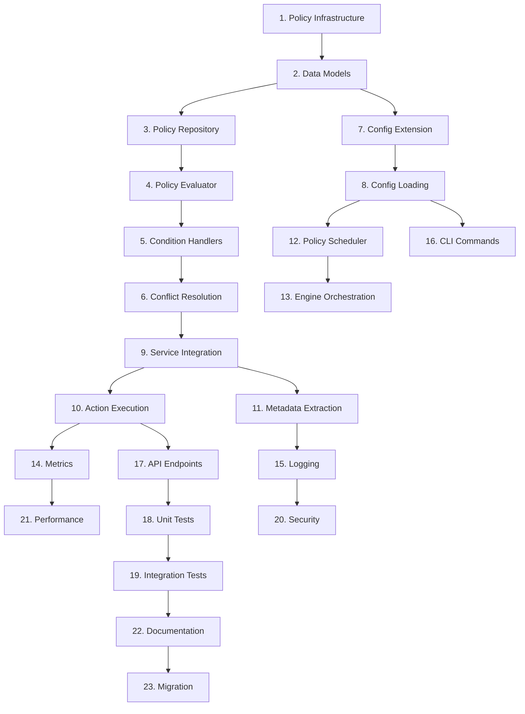

# Implementation Tasks: Multi-Registry Policy Engine

## Task Breakdown

### Phase 1: Core Infrastructure

- [ ] 1. Create policy package structure and core interfaces
  - Create `pkg/policy/` directory following project structure conventions
  - Define core interfaces: `PolicyEngine`, `PolicyRepository`, `PolicyEvaluator`, `PolicyScheduler`
  - Implement policy-specific error types extending existing error handling patterns
  - Create `pkg/policy/interfaces.go` with interface definitions
  - _Leverage: pkg/helper/errors/errors.go, pkg/interfaces/ patterns, existing interface design_
  - _Requirements: 1.1, 1.2, 5.1_

- [ ] 2. Implement core policy data models
  - Create `pkg/policy/types.go` with Policy, PolicyCondition, ReplicationAction structs
  - Add YAML/JSON tags following existing configuration patterns
  - Implement validation methods using existing config validation patterns
  - Add policy serialization/deserialization with proper error handling
  - _Leverage: pkg/config/config.go validation patterns, existing struct designs_
  - _Requirements: 1.1, 2.1, 2.2_

- [ ] 3. Create file-based policy repository
  - Implement `pkg/policy/repository.go` with FileBasedRepository struct
  - Add policy loading, saving, and validation with proper error handling
  - Implement caching using existing cache patterns from base client
  - Add policy hot-reload with file watching capabilities
  - _Leverage: pkg/client/common/base_client.go caching patterns, pkg/config/loading.go_
  - _Requirements: 1.3, 2.1, 4.2_

### Phase 2: Policy Evaluation Engine

- [ ] 4. Implement standard policy evaluator
  - Create `pkg/policy/evaluator.go` with StandardEvaluator struct
  - Implement pluggable condition handler system using interface pattern
  - Add logical operators (AND, OR) for condition combining
  - Implement policy priority-based evaluation ordering
  - _Leverage: pkg/replication/rules.go pattern matching, existing interface patterns_
  - _Requirements: 1.1, 2.3, 3.1_

- [ ] 5. Add condition handler implementations
  - Create `pkg/policy/handlers.go` with specific condition handlers
  - Implement TagConditionHandler for tag pattern matching using existing regex
  - Implement LabelConditionHandler for image label evaluation
  - Implement MetadataConditionHandler for image metadata evaluation
  - Implement RegistryConditionHandler for registry-specific conditions
  - _Leverage: pkg/replication/rules.go pattern matching functions, existing string utilities_
  - _Requirements: 2.3, 3.1, 3.2_

- [ ] 6. Implement policy conflict resolution and debugging
  - Add priority-based policy ordering and conflict detection logic
  - Implement policy composition for multiple matching policies
  - Add detailed policy evaluation tracing for troubleshooting
  - Create policy decision explanation and reasoning system
  - _Leverage: pkg/helper/log/logger.go structured logging patterns_
  - _Requirements: 1.4, 4.1, 5.2_

### Phase 3: Configuration Integration

- [ ] 7. Extend main configuration structure
  - Modify `pkg/config/config.go` to add PolicyConfig struct
  - Add proper YAML mapping and environment variable support
  - Implement configuration validation for policy-related settings
  - Add backward compatibility checks for existing configurations
  - _Leverage: pkg/config/config.go structure, existing validation patterns_
  - _Requirements: 1.5, 4.2_

- [ ] 8. Update configuration loading and validation
  - Extend `pkg/config/loading.go` to handle policy configuration sections
  - Add policy-specific environment variable support following existing patterns
  - Implement configuration file schema validation for policies
  - Add configuration migration utilities for existing setups
  - _Leverage: pkg/config/loading.go patterns, existing env var handling_
  - _Requirements: 1.5, 4.2, 4.3_

### Phase 4: Service Integration

- [ ] 9. Enhance ReplicationService with policy support
  - Modify `pkg/service/replicate.go` to add PolicyEngine field
  - Implement policy evaluation in main replication flow
  - Add graceful fallback when policy evaluation fails
  - Implement image metadata extraction for policy evaluation
  - _Leverage: pkg/service/replicate.go service patterns, existing error handling_
  - _Requirements: 1.1, 1.2, 3.3_

- [ ] 10. Implement policy-driven action execution
  - Create action executor in `pkg/policy/actions.go` for handling ReplicationAction types
  - Implement replicate, block, and notify action types
  - Add action retry logic using existing retry patterns
  - Integrate with existing registry client operations
  - _Leverage: pkg/helper/util/retry.go, pkg/replication/worker_pool.go patterns_
  - _Requirements: 2.4, 3.3, 4.4_

- [ ] 11. Add image metadata extraction and caching
  - Implement ImageMetadata extraction from registry responses in policy evaluator
  - Add support for OCI image annotations and labels parsing
  - Cache image metadata to improve policy evaluation performance
  - Integrate with existing registry client interfaces
  - _Leverage: pkg/client/common/ patterns, existing registry client interfaces_
  - _Requirements: 2.3, 3.1_

### Phase 5: Scheduled Policy Execution

- [ ] 12. Implement policy scheduler
  - Create `pkg/policy/scheduler.go` using existing cron dependency
  - Add support for scheduled policy evaluation and execution
  - Implement scheduler lifecycle management (start/stop/reload)
  - Add scheduled policy maintenance and cleanup tasks
  - _Leverage: github.com/robfig/cron/v3 dependency, existing service patterns_
  - _Requirements: 1.6, 4.1_

- [ ] 13. Add policy engine orchestration
  - Create `pkg/policy/engine.go` as main policy engine orchestrator
  - Integrate repository, evaluator, and scheduler components
  - Implement policy engine initialization and configuration
  - Add policy hot-reload and runtime management capabilities
  - _Leverage: existing service patterns, pkg/service/ architecture_
  - _Requirements: 1.1, 4.1, 4.3_

### Phase 6: Observability and Metrics

- [ ] 14. Implement policy metrics collection
  - Extend `pkg/metrics/metrics.go` with PolicyMetrics struct
  - Add policy evaluation, execution, and error metrics
  - Implement Prometheus metric registration and collection
  - Add metrics for policy performance and success rates
  - _Leverage: pkg/metrics/metrics.go patterns, existing Prometheus integration_
  - _Requirements: 5.1, 5.2, 5.3_

- [ ] 15. Add structured logging for policy operations
  - Implement comprehensive logging for policy evaluation and execution
  - Add policy decision audit trail with structured log format
  - Create policy error logging with appropriate severity levels
  - Add policy change tracking and audit events
  - _Leverage: pkg/helper/log/logger.go patterns, existing structured logging_
  - _Requirements: 4.3, 5.1, 5.2_

### Phase 7: CLI and API Integration

- [ ] 16. Add policy management CLI commands
  - Create `cmd/policy.go` with policy-related commands
  - Implement `policy list`, `policy validate`, `policy test` commands
  - Add policy configuration validation and reload commands
  - Create policy debugging and status commands for operational support
  - _Leverage: cmd/ command structure, existing cobra command patterns_
  - _Requirements: 4.2, 4.3_

- [ ] 17. Extend server API with policy endpoints
  - Modify `pkg/server/handlers.go` to add policy management endpoints
  - Implement REST endpoints for policy CRUD operations
  - Add policy evaluation API for external integrations
  - Add policy status and health check endpoints
  - _Leverage: pkg/server/ HTTP server patterns, existing handler structure_
  - _Requirements: 1.7, 4.3_

### Phase 8: Testing Infrastructure

- [ ] 18. Implement comprehensive unit tests
  - Create test suites for all policy engine components
  - Implement table-driven tests for policy evaluation scenarios
  - Add benchmark tests for policy evaluation performance
  - Create mock implementations for testing policy interactions
  - _Leverage: existing test patterns, test/mocks/ structure, test/fixtures/_
  - _Requirements: All requirements for testing coverage_

- [ ] 19. Create integration tests
  - Implement end-to-end policy evaluation and execution tests
  - Add multi-registry policy scenario tests using existing test fixtures
  - Create policy conflict resolution integration tests
  - Add policy hot-reload and configuration change tests
  - _Leverage: test/integration/ patterns, existing mock infrastructure_
  - _Requirements: All requirements for integration testing_

### Phase 9: Security and Performance

- [ ] 20. Implement policy security controls
  - Add input validation and sanitization for policy definitions
  - Implement access controls for policy management operations
  - Add policy signature verification for trusted policy sources
  - Implement security audit logging for policy operations
  - _Leverage: existing security patterns, input validation utilities_
  - _Requirements: Security requirements, 4.4_

- [ ] 21. Optimize policy evaluation performance
  - Implement policy evaluation caching and memoization
  - Add policy compilation and optimization for better performance
  - Create policy evaluation profiling and optimization tools
  - Add performance monitoring and alerting for policy operations
  - _Leverage: existing caching patterns, performance optimization utilities_
  - _Requirements: Performance requirements, 3.1_

### Phase 10: Documentation and Migration

- [ ] 22. Create policy documentation and examples
  - Create comprehensive policy configuration documentation
  - Add policy troubleshooting guide and best practices
  - Implement policy template examples for common use cases
  - Add migration guide from existing replication rules
  - _Leverage: docs/ structure, examples/ configuration patterns_
  - _Requirements: 4.2, user documentation needs_

- [ ] 23. Create migration and deployment utilities
  - Implement migration tools for existing replication rules to policies
  - Add configuration migration and validation utilities
  - Create policy import/export functionality for operational use
  - Add deployment configuration examples and templates
  - _Leverage: existing configuration utilities, validation patterns_
  - _Requirements: 4.2, backward compatibility, operational requirements_

## Task Dependencies

## Critical Path

The minimum viable functionality requires:
1. **Core Infrastructure** (Tasks 1-3): Basic policy system
2. **Evaluation Engine** (Tasks 4-6): Policy evaluation logic
3. **Configuration** (Tasks 7-8): Integration with existing config system
4. **Service Integration** (Tasks 9-11): Integration with replication service
5. **Basic Testing** (Task 18): Unit tests for core functionality

This represents the minimum set needed for basic policy-driven replication functionality.

## Implementation Guidelines

### Code Reuse Strategy
- **Extend existing patterns** rather than creating new ones
- **Leverage established interfaces** from `pkg/interfaces/`
- **Follow project structure** conventions from `structure.md`
- **Use existing error handling** patterns from `pkg/helper/errors/`
- **Build upon configuration** framework in `pkg/config/`

### Testing Strategy
- Each task should include unit tests before marking as complete
- Integration tests should be added incrementally as components are integrated
- Performance benchmarks should be established early and monitored
- Use existing test fixtures and mock patterns

### Performance Considerations
- Policy evaluation must complete within 100ms for typical rule sets
- Memory usage should be minimal and bounded
- CPU overhead should be under 10% of total usage
- Implement caching and optimization early in the process

Do the tasks look good?