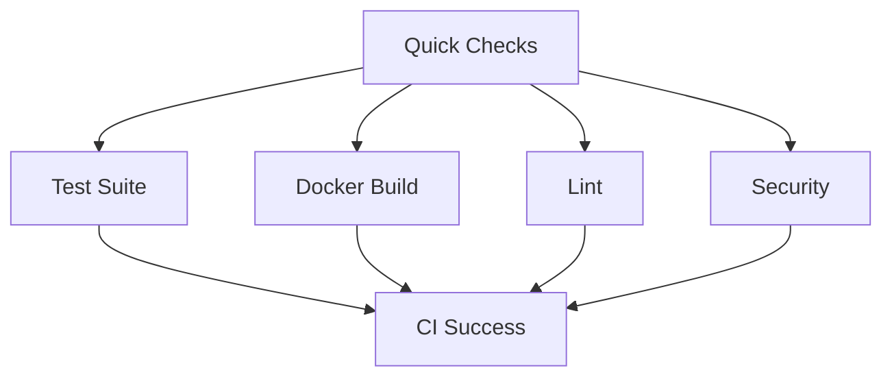

# GitHub Actions Workflows Documentation

This document describes the CI/CD pipeline structure for the Freightliner project and provides guidance for contributors.

## 🚀 Workflow Overview

### Core Workflows

| Workflow | Purpose | Trigger | Owner | Duration |
|----------|---------|---------|--------|----------|
| **CI** | Fast feedback for pull requests | Push, PR | @dev-team | ~10-15 min |
| **Release** | Production deployments | Tags, Manual | @release-team | ~30-45 min |
| **Security** | Comprehensive security scanning | Schedule, Push | @security-team | ~15-20 min |
| **Comprehensive** | Extensive testing suite | Schedule, Manual | @qa-team | ~45-60 min |

### Composite Actions

| Action | Purpose | Location | Usage |
|--------|---------|----------|-------|
| **setup-go** | Go environment with caching | `.github/actions/setup-go` | All Go workflows |
| **setup-docker** | Docker Buildx with registry | `.github/actions/setup-docker` | Build workflows |
| **run-tests** | Test execution with coverage | `.github/actions/run-tests` | Test workflows |

## 📋 Workflow Details

### CI Workflow (`ci.yml`)

**Purpose**: Provides fast feedback for pull requests and pushes to main branches.

**Strategy**: 
- **Quick Checks**: Code formatting, go.mod verification, basic build (~5 min)
- **Parallel Testing**: Unit and integration tests with race detection
- **Conditional Docker**: Only builds containers when Docker files change
- **Security Integration**: Basic security scanning with gosec

**Optimization Features**:
- Path filters to skip documentation-only changes
- Concurrency groups to cancel outdated runs
- Matrix strategy for different test types
- Conditional job execution based on file changes

**Success Criteria**: All jobs must pass for PR merge eligibility.

### Release Workflow (`release.yml`)

**Purpose**: Handles production deployments with comprehensive validation.

**Triggers**:
- Git tags starting with `v*`
- Published GitHub releases
- Manual workflow dispatch

**Process**:
1. **Validate CI Status**: Ensures CI has passed for the commit
2. **Build & Publish**: Multi-platform container images with attestations
3. **Security Scan**: Container vulnerability scanning with Trivy
4. **Deploy Staging**: Automated staging deployment (pre-release tags)
5. **Deploy Production**: Production deployment (stable releases)
6. **GitHub Release**: Automated release notes and SBOM artifacts

**Security Features**:
- Container image signing and attestations
- SBOM (Software Bill of Materials) generation
- Vulnerability scanning with fail-on-critical
- Multi-stage approval process for production

### Security Workflow (`security.yml`)

**Purpose**: Centralized security scanning to prevent duplication.

**Scans Performed**:
- **Dependency Scanning**: Nancy, Govulncheck for Go vulnerabilities
- **SAST**: Gosec, Semgrep for static analysis
- **Container Scanning**: Trivy, Anchore Grype for image vulnerabilities
- **License Compliance**: go-licenses for license validation
- **Secret Detection**: TruffleHog, GitLeaks for credential leaks
- **IaC Scanning**: Checkov, Terrascan for infrastructure security

**Schedule**: Daily at 2 AM UTC, plus on relevant file changes.

### Comprehensive Workflow (`scheduled-comprehensive.yml`)

**Purpose**: Extensive testing including external dependencies and flaky test detection.

**Features**:
- External dependency testing (AWS/GCP integration)
- Flaky test detection with multiple iterations
- Performance benchmarking
- Long-running integration tests

**Schedule**: Daily at 2 AM UTC, with manual trigger options.

## 🔧 Configuration

### Environment Variables

| Variable | Purpose | Scope | Default |
|----------|---------|-------|---------|
| `GO_VERSION` | Go version to use | All workflows | `1.24.5` |
| `GOLANGCI_LINT_VERSION` | Linter version | CI workflows | `v2.3.0` |
| `REGISTRY` | Container registry | Release workflow | `ghcr.io` |

### Secrets Configuration

| Secret | Purpose | Required For |
|--------|---------|---------------|
| `GITHUB_TOKEN` | GitHub API access | All workflows (auto) |
| `AWS_ACCESS_KEY_ID` | AWS credentials | External dep tests |
| `AWS_SECRET_ACCESS_KEY` | AWS credentials | External dep tests |
| `GOOGLE_APPLICATION_CREDENTIALS_JSON` | GCP credentials | External dep tests |
| `SLACK_WEBHOOK_URL` | Notifications | Release workflow |

### Concurrency Groups

| Group | Purpose | Cancel Policy |
|-------|---------|---------------|
| `${{ github.workflow }}-${{ github.ref }}` | CI feedback | Cancel in progress |
| `security-${{ github.ref }}` | Security scans | Cancel in progress |
| `release-${{ github.ref }}` | Releases | Never cancel |
| `comprehensive-${{ github.run_id }}` | Comprehensive tests | Never cancel |

## 🚀 Performance Optimizations

### Caching Strategy

1. **Go Module Cache**: Shared across all workflows with versioned keys
2. **Docker Layer Cache**: GitHub Actions cache for build acceleration
3. **Tool Installation**: Cached based on tool versions

### Path Filters

CI workflows skip runs for documentation-only changes:
```yaml
paths-ignore:
  - '**.md'
  - '.gitignore'
  - 'LICENSE'
  - 'docs/**'
```

### Conditional Execution

- **Docker builds**: Only when Docker files change or on PRs
- **IaC scans**: Only when infrastructure files change
- **External dependency tests**: Only on schedule or manual trigger

### Job Dependencies



## 🛠 Contributing Guidelines

### For Contributors

1. **PR Workflow**: CI must pass before merge
2. **Test Categories**: 
   - Use `-short` flag for quick tests
   - Mark integration tests appropriately
   - Ensure tests are not flaky

3. **Docker Changes**: Expect longer CI times when modifying Docker files
4. **Security**: Security workflow runs automatically on relevant changes

### For Maintainers

1. **Release Process**:
   - Create semver tags for releases (`v1.2.3`)
   - Pre-release tags include identifiers (`v1.2.3-rc1`)
   - Production deployments require tag creation

2. **Security Response**:
   - Monitor security workflow results
   - Address critical vulnerabilities promptly
   - Review license compliance reports

3. **Performance Monitoring**:
   - Watch workflow execution times
   - Optimize based on comprehensive test results
   - Adjust concurrency limits as needed

## 📊 Monitoring and Metrics

### Workflow Metrics

Monitor these key metrics:
- **CI Duration**: Target <15 minutes for feedback
- **Release Success Rate**: Target >95% success rate
- **Security Scan Coverage**: All critical scans must pass
- **Test Reliability**: <1% flaky test rate

### Troubleshooting

#### Common Issues

1. **Cache Miss**: Check Go version consistency across workflows
2. **Test Timeouts**: Review test duration and CI environment constraints
3. **Docker Build Failures**: Verify Dockerfile syntax and build context
4. **Security Failures**: Address vulnerabilities or adjust scan sensitivity

#### Debug Commands

```bash
# Local CI simulation
make test-ci

# Security scan locally
gosec ./...

# Docker build test
docker build -t freightliner:test .
```

## 🔄 Future Improvements

### Planned Optimizations

1. **OIDC Authentication**: Migrate from long-lived secrets to OIDC
2. **Advanced Caching**: Implement distributed caching for larger builds
3. **Parallel Security Scans**: Further optimize security scan execution
4. **Environment Promotion**: Implement progressive deployment patterns

### Monitoring Integration

- OpenTelemetry integration for workflow observability
- Prometheus metrics for CI/CD performance
- Slack/Teams integration for real-time notifications

---

## 📞 Support

For workflow-related questions:
- **CI Issues**: Contact @dev-team
- **Release Problems**: Contact @release-team  
- **Security Concerns**: Contact @security-team
- **General Questions**: Create an issue with the `workflow` label

Last Updated: $(date -u +'%Y-%m-%d %H:%M:%S UTC')