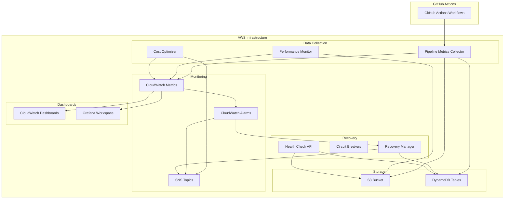

# CI/CD Monitoring Module

A comprehensive Terraform module for monitoring and alerting on CI/CD pipelines, with a focus on GitHub Actions workflows. This module provides pipeline health monitoring, performance regression detection, cost optimization, automated recovery, and comprehensive dashboards.

## Features

### 🚀 Pipeline Health Monitoring
- **Real-time metrics**: Track pipeline success rates, failure patterns, and execution times
- **Smart alerting**: CloudWatch alarms with composite alerting for complex conditions
- **Historical analysis**: Long-term trend analysis and pattern detection
- **Multi-branch support**: Monitor different branches with separate thresholds

### 📊 Performance Monitoring
- **Baseline tracking**: Automatic establishment and maintenance of performance baselines
- **Regression detection**: Statistical analysis to detect performance degradations
- **Anomaly detection**: CloudWatch anomaly detection for unusual patterns
- **Detailed metrics**: Stage-by-stage performance breakdown

### 💰 Cost Optimization
- **Cost tracking**: Monitor CI/CD costs across AWS services
- **Optimization recommendations**: Automated suggestions for cost reduction
- **Resource rightsizing**: Automatic Lambda memory and timeout optimization
- **Budget alerts**: Configurable cost thresholds and alerts

### 🔧 Reliability Engineering
- **Circuit breakers**: Protect against external service failures
- **Retry mechanisms**: Exponential backoff for transient failures
- **Automated recovery**: Self-healing procedures for common issues
- **Health checks**: Comprehensive system health monitoring

### 📈 Dashboards and Visualization
- **CloudWatch Dashboards**: Pre-built dashboards for pipeline, performance, and cost metrics
- **Grafana Integration**: Advanced visualization with Grafana workspace
- **Custom Queries**: Pre-defined CloudWatch Insights queries for troubleshooting
- **Mobile-friendly**: Responsive dashboard design

## Architecture



## Quick Start

### 1. Basic Setup

```hcl
module "ci_monitoring" {
  source = "path/to/modules/ci-monitoring"

  # Basic Configuration
  project_name = "my-project"
  environment  = "prod"
  vpc_id       = "vpc-12345678"
  subnet_ids   = ["subnet-12345678", "subnet-87654321"]

  # GitHub Configuration
  github_token = var.github_token
  github_owner = "my-org"
  github_repo  = "my-repo"

  # Alert Configuration
  alert_email_recipients = ["team@company.com"]
  
  tags = {
    Project = "my-project"
    Team    = "devops"
  }
}
```

### 2. Advanced Configuration

```hcl
module "ci_monitoring" {
  source = "path/to/modules/ci-monitoring"

  # Basic Configuration
  project_name = "my-project"
  environment  = "prod"
  vpc_id       = data.aws_vpc.main.id
  subnet_ids   = data.aws_subnets.private.ids

  # GitHub Configuration
  github_token = var.github_token
  github_owner = "my-org"
  github_repo  = "my-repo"

  # Advanced Features
  enable_cost_optimization    = true
  enable_performance_baseline = true
  enable_circuit_breaker     = true
  enable_grafana_dashboard   = true
  auto_scaling_enabled       = true

  # Custom Thresholds
  pipeline_success_rate_threshold     = 0.95
  pipeline_duration_threshold_minutes = 30
  cost_alert_threshold_usd           = 500

  # Circuit Breaker Configuration
  circuit_breaker_failure_threshold = 5
  circuit_breaker_timeout_seconds   = 60

  # Auto Scaling
  scaling_target_utilization = 70
  min_capacity              = 2
  max_capacity              = 10

  # Data Retention
  log_retention_days  = 30
  data_retention_days = 365

  # Security
  enable_encryption_at_rest    = true
  enable_encryption_in_transit = true

  # Notifications
  alert_email_recipients = ["devops@company.com", "sre@company.com"]
  slack_webhook_url     = var.slack_webhook_url

  tags = {
    Project     = "my-project"
    Environment = "prod"
    Team        = "devops"
    CostCenter  = "engineering"
  }
}
```

## Configuration

### Required Variables

| Variable | Type | Description |
|----------|------|-------------|
| `project_name` | `string` | Name of the project |
| `environment` | `string` | Environment name (dev, staging, prod) |
| `vpc_id` | `string` | VPC ID for resource deployment |
| `subnet_ids` | `list(string)` | List of subnet IDs for Lambda functions |
| `github_token` | `string` | GitHub personal access token |
| `github_owner` | `string` | GitHub repository owner |
| `github_repo` | `string` | GitHub repository name |

### Optional Variables

| Variable | Type | Default | Description |
|----------|------|---------|-------------|
| `enable_cost_optimization` | `bool` | `true` | Enable automated cost optimization |
| `enable_performance_baseline` | `bool` | `true` | Enable performance baseline tracking |
| `enable_circuit_breaker` | `bool` | `true` | Enable circuit breaker functionality |
| `enable_grafana_dashboard` | `bool` | `true` | Deploy Grafana workspace |
| `auto_scaling_enabled` | `bool` | `true` | Enable auto-scaling for resources |
| `pipeline_success_rate_threshold` | `number` | `0.95` | Minimum acceptable success rate |
| `cost_alert_threshold_usd` | `number` | `100` | Monthly cost alert threshold |
| `log_retention_days` | `number` | `30` | CloudWatch log retention period |
| `data_retention_days` | `number` | `365` | S3 data retention period |

## Outputs

### Infrastructure

- `s3_bucket_name` - Name of the monitoring data bucket
- `dynamodb_table_name` - Pipeline metadata table name
- `kms_key_arn` - Encryption key ARN

### Functions

- `pipeline_metrics_collector_function_name` - Metrics collector function name
- `performance_monitor_function_name` - Performance monitor function name
- `cost_optimizer_function_name` - Cost optimizer function name
- `recovery_manager_function_name` - Recovery manager function name
- `health_check_function_name` - Health check function name

### Monitoring

- `dashboard_urls` - Map of dashboard URLs
- `health_check_api_url` - Health check endpoint URL
- `critical_alerts_topic_arn` - Critical alerts SNS topic ARN

### Complete list available in [outputs.tf](outputs.tf)

## Lambda Functions

### Pipeline Metrics Collector
- **Schedule**: Every 5 minutes
- **Purpose**: Collect pipeline metrics from GitHub API
- **Features**: Circuit breaker, retry logic, metric calculation
- **Output**: CloudWatch metrics, S3 storage, DynamoDB records

### Performance Monitor
- **Schedule**: Every 10 minutes
- **Purpose**: Track performance baselines and detect regressions
- **Features**: Statistical analysis, anomaly detection, trend analysis
- **Output**: Performance metrics, regression alerts

### Cost Optimizer
- **Schedule**: Daily
- **Purpose**: Analyze costs and optimize resource allocation
- **Features**: Service cost analysis, optimization recommendations, automated rightsizing
- **Output**: Cost metrics, optimization actions, savings recommendations

### Recovery Manager
- **Trigger**: CloudWatch alarms, manual invocation
- **Purpose**: Automated recovery procedures
- **Features**: Circuit breaker management, resource scaling, cache clearing
- **Output**: Recovery actions, status notifications

### Health Check
- **Trigger**: API Gateway requests
- **Purpose**: System health monitoring
- **Features**: Component health checks, status aggregation
- **Output**: Health status, component details

## Dashboards

### Pipeline Overview Dashboard
- Pipeline success/failure rates
- Average execution times
- Total pipeline runs
- Long-running pipeline counts
- Recent error logs

### Performance Analysis Dashboard
- Stage duration breakdown
- Pipeline efficiency metrics
- Performance baseline deviations
- Resource utilization trends

### Cost Analysis Dashboard
- Service cost breakdown
- Cost change percentages
- Optimization potential
- Monthly spending trends

### Grafana Workspace (Optional)
- Advanced visualizations
- Custom dashboards
- Alert management
- Team collaboration features

## Alerting

### Alert Types

1. **Critical Alerts**
   - Pipeline failure rate > 20%
   - Performance regression > 50%
   - System component failures

2. **Warning Alerts**
   - Pipeline success rate < 95%
   - Duration exceeds threshold
   - Cost increases > 25%

3. **Cost Alerts**
   - Monthly spending exceeds threshold
   - Significant cost increases
   - Optimization opportunities

### Alert Channels

- **Email**: Direct email notifications
- **Slack**: Webhook-based notifications
- **SNS**: Integration with other AWS services
- **Lambda**: Automated response triggers

## Circuit Breaker

The module implements circuit breaker patterns for external dependencies:

### States
- **CLOSED**: Normal operation
- **OPEN**: Failing requests blocked
- **HALF_OPEN**: Testing recovery

### Configuration
- Failure threshold: Configurable (default: 5 failures)
- Timeout: Configurable (default: 60 seconds)
- Services: GitHub API, external endpoints

### Benefits
- Prevents cascade failures
- Reduces external service load
- Enables graceful degradation
- Automatic recovery detection

## Cost Optimization

### Features

1. **Service Cost Analysis**
   - Lambda function costs
   - EC2 instance costs
   - Storage costs
   - CloudWatch costs

2. **Optimization Actions**
   - Lambda memory rightsizing
   - Instance type recommendations
   - Storage lifecycle policies
   - Log retention optimization

3. **Automated Scaling**
   - Lambda provisioned concurrency
   - DynamoDB capacity adjustment
   - Auto Scaling Groups optimization

### Savings Potential

Typical savings range from 15-30% through:
- Memory optimization: 10-20%
- Storage lifecycle: 20-40%
- Instance rightsizing: 25-50%
- Monitoring optimization: 15-25%

## Security

### Encryption
- **At Rest**: KMS encryption for all stored data
- **In Transit**: TLS encryption for all communications
- **Key Management**: Customer-managed KMS keys

### Access Control
- **IAM Roles**: Least privilege access
- **Resource Policies**: Fine-grained permissions
- **VPC Integration**: Private subnet deployment
- **Security Groups**: Restrictive network access

### Compliance
- **Audit Logging**: All actions logged
- **Data Retention**: Configurable retention periods
- **Backup**: Automated backup procedures
- **Monitoring**: Security event monitoring

## Troubleshooting

### Common Issues

#### Health Check Failures
```bash
# Check health endpoint
curl -s https://api-id.execute-api.region.amazonaws.com/env/health | jq .

# Check Lambda logs
aws logs describe-log-groups --log-group-name-prefix '/aws/lambda/project-health-check'
```

#### Pipeline Metrics Not Updating
```bash
# Check metrics collector logs
aws logs filter-log-events --log-group-name '/aws/lambda/project-pipeline-metrics-collector'

# Verify GitHub token permissions
curl -H "Authorization: token $GITHUB_TOKEN" https://api.github.com/rate_limit
```

#### Cost Optimizer Issues
```bash
# Check cost optimizer execution
aws lambda invoke --function-name project-cost-optimizer response.json
cat response.json

# Verify Cost Explorer permissions
aws ce get-cost-and-usage --time-period Start=2023-01-01,End=2023-01-02 --granularity DAILY --metrics BlendedCost
```

### Debug Mode

Enable debug logging by setting:
```hcl
log_level = "DEBUG"
```

### Monitoring Commands

```bash
# List all Lambda functions
aws lambda list-functions --query 'Functions[?contains(FunctionName, `project-name`)]'

# Check CloudWatch metrics
aws cloudwatch list-metrics --namespace 'CI-CD/Pipeline'

# View recent alarms
aws cloudwatch describe-alarms --state-value ALARM
```

## Contributing

### Development Setup

1. Clone the repository
2. Install Terraform >= 1.5
3. Configure AWS credentials
4. Set up GitHub token with appropriate permissions

### Required GitHub Token Permissions

- `repo` - Full repository access
- `workflow` - Access to GitHub Actions
- `read:org` - Read organization information

### Testing

```bash
# Validate Terraform configuration
terraform validate

# Plan deployment
terraform plan

# Apply with auto-approve for testing
terraform apply -auto-approve

# Destroy test resources
terraform destroy -auto-approve
```

## License

This module is released under the MIT License. See [LICENSE](LICENSE) for details.

## Support

For support and questions:
- Create an issue in the repository
- Check the troubleshooting guide above
- Review CloudWatch logs for detailed error information
- Use the health check endpoint for system status

## Roadmap

### Upcoming Features

- [ ] Multi-cloud support (Azure DevOps, GitLab CI)
- [ ] Machine learning-based anomaly detection
- [ ] Integration with external monitoring systems
- [ ] Advanced cost prediction models
- [ ] Kubernetes deployment monitoring
- [ ] Security vulnerability scanning integration
- [ ] Compliance reporting automation
- [ ] Mobile app for alerts and monitoring

### Version History

- **v1.0.0** - Initial release with core monitoring features
- **v1.1.0** - Added cost optimization and circuit breaker
- **v1.2.0** - Grafana integration and advanced dashboards
- **v1.3.0** - Automated recovery and health checks